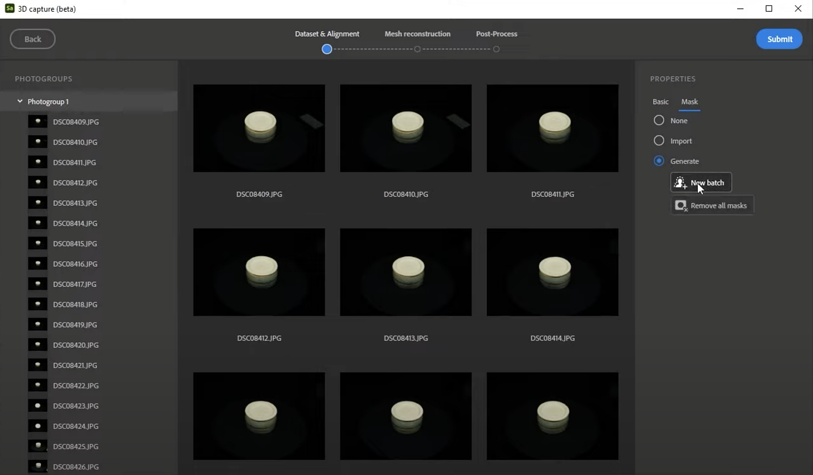

# Procesamiento de capturas 3D avanzadas

>[!WARNING]
>
> La compatibilidad con captura 3D se ha eliminado a partir de la versión 5.1 de Sampler.

## Procesamiento de capturas 3D avanzadas en Substance 3D Sampler

En esta guía del usuario, analizamos en profundidad el procesamiento de sus conjuntos de datos de captura 3D en Substance 3D Sampler.

¿Prefiere ver esto como un tutorial de vídeo? Puedes encontrarlo [aquí](https://youtu.be/vJQ756Up55Y?si=GiAnajXRGkb5gyTH "Tutorial de captura 3D avanzada - Procesamiento de captura").

Cuando se hace Captura 3D o fotogrametría, la mayor parte del esfuerzo consiste en tomar buenas fotografías, cuyos pasos se tratan en los artículos anteriores de la guía del usuario. También tenga en cuenta que hemos diseñado y centrado la experiencia de Captura 3D para objetos de hasta tamaño humano. Es posible que surjan problemas al utilizar un conjunto de datos muy grande (es decir, más de 6 Giga píxeles, lo que equivale a 500 fotos de 12 Megapixels).

## Inicio del proceso de captura 3D

Para empezar en Sampler, tendrás que crear un <b>nuevo proyecto</b>. Verá una nueva sección Objetos 3D en la ventana Proyectos. Haga clic en el signo + situado junto a él y seleccione &quot;<b>Nuevo objeto 3D</b>&quot; para comenzar con el proceso de captura 3D en una ventana nueva y dedicada.

Seleccione todas las fotografías en el explorador y arrástrelas a la ventana de captura 3D. Después de cargarlas durante un tiempo, las fotografías se presentan en una lista y como una galería, con las propiedades de la selección a la derecha.

La lista de grupos de fotografías de la izquierda se basa en la cámara y la lente utilizadas para las fotografías. Si mezclas fotos de varios dispositivos, como un teléfono móvil, una cámara réflex digital o un dron, obtendrás <b>grupos separados</b> aquí.

Con el grupo seleccionado, obtendrá una descripción general de sus propiedades. A veces faltan la <b>Distancia focal</b> y el <b>tamaño del sensor</b>; es posible rellenar estos <b>manualmente</b> si conocemos los números. Esta información puede ayudar a mejorar un poco el procesamiento.

## Generación de máscaras

La opción más importante está en la sección <b>Máscara</b>. Debido a que las fotos se han tomado en un tocadiscos, el fondo no cambió mucho, pero el objeto sí. Esto puede hacer que el proceso de alineación falle por completo. Además de eso, el fondo no contiene información significativa en absoluto. Para resolver este problema, enmascararás al sujeto de cada foto.

La forma más sencilla es utilizar la generación automática de lotes. Seleccione <b>Generar</b>, luego <b>Nuevo lote</b> y espere a que Sampler cree las máscaras. Utiliza la tecnología &quot;Seleccionar sujeto&quot; de Adobe Sensei, como en Photoshop. Con 72 fotos, este proceso tarda un poco en completarse, por lo que es mejor ser paciente.

Puedes verificar una máscara individual <b>seleccionando una foto</b> y haciendo clic en el <b>icono de ojo</b> de la parte inferior derecha, junto a la ruta de la máscara. Esto muestra una previsualización en escala de grises de la máscara. Si el enmascaramiento automático comete un error y mantiene partes del fondo, no se preocupe, algunas máscaras incorrectas no son un problema.

La mayoría de las máscaras deben tener solo el sujeto. Por esta razón, resulta clave hacer fotos con un <b>fondo uniforme y sencillo</b>; es mucho más fácil que las máscaras automáticas funcionen bien. Si la mayoría de las máscaras no son correctas, puede corregirlas todas manualmente o volver a grabar las fotografías con un fondo más adecuado.

Puede volver a intentar un conjunto de datos varias veces y evitar volver a generar las máscaras cada vez, ya que Sampler las elimina una vez que cierra la aplicación. Las máscaras se almacenan en caché en Documentos\Adobe\Adobe Substance 3D Sampler\3DCapture\p1. Si utiliza varios recursos en una sesión, obtendrá carpetas denominadas p2, p3, etc. Es recomendable <b>copiar las máscaras almacenadas en caché en una ubicación segura con el conjunto de datos</b>, para ahorrar tiempo si necesita volver a visitar este conjunto de datos.

## Alineación

Con las máscaras correctas, ya puedes pasar a la alineación. Presione el <b>botón Azul de envío</b> en la parte superior derecha. Tendrás dos opciones: <b>Precisión</b> y <b>Ordenación de fotos</b>.

* <b>Precisión</b> puede mejorar la alineación, es mejor empezar en Baja, si recibes fotos con errores, inténtalo de nuevo con Alta.
* <b>El orden de las fotos</b> está relacionado con el orden en que hiciste las fotos. Si has dado la vuelta a un objeto y has disparado en círculos en espiral, puedes optar por una secuencia para ahorrar tiempo, pero normalmente la opción predeterminada es la más segura, incluso si la alineación puede tardar un poco más.

Haga clic en <b>Proceso</b> y espere a que finalice la alineación. Esto puede tardar varios minutos, por lo que es mejor tener paciencia de nuevo. Cuando haya terminado, verá una representación en la nube de puntos de su objeto, en la que cada fotografía se representará como una cámara flotando a su alrededor. Un triángulo de advertencia naranja en la parte superior izquierda significa que algunas fotos <b> no se han alineado </b>. Vuelva y pruébelo con Precisión de alta calidad y Orden predeterminado si aún no lo ha hecho. Es posible que algunas fotos no se alineen, lo que significa que no tienen suficiente superposición o detalles insuficientes. Puede que tengas que volver a tu proceso de fotografía para resolverlo, o puedes simplemente ignorarlo si son solo unas pocas fotos.

Si observas los datos de la nube de puntos, es posible que veas <b>puntos aislados flotando alrededor de tu objeto</b> que no están pensados para formar parte de ellos. Esto suele deberse a algunas máscaras incorrectas, en este caso, algunas máscaras incorrectas han provocado que se capturen algunas partículas de dust. Y<b>puedes recortarlos</b> con el icono de ojo de la derecha, junto a la Región de interés. Solo <b>mueve los controles cuadrados</b> que parezcan ajustarse más alrededor de tu objeto. Cualquier punto fuera de este cuadro, que se muestre en gris oscuro, no se incluirá en el modelo 3D final. También puedes usar este cuadro delimitador para <b>prerotar y alinear mejor tu modelo.</b>

A veces las nubes de puntos tienen puntos mucho más densos que otros. Esto no es un problema, al tener menos puntos, la superficie tendrá menos detalles geométricos pequeños. Se debe a la falta de detalle y contraste en algunas partes del objeto, mientras que otras tienen más detalles.

## Información sobre la geometría

Solo queda un ajuste antes de crear nuestra malla. En Detalles de geometría (geometry details) se puede seleccionar el nivel de detalle inicial de la geometría.

* <b>Raw</b> es el <b>mes sin diezmar</b>h, en realidad no es recomendable usarlo a menos que estés seguro de que lo necesitas.
* Las <b>mallas completas a borrador</b> son <b>mallas diezmadas</b>, deberías elegir opciones más bajas para obtener un resultado de prueba más rápido, opciones más altas para obtener más detalles a expensas de un procesamiento más lento.

Pulse <b>Enviar para iniciar el procesamiento de la malla</b>. Este proceso puede tardar un poco más que cualquiera de los pasos anteriores.

## Previsualización y posprocesamiento

Una vez realizada la malla, la ventana final nos permite previsualizar y postprocesar la malla antes de añadirla a nuestro proyecto de Sampler. Este modo tiene algunos botones en la parte inferior para ver tu malla con <b>textura</b>, <b>sólido sombreado</b>, como <b>malla metálica</b> y con un <b>material de verificador UV</b>. La configuración de posprocesamiento en el lateral le permite generar una nueva versión de la malla. Eso significa una malla reteselada, con nuevos UV automáticos y textura cocida de la malla original. Los controles principales le permiten definir un recuento de caras objetivo y alternar entre el horneado Normal, height y AO. Hay muchos ajustes avanzados que se pueden modificar, pero los valores predeterminados suelen funcionar correctamente.

También puede realizar este paso de procesamiento de malla posteriormente, una vez que la malla se haya añadido a Sampler. Una vez que lo haya añadido a Sampler, puede ponerle un nombre y aparecerá en la lista de proyectos.

Puedes editar la malla y las texturas, pero ya puedes exportar el resultado usando <b>Compartir</b> > <b>Cuadro de diálogo Exportar como</b>. <b>Configuración general</b> te permite elegir el nombre y la ruta de acceso, <b>Configuración de malla</b> te permite elegir el formato de malla 3D y <b>Configuración de material</b> te permite configurar el material de la malla. Puede desactivar la malla o el material para exportar solo uno de ellos de forma individual. Una vez exportada, la malla está lista para utilizarse en otras aplicaciones 3D.

Ahora aprende a [editar aún más tus mallas 3D capturadas en Sampler](editing-3d-captured-meshes.md).
