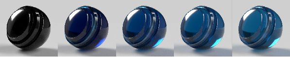

# Adobe Standard Material

>[!NOTE]
>
> Substance 3D Sampler ahora utiliza de forma predeterminada el modelo de material [OpenPBR](openpbr.md) en lugar de Adobe Standard Material.

## Propiedades de material estándar

## Propiedades de superficie base

**Color base**

El color de la superficie.

**Rugosidad**

Qué tan suave o mate es la superficie.

**Metálico**

El grado de brillo metálico de la superficie.

**Opacidad**

La visibilidad de la superficie.

**oclusión de ambiente**

Sombras de cavidades y pliegues que impiden que la luz llegue a la superficie.

**Specular level**

La intensidad de los reflejos de luz en la superficie.

**Specular edge color**

El color de los reflejos de luz. Afecta a los ángulos de inclinación de los materiales metálicos.

**Normal**

Simula los detalles de la superficie, como relieves y grietas.

**Escala normal**

La intensidad del efecto normal.

**Combinar normal y height**

Aplica la textura normal sobre la textura del height.

**Height**

Crea detalles de superficie mediante relieve o desplazamiento geométrico.

**escala de Height**

Escala de height en unidades de escena. Se aplica tanto a relieve como a desplazamiento.

**Nivel de Height**

Valor de la textura de height que representa el desplazamiento cero.

**Nivel de Anisotropía**

La cantidad de reflejos que se estiran en una dirección a lo largo de la superficie.

**ángulo de Anisotropía**

Giro del efecto anisotrópico hacia la izquierda.

**Intensidad de emisión**

Intensidad de la luz emitida desde la superficie.

**Color de emisión**

El color de la luz emitida.

**Opacidad de brillo**

Simula el efecto de fibras microscópicas o pelusa en la superficie.

**Color de brillo**

El color del efecto de brillo.

**Rugosidad de brillo**

Suavidad del efecto brillo.

## Propiedades interiores

**Transparencia**

Cantidad de luz capaz de transmitir a través de la superficie.

**Color de absorción**

La luz de color converge a medida que se absorbe.

**Distancia de Absorción**

Distancia aproximada en unidades de escena que la luz recorrerá antes de alcanzar el color de absorción. Si se establece en cero, el thickness no afectará al color de absorción.

**Índice de refracción**

Cantidad de luz que se dobla a medida que pasa a través del objeto.

**Dispersión**

Cantidad de espectro de color que se extiende cuando se refracta.

**Dispersión subsuperficial**

Dispersión la luz por debajo de la superficie, en lugar de pasar recto.

**Color de dispersión**

El color bajo la superficie en el que se convertirá la luz dispersada.

**Distancia de dispersión**

La luz de distancia aproximada debe viajar antes de alcanzar la dispersión completa.

**Escala de distancia de dispersión**

Un multiplicador de la distancia de dispersión. Puede ser diferente para cada canal de color.

**Cambio de color rojo**

Configura la luz roja para que se desplace más que otros colores claros. Útil para la piel.

**Dispersión de Rayleigh**

Configura la luz naranja para que se desplace más bajo la superficie y la luz azul para que se desplace menos.

**thickness de volumen**

El thickness de la superficie con respecto al cuadro delimitador del objeto. Se utiliza para efectos interiores cuando no se conoce el thickness real.

**Escala de thickness de volumen**

Multiplicador del thickness de volumen.

## Propiedades de capa

**Opacidad de la capa**

Simula una capa sobre el material. Se utiliza para crear capas, lacas y barnices transparentes.

**Color de la capa**

El color del abrigo.

**Rugosidad del abrigo**

Qué tan suave o mate es la superficie de la capa.

**Recubrimiento del índice de refracción**

La cantidad de luz se dobla a medida que pasa a través de la capa.

**specular level de abrigo**

La intensidad de los reflejos de luz en la capa en ángulos de mirada.

**Abrigo normal**

Simule los detalles de la superficie, como los golpes y las grietas, en la superficie de la capa.

**Recubrir escala normal**

La intensidad del efecto normal de la capa.
