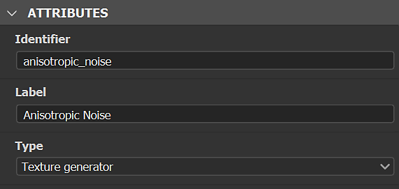
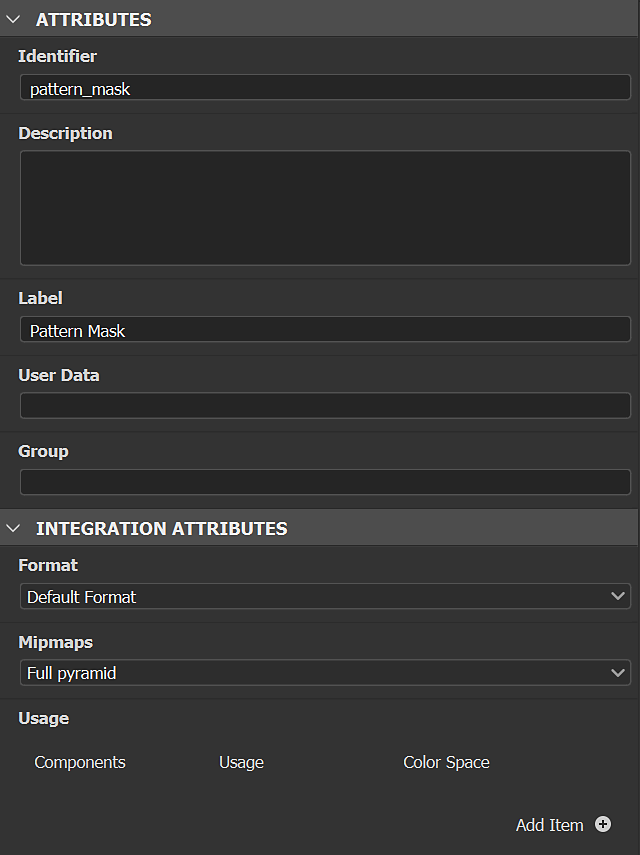

# Generadores de texturas

Los generadores de texturas proporcionan un control mejorado sobre la creación de materiales mediante las opciones de <b>ruidos paramétricos, patrones </b>y<b> grunges</b>. Las imágenes generadas se pueden utilizar en mapas de canales o máscaras.

<table>
<tr style="border: 0;">
<td style="border: 0;" valign="top">

</td>
<td style="border: 0;" valign="top">

Los generadores de texturas son un tipo de recursos de Substance 3D Sampler. Se pueden filtrar en el panel Activos con el icono Generadores de Texturas .

</td>
</tr>
</table>

## Cómo usar los generadores de Textura

### Mapas de canales

Arrastre y suelte un generador de texturas en la vista 3D, la Vista 2D o la pila de capas y seleccione un canal para utilizarlo.

Se creará un filtro de relleno en la pila con el generador de Texturas en la entrada derecha. Puede acceder a las propiedades del generador de Texturas en el panel de propiedades.

#### Filtros

Algunos filtros como <b>Parquet</b> usan generadores de textura predeterminados para las máscaras de motivo. Otros trabajan con una imagen o un generador de Texturas como el filtro <b>Patrón</b>.\
En los filtros, puedes usar generadores de textura en cualquier propiedad de imagen, por ejemplo <b>máscaras personalizadas</b>.

Los filtros pueden sugerir generadores con los que trabajar; se muestran en el nuevo selector de recursos, al hacer clic en una propiedad de imagen.

#### Tutorial

Encontrarás todos los tutoriales de Substance 3D Sampler en nuestra [página de aprendizaje](https://creativecloud.adobe.com/cc/learn/app/substance-3d-sampler).

[Diseño textil con los generadores de Textura de Sampler](https://creativecloud.adobe.com/cc/learn/substance-3d-sampler/web/fabric-texture-generator?locale=en)

[Material de fibra de carbono en minutos con Substance 3D Sampler](https://creativecloud.adobe.com/cc/learn/substance-3d-sampler/web/create-carbon-fiber-material?locale=en)

[Material de tela a cuadros en minutos con Substance 3D Sampler](https://creativecloud.adobe.com/cc/learn/substance-3d-sampler/web/create-plaid-fabric-material?locale=en)

## Cómo crear generadores de texturas personalizados

Puede importar generadores de texturas creados con Adobe Substance 3D Designer mediante el botón *Importar* en las acciones de pila de capas. Se deben crear de una forma específica en Designer para que funcionen correctamente al importarse en Sampler.

### Tipo

Elija &quot;generador de Textura&quot; como gráfico<b> tipo</b>.

#### Salidas

El nodo de salida de los filtros del filtro debe tener definido el <b>identificador</b> o el <b>uso </b>:

* La salida principal del generador de Texturas no debería tener ningún uso. A continuación, 3D Sampler puede reconocerlo como el resultado principal.

<table>
<tr style="border: 0;">
<td style="border: 0;" valign="top">

</td>
<td style="border: 0;" valign="top">

</td>
</tr>
</table>

* El <b>resultado secundario</b> del Generador de Texturas necesita <b>uso</b> para ser usado.\
  Su nombre de grupo sería el <b>Identificador</b> de salida principal.

>[!NOTE]
>
> Si creas tus propios filtros y generadores de Texturas para que funcionen juntos, te recomendamos que utilices <b>usos personalizados</b> según los <b>Identificadores de salida</b>.

<table>
<tr style="border: 0;">
<td style="border: 0;" valign="top">

</td>
<td style="border: 0;" valign="top">

</td>
</tr>
</table>

>[!IMPORTANT]
>
> Si desea que el generador de Texturas personalizado esté en una lista de recursos sugeridos por filtro, debe agregar los siguientes datos de usuario en el gráfico de Substance:
> 
> alchemist::sugeredfilters=[NombreFiltro,NombreFiltro2];

>[!NOTE]
>
> Los datos de usuario se pueden usar con [filtros personalizados](../filters/custom-filters.md).

#### Formato

Exportar el filtro como archivo de almacenamiento de Substance (.sbsar)

>[!NOTE]
>
> Puede exponer parámetros de filtro para controlar el filtro directamente en Sampler. Ver instrucciones [aquí](https://experienceleague.adobe.com/es/docs/substance-3d-designer/using/substance-graphs/manage-parameters/exposing-a-parameter)
