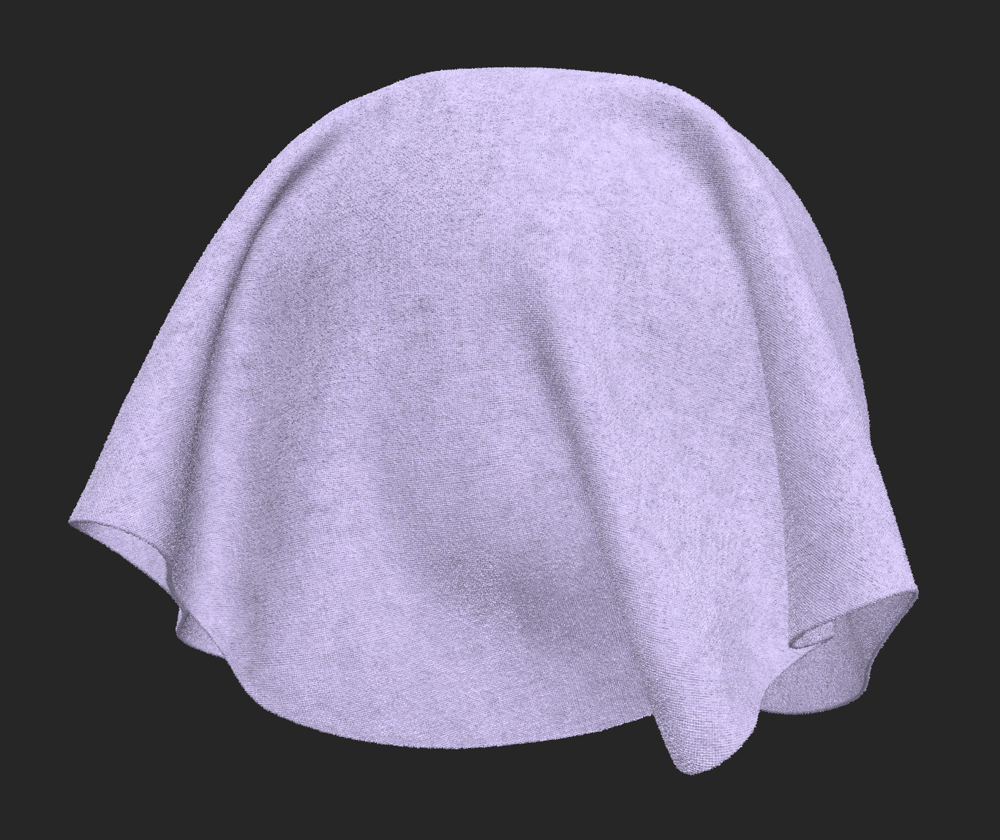

# Relleno

<table>
<tr style="border: 0;">
<td width="41.60%" style="border: 0;" valign="top">

**En:** Ajustes

</td>
<td width="58.30%" style="border: 0;" valign="top">

## Descripción

El **filtro Rellenar** te permite reemplazar o ajustar los valores de canales específicos en función de un valor seleccionado.
A partir de Sampler 6.0, el filtro Relleno adapta sus parámetros en función del tipo de canal al que se aplica. Esto garantiza que los controles disponibles siempre coincidan con el significado físico y el tipo de datos del canal seleccionado, y que el filtro se pueda aplicar a cualquier mapa, incluso desde flujos de trabajo personalizados.

En las imágenes siguientes, se ha reemplazado el canal de color base.

<table>
<tr style="border: 0;">
<td style="border: 0;" valign="top">

{width="200px"}

</td>
<td style="border: 0;" valign="top">

{width="200px"}

</td>
</tr>
</table>

</td>
</tr>
</table>

## Parámetros

<b>Aplicado a...</b>

El menú desplegable Aplicado a... determina a qué canal afecta el filtro Relleno.
**En esta lista solo aparecen los canales que están habilitados actualmente en la configuración de canales del material.** Si el canal que desea rellenar no está disponible:

* Abra el panel de ajustes de canal (en la parte inferior de la barra de navegación izquierda)
* Haga clic en &quot;Editar lista&quot;
* Activar el canal deseado
* Volver a aplicar o actualizar el filtro Rellenar

Una vez habilitado, el canal estará disponible en el menú desplegable Aplicado a...

<b>Parámetros básicos</b>

Los parámetros del filtro de relleno **cambian dinámicamente en función del tipo de canal** seleccionado en Aplicado a... Hay cuatro conjuntos de parámetros, cada uno correspondiente a un tipo específico de mapa.

### Parámetros de mapa de color

Se utiliza cuando el filtro Relleno se aplica a los canales de color.

#### Canales de ejemplo:

* Color base
* Color de capa
* Color de subsuperficie...

#### Parámetros disponibles

* Color
Selecciona el color del RGB utilizado para rellenar el canal.
* Valor personalizado
Cambie el botón deslizante para abrir el mapa personalizado. Seleccione una imagen para reemplazar el canal seleccionado o pinte directamente en la **vista 2D**.
* Grano aleatorio
Cambia la aleatorización utilizada cuando se habilitan las variaciones de procedimientos.
* Modo de fusión
Determina cómo se fusiona el relleno con las capas inferiores (por ejemplo: Copiar, Agregar, Multiplicar).
* Opacidad
Ajuste la opacidad de la información del nuevo canal en relación con la información del canal existente. En otras palabras, esto controla la opacidad de la máscara utilizada para aplicar el nuevo relleno de canal.

Este modo se suele utilizar para inicializar o reemplazar la información de color.

### Parámetros de mapa de escala de grises

Se utiliza cuando el filtro Relleno se aplica a canales de escala de grises escalares.

#### Canales de ejemplo:

* Rugosidad especular
* Metalicidad base
* Opacidad
* Height...

#### Parámetros disponibles

* Valor
Define un único valor de escala de grises para el canal.
* Grano aleatorio
Cambia la aleatorización utilizada cuando se habilitan las variaciones de procedimientos.
* Valor personalizado
Cambie el botón deslizante para abrir el mapa personalizado. Seleccione una imagen para reemplazar el canal seleccionado o pinte directamente en la **vista 2D**.
* Modo de fusión
Copiar, Añadir (Sobreexposición lineal), Sustract, Multiply, Añadir Sub, Max (aclarar), Min (oscurecer), Cambiar, Dividir, Superponer, Trama, Luz suave.
Seleccione el modo de fusión para fusionar la entrada personalizada con las capas siguientes.
* Opacidad
Ajuste la opacidad de la información del nuevo canal en relación con la información del canal existente. En otras palabras, esto controla la opacidad de la máscara utilizada para aplicar el nuevo relleno de canal.

Este modo resulta útil para definir propiedades físicas uniformes, como un valor de rugosidad u opacidad constante.

#### Parámetros normales del mapa

Se utiliza cuando el filtro Relleno se aplica a los canales **Normal**.

##### Canales de ejemplo:

* Normal
* Capa normal

##### Parámetros disponibles

* Grano aleatorio
Cambia la aleatorización utilizada cuando se habilitan las variaciones de procedimientos.
* Valor personalizado
Cambie el botón deslizante para abrir el mapa personalizado. Seleccione una imagen para reemplazar el canal seleccionado o pinte directamente en la **vista 2D**.
* Opacidad
Ajuste la opacidad de la información del nuevo canal en relación con la información del canal existente. En otras palabras, esto controla la opacidad de la máscara utilizada para aplicar el nuevo relleno de canal.

Este modo se utiliza principalmente para restablecer o neutralizar la información normal, o para establecer una línea de base limpia antes de agregar detalles normales.

### Parámetros de valor uniformes

Se utiliza para canales que dependen de un único valor físico uniforme en lugar de un mapa de textura.

#### Canales de ejemplo

* Specular IOR...

#### Parámetros disponibles

* Grano aleatorio
Cambia la aleatorización utilizada cuando se habilitan las variaciones de procedimientos.
* Valor
Define el valor constante aplicado al canal.
* Modo de fusión
Entre Normal y Multiplicar

Este modo resulta especialmente útil cuando se trabaja con comportamientos de materiales avanzados introducidos a través de plantillas, donde algunas propiedades se controlan mediante valores escalares en lugar de mapas.

## Casos de uso habituales

El filtro Relleno se suele utilizar para lo siguiente:

* Inicialización de canales al crear un material desde cero
* Reemplazar valores de canal existentes
* Definir propiedades físicas uniformes (por ejemplo, rugosidad o metalidad fijas)
* Neutralice canales como Normal antes de reconstruir los detalles
* Ajusta rápidamente propiedades avanzadas como el espolón, la translucidez o los valores de revestimiento

Dado que el filtro Rellenar se adapta automáticamente al canal seleccionado, proporciona un flujo de trabajo coherente y predecible en todos los tipos de material.
