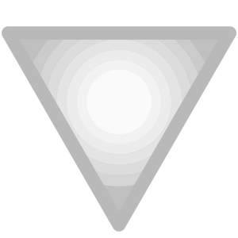

# Intensidad

<table>
<tr style="border: 0;">
<td width="41.60%" style="border: 0;" valign="top">

**En:** Ajustes

</td>
<td width="58.30%" style="border: 0;" valign="top">

## Descripción

El filtro Intensidad le permite ajustar rápidamente la intensidad de los canales Color base o Difusión de su material.

La intensidad y la saturación funcionan de forma similar, ya que aumentan la intensidad de los colores. Mientras que Saturación aumenta la intensidad de todos los colores en la imagen, Intensidad aumenta principalmente la intensidad de los tonos apagados o apagados.

</td>
</tr>
</table>

## Parámetros

**Parámetros básicos**

* **Intensidad**: -1 a 1\
  Aumente o disminuya la intensidad del color base o del canal difuso.

**Máscara**

* **Usar máscara personalizada**: alternar\
  Activar o desactivar el uso de una máscara personalizada. Si se ha activado, aparecerán los siguientes parámetros:
  * **Máscara**: imagen/pincel\
    Seleccione una imagen para utilizarla como máscara o utilice el pincel para pintar una máscara personalizada directamente en la vista 2D
  * **Máscara personalizada - Desenfocar**: 0-1\
    Desenfocar la máscara
  * **Máscara personalizada - Invertir**: alternar\
    Invertir la máscara
