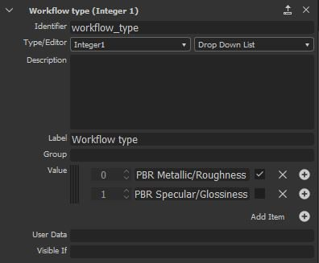

# Filtros personalizados

## Filtros personalizados de Substance

Puedes importar filtros creados con Adobe Substance 3D Designer mediante el botón *Importar* en las acciones de pila de capas.

### Crear un filtro de Substance

Los filtros se deben crear de una forma específica en Designer para que funcionen correctamente una vez importados en Sampler.

Los nodos de entrada y salida del filtro deben tener definido un identificador o un uso.

>[!NOTE]
>
> Es posible usar el **uso** o el **identificador** (el uso tiene la prioridad).

#### Formato

Exportar el filtro como archivo de almacenamiento de Substance (.SBSAR)

>[!NOTE]
>
> Puede exponer parámetros de filtro para controlar el filtro directamente en Sampler. Ver instrucciones [aquí](https://experienceleague.adobe.com/en/docs/substance-3d-designer/using/substance-graphs/manage-parameters/exposing-a-parameter)

#### Creación de un filtro para modificar imágenes

| Nombre de imágenes | Uso |
| --- | --- |
| *Examen1* | **scan1** |
| *Examen2* | **scan2** |
| *...* | **...** |

#### Crear un filtro para modificar canales

| Nombre del canal | Uso |
| --- | --- |
| *Color base* | **basecolor** |
| *Difusión* | **difusa** |
| *Specular* | **specular** |
| *Specular level* | **nivel especular** |
| *Metálico* | **metálico** |
| *Rugosidad* | **rugosidad** |
| *Brillo* | **brillo** |
| *Normal* | **normal** |
| *Height* | **height** |
| *Oclusión de ambiente* | **ambientOcclusion** |
| *Opacidad* | **opacidad** |

>[!IMPORTANT]
>
> Al crear un filtro personalizado para Sampler, debe añadir los siguientes datos de usuario en el gráfico de Substance:
>
> alchemist::type=filter;

>[!IMPORTANT]
>
> Si, en su paquete, tiene un gráfico para procesar imágenes (scan1 para scanX) y un gráfico para procesar materiales (canales PBR), Sampler puede elegir el gráfico correcto en función de dónde se inserte el filtro en la pila de capas.
>
> En el gráfico de &quot;imagen&quot;, añada los siguientes datos de usuario:
>
> * alchemist::type=filter;alchemist::variation::type=multi
>
> En el gráfico &quot;material&quot;, añada los siguientes datos de usuario:
>
> * alchemist::type=filter;alchemist::variation::type=material

### Parámetros específicos

La aplicación administra globalmente parámetros específicos. Es una forma de utilizar parámetros globales de la aplicación, el proyecto y la pila de capas en los filtros personalizados.

#### Formato normal

Control del formato normal sobre la aplicación. Establecer en DirectX en Sampler

**Identificador de parámetro**: normalformat, normal_format, $normalformat, $normal_format

#### Recuento de entradas

Si desea modificar imágenes (scan1 a scanX), puede utilizar el número de imágenes de la pila de capas mediante el parámetro **Número de imágenes**.

* **Identificador de parámetro**: input_count
* **Tipo de parámetro**: entero1

#### Entrada de material

Si desea mostrar una ranura de material en la pila de capas como el atlas scatter o la salpicadura:

* Añadir un nuevo conjunto de nodos de entrada (Color base, Normal, ... )
* Todos los nodos Input del fondo (material inferior de la pila de capas) deben estar en el grupo **Material1**
* Todos los nodos de entrada del primer material que desee agregar en la parte superior deben estar en el grupo **Material2** y, etcétera, si desea varias ranuras de material.
* Añada un parámetro de entrada de material:
  * **Identificador de parámetro**: material_input
  * **Tipo de parámetro**: entero1

#### Tipo de flujo de trabajo

Si desea mostrar u ocultar algunos parámetros basados en el flujo de trabajo del proyecto (Specular/brillo PBR Metálico/Rugosidad o PBR), puede utilizar el parámetro Tipo de flujo de trabajo

**Identificador de parámetro**: workflow_type

**Tipo de parámetro**: entero1, lista desplegable

opciones:

* 0: PBR Metálico/Rugosidad
* 1: SPECULAR/Brillo PBR

{width="300px"}
