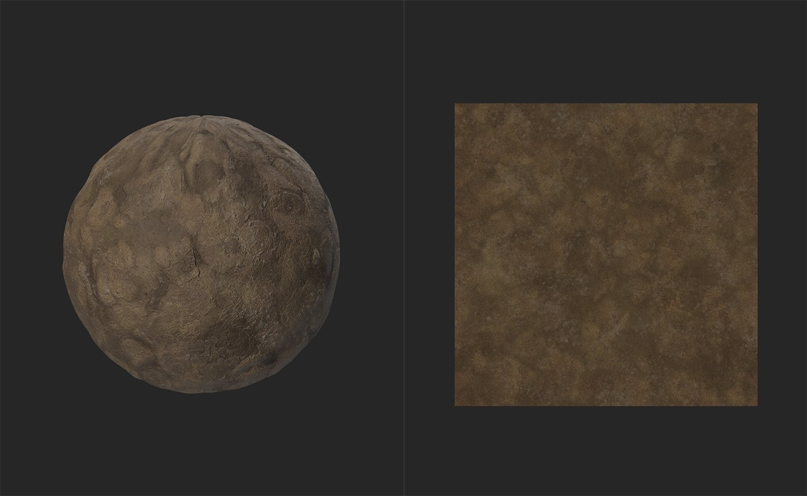

# Atlas scatter

<table>
<tr style="border: 0;">
<td width="41.60%" style="border: 0;" valign="top">

**En:** Generadores

</td>
<td width="58.30%" style="border: 0;" valign="top">

## Descripción

El filtro de Atlas scatter dispersión instancias de los elementos de un material de atlas a través del material subyacente. El atlas scatter es útil para esparcir elementos como hojas, rocas o basura por un material de forma natural.

Las imágenes siguientes muestran el **filtro de Atlas scatter** en acción.

Antes de usar el **filtro de Atlas scatter**, tenemos un material básico de barro, no muy emocionante.

Al agregar el **filtro de Atlas scatter** con un atlas de piedras, el material se vuelve más interesante a medida que las piedras se dispersan y se mezclan de manera realista con el barro subyacente.

</td>
</tr>
</table>

## Parámetros

**Parámetros básicos**

* **Cantidad X**: 1-64\
  Número de instancias en el eje X
* **Importe Y**: 1-64\
  Número de instancias en el eje Y
* **Modo de fusión**:\
  Método utilizado para fusionar con capas subyacentes
* **Escala**: 0-5\
  Escala de instancias
* **Posición aleatoria**: 0-2\
  Aumentar o reducir el desplazamiento aleatorio de instancias desde posiciones de cuadrícula
* **Escala de Height**: 0-1\
  Ajuste del height de instancias
* **Ajustar al fondo**: 0-1\
  Cambiar el impacto de los valores de height subyacentes en instancias dispersas
* **Color de fondo**:
  * **Tono:** 0-1\
    Ajustar el tono de las instancias
  * **Saturación:** 0-1\
    Ajuste de la saturación de instancias
  * **Valor:** 0-1\
    Ajustar el valor de las instancias

**Máscara**

* **Máscara personalizada**: alternar\
  Activar o desactivar el uso de una máscara personalizada. Cuando se activa, aparecen los siguientes controles:
  * **Máscara personalizada:**\
    Seleccione un archivo para utilizarlo como máscara o utilice el modo de pincel para aplicar una máscara manualmente.
  * Alternar **Máscara invertida:**\
    Invertir el valor de la máscara
* **Aleatorio de máscara**: 0-1\
  Ocultar un porcentaje de instancias de forma aleatoria

**Tamaño**

* **Escala aleatoria**: 0-1\
  Cantidad de escala aleatoria que se aplicará a cada instancia
* **Escalar sin superposición**: 0-1\
  Ajuste la escala de cada instancia para evitar la superposición de instancias

**Height**

* **Desplazamiento de Height**: -1 a 1\
  Desplazar el height de instancias desde el nivel base de 0
* **Aleatorio de desplazamiento de Height**: 0-1\
  Añada un valor aleatorio al desplazamiento de height para cada instancia
* **Sesgar desde Pendiente grande**: 0-1\
  Ajuste de sesgo de normales basado en la pendiente de fondo
* **Smoothness de fondo**: 0-2\
  Ajustar Smoothness de fondo

**Rotación**

* **Rotación**: 0-1\
  Rotar todas las instancias mediante un valor definido
* **Aleatorio de rotación**: 0-1\
  Añadir un valor aleatorio a la rotación de cada instancia
* **Rotación desde Pendiente grande**:\
  Rotar instancias en función de la pendiente del material subyacente

**Ajustes de materiales de Atlas**

* **Ajuste de color**:\
  Ajuste de los valores de HSV para el atlas
* **Aleatorio de color**:\
  Agregue aleatoriedad a los valores de HSV establecidos en **Ajuste de color**
* **Rugosidad del fondo**: 0-1\
  Utilice la rugosidad del fondo en lugar de la rugosidad de cada instancia.
* **Ajuste de rugosidad**: -1 a 1\
  Añada o reste valores de rugosidad de cada instancia.
* **Aleatorio normal**: 0-1\
  Rotar normales de cada instancia mediante un valor aleatorio por instancia
* **Recalcular Oclusión ambiental**: alternar\
  Si está activada, los valores de Oclusión ambiental se recalcularán en función de los valores de height modificados

**Detección de formas en Atlas**

* **Intervalo de patrones**:\
  Limite los activos disponibles del atlas en función de la posición. Deje los valores X e Y en 0 para utilizar todos los recursos del atlas.
* **Opacidad Atlas De Escala Baja**: 0-4
* **Precisión de detección de formas**:\
  Seleccione el algoritmo que desea detectar las formas. Los diferentes atlas se adaptarán a diferentes algoritmos de detección. Ningún modo de error es más costoso desde el punto de vista informático que ninguna de las otras opciones.
* **Omitir forma menor que**: 0-1\
  Utilice esta opción para evitar que aparezcan formas muy pequeñas como elementos individuales.

Guía de uso

El filtro de Atlas scatter es una forma útil de dispersión de recursos en el material, como hojas, piedras o basura. Para utilizar el filtro de Atlas scatter, necesitará un material de atlas para que el filtro pueda procesarse.

>[!NOTE]
>
> Un material de atlas es un material que contiene una colección (o atlas) de activos independientes. Por ejemplo, Sampler incluye de forma predeterminada las hojas de laurel seco, un material de atlas porque contiene una colección de hojas en un único material en el que cada hoja es independiente entre sí. El nodo Atlas scatter utiliza un algoritmo para controlar cada hoja del material del atlas como un elemento independiente.

Para utilizar el filtro de Atlas scatter:

1. Añadir el Atlas scatter a la pila de capas
1. Debajo de la capa de Atlas scatter, aparecerá una ranura de entrada
1. Arrastre el material del atlas a la ranura de entrada de Atlas scatter

Puede ajustar los parámetros de dispersión en el **panel Propiedades** seleccionando la capa de Atlas scatter.

Puede ajustar los parámetros del material del atlas en el **panel Propiedades** seleccionando el material en la ranura de entrada.
