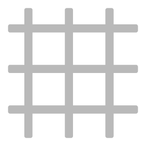

# Panel

<table>
<tr style="border: 0;">
<td width="41.60%" style="border: 0;" valign="top">

**En:** Generadores

</td>
<td width="58.30%" style="border: 0;" valign="top">

## Descripción

Convierte tu material en paneles. El filtro Paneles es especialmente adecuado para materiales metálicos.

*Material metálico continuo convertido en paneles.*

{width="200px"}

{width="200px"}

</td>
</tr>
</table>

## Parámetros

**Ajustes preestablecidos**

Utilice los ajustes preestablecidos para modificar rápidamente los parámetros y crear un efecto específico.

**Parámetros básicos**

* **Raíz aleatoria**:\
  La velocidad aleatoria determina los valores aleatorios de otros parámetros que utilizan aleatoriedad en este filtro.
* **Cantidad X**: 0-20\
  Cambiar el número de paneles en el eje X
* **Importe Y**: 0-20\
  Cambiar el número de paneles en el eje Y
* **Tipo de costura**:\
  Selección de diferentes estilos de juntas entre paneles
* **Usar elementos de sujeción**:\
  Añade fijadores entre los paneles. Cuando se activa, la sección Sujetadores aparecerá en la lista de parámetros.

**Paneles**

* **Importe de desplazamiento**: 0-1\
  Desplace cada fila de paneles de la fila anterior en un porcentaje del tamaño del panel.
* **Desplazamiento aleatorio**: 0-1\
  Agregar un valor aleatorio al desplazamiento de cada fila
* **Desplazamiento vertical**: alternar\
  Cambiar entre desplazamiento horizontal y desplazamiento vertical.
* **Tensión abultada**: -1 a 1\
  Modifique los valores normales de cada panel para que parezca que el panel se bombea hacia dentro o hacia fuera debido a la presión.
* **Arrugas**: 0-1\
  Añade sutiles abolladuras y arrugas a los paneles
* **Variación de color**: 0-1\
  Variación aleatoria del color entre paneles individuales
* **Variación de reflejo**: 0-1\
  Variar aleatoriamente la rugosidad de los paneles individuales

**Costuras**

La selección de parámetros en esta sección depende del valor elegido en **Parámetros básicos > Tipo de unión**.

* ***Hueco***
  * **Ancho de unión**: 0-1\
    Modificación de la anchura entre paneles
  * **Variación de hueco**: 0-1\
    Desplace los paneles un poco para que los espacios entre los paneles varíen en anchura
  * **Redondeo de vértice de hueco**: 0-1\
    Redondear los bordes de los paneles
  * **Bisel de hueco**: 0-1\
    Biselar los bordes de los paneles
* ***Soldadura***
  * **Ancho de unión**: 0-1\
    Modificación de la anchura entre paneles
  * **Calidad de soldadura**: 0-1\
    Ajustar la uniformidad de la soldadura
  * **Decoloración de la soldadura**: 0-1\
    Modifique la cantidad de decoloración de la soldadura en comparación con el color de los paneles.
  * **Reemplazar material de soldadura**: alternar\
    Active esta opción para personalizar el material utilizado para crear la soldadura. Si está activado, aparecerán los siguientes parámetros adicionales:
    * **Color de material de soldadura**: selección de color\
      Seleccione el color de la soldadura. Esto se verá afectado por la **decoloración de la soldadura**.
    * **Rugosidad del material de soldadura**: 0-1\
      Ajuste la rugosidad de la unión de soldadura entre los paneles
* ***Superponer***
  * **Ancho de unión**: 0-1\
    Modificación de la anchura entre paneles
* ***Junta de pie***
  * **Ancho de unión**: 0-1\
    Modificación de la anchura entre paneles

**Elementos de sujeción**

* **Tipo de elemento de sujeción**:\
  Seleccione el estilo de fijación que se utilizará entre los paneles
* **Cantidad de fijador**: 3-10\
  Cambie el número de elementos de fijación que se deben utilizar a lo largo del borde entre dos paneles cualesquiera.
* **Tamaño de fijador**: 0-1\
  Modificar el tamaño de los elementos de fijación
* **Variación de sujetador**: 0-1\
  Desplazamiento de la posición de los elementos de fijación
* **Reemplazar material de fijación**: alternar\
  Modifique el material utilizado para los fijadores por separado del material base. Cuando se activa, aparecen los siguientes parámetros:
  * **Color del material del fijador**: selección de color\
    Seleccione el color del material de fijación
  * **Rugosidad del material del fijador**: 0-1\
    Modificar la rugosidad del material de fijación

**Avanzado**

* **Intensidad** **normal**: 0-3\
  Ajustar la intensidad normal general del material
* **Rango de Height de costuras**: 0-1\
  Modifique la altura a la que se elevan las costuras personalizadas sobre los paneles
* **Rango de Height del fijador**: 0-1\
  Modificación del height de los elementos de fijación
* **Profundidad de Height AO**: 0-1\
  Cambiar la intensidad del AO
* **Radio AO**: 0-1\
  Modificar el radio del AO
