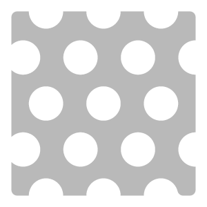

# Perforar

<table>
<tr style="border: 0;">
<td width="41.60%" style="border: 0;" valign="top">

**En:** Generadores

</td>
<td width="58.30%" style="border: 0;" valign="top">

## Descripción

Utilice el filtro Perforar para añadir taladros al material.

*Antes y después de aplicar el filtro **Perforar**.*

<table>
<tr style="border: 0;">
<td style="border: 0;" valign="top">

{width="200px"}

</td>
<td style="border: 0;" valign="top">

{width="200px"}

</td>
</tr>
</table>

</td>
</tr>
</table>

## Parámetros

**Parámetros básicos**

* **Raíz aleatoria**:\
  La velocidad aleatoria determina los valores aleatorios de otros parámetros que utilizan aleatoriedad en este filtro.
* **Selección de motivo**:\
  Seleccione la forma de los taladros o elija Motivo personalizado para crear el suyo propio.
* **Posición de perforación**:\
  Seleccione si las normales y el height se retiran en el material o se destacan del material
* **Tamaño de chaflán de perforación**: 0-1\
  Cambio del tamaño del chaflán en las aristas de los taladros
* **Tamaño de taladro**: 0-1\
  Cambio del tamaño de los taladros
* **Usar máscara**: alternar\
  Habilita la **sección Máscara**, que puede usar para enmascarar la perforación con un pincel o una imagen.
* **Usar mapa de escala**: alternar\
  Permite el uso de un mapa de escala. Cuando se activa, aparecerán los siguientes parámetros:
  * **Multiplicador de mapa de escala**: 0-1\
    Ajuste el impacto del mapa de escala en la escala de la perforación
  * **Invertir mapa de escala**: alternar\
    Invertir los valores del mapa de escala
  * **Asignación de escala personalizada**: imagen/pincel\
    Importa una imagen para usarla como mapa de escala o usa el pincel para pintar un mapa de escala directamente en la **vista en 2D** **3&rbrace;**

**Máscara**

Esta sección solo está visible si **Parámetros básicos > Usar máscara** está habilitado

* **Invertir máscara**:
* **Desenfoque de máscara**: 0-1\
  Ajustar el desenfoque aplicado a la máscara
* **Umbral de máscara**: 0-1\
  Modifique el umbral de la máscara. Utiliza los valores de **Desenfoque de máscara** y **Umbral de máscara** para perfeccionar los bordes de tu máscara.
* **Máscara personalizada**: imagen/pincel\
  Importa una imagen para usarla como máscara o pinta tu propia máscara directamente en la **vista en 2D**

**Perforación**

* **Tamaño de perforación**: 0-1\
  Cambie el tamaño de cada perforación, incluidos el taladro y el chaflán.
* **Cantidad Y De Perforación**: 1-64\
  Ajustar el número de perforaciones en el eje Y
* **Cantidad X de perforación**: 1-64\
  Ajustar el número de perforaciones en el eje X
* **Densidad de perforación**: 0-1\
  Perforaciones de máscara aleatoria
* **Desplazamiento de perforación**: 0-1\
  Ajuste el desplazamiento de cada segunda fila de perforaciones
* **Opacidad de color de perforación**: 0-1\
  Ajustar la transparencia del color del área biselada de las perforaciones
* **Color de perforación**: selección de color\
  Seleccione el color del área biselada de cada perforación
* **Rugosidad de perforación**: 0-1\
  Modificación del valor de rugosidad de las perforaciones
* **Perforación metálica**: 0-1\
  Modificación del valor metálico de las perforaciones

**Parámetros avanzados**

* **Luminosidad**: 0-1
* **Contraste**: -1 a 1
* **Cambio de tono**: 0-1
* **Saturación**: 0-1
* **Intensidad normal**: -1 a 1\
  Ajuste la intensidad de cada perforación normal
* **Intensidad de Height**: 0-1\
  Ajuste la intensidad de cada mapa de height de perforaciones
