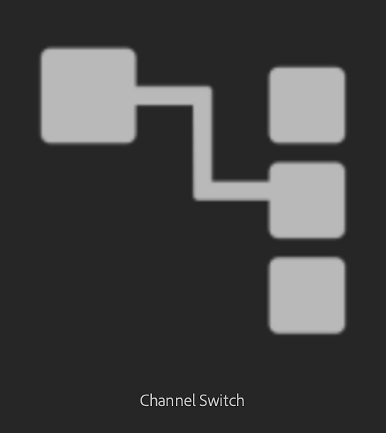

# Conmutador de canal

<table>
<tr style="border: 0;">
<td width="41.60%" style="border: 0;" valign="top">

</td>
<td width="58.30%" style="border: 0;" valign="top">

## Descripción

Cambie los canales de los mapas de salida del material.

</td>
</tr>
</table>

## Parámetros

**Parámetros básicos**

* **Dibujar trama personalizada:** Dibuje las tramas en la ventana gráfica 2D.
* **Canal de entrada:** Seleccione qué canal se moverá el filtro.
* **Canal de salida:** Seleccione qué canal es el destino del canal de entrada.
* **Opacidad:** 0-1\
  Ajuste la opacidad de la información del canal en relación con la información del canal existente. En otras palabras, esto controla la opacidad de la máscara utilizada para aplicar el nuevo relleno de canal.
* **Modo de fusión**&#x200B;**:** Seleccione el modo de fusión para el canal de color base. El cambio del modo de fusión puede cambiar sustancialmente el aspecto del canal.

**Avanzado**

* **Entrada de material:** Seleccione el material que desea usar como entrada.

**Máscara**

* Conmutador **Usar máscara personalizada:**\
  Activar o desactivar el uso de una máscara personalizada. Si se ha activado, aparecerán los siguientes parámetros:
* **Máscara personalizada - Desenfocar:** 0-1\
  Desenfoca la máscara.
* Conmutador **Máscara personalizada - Invertir:**\
  Invierte la máscara.
