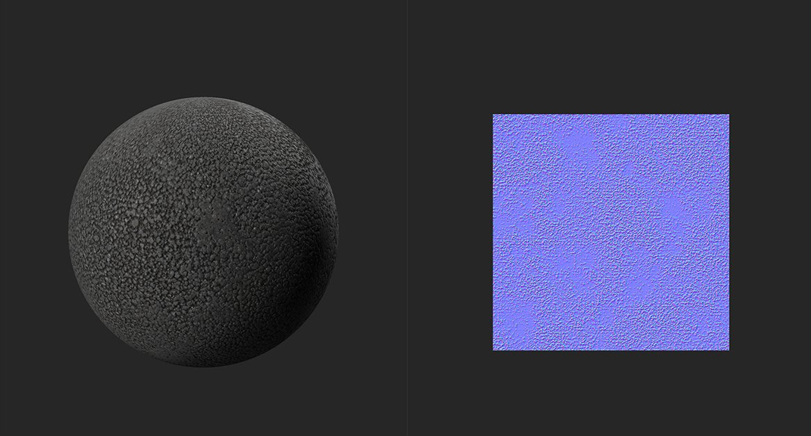

# Height a Normal

<table>
<tr style="border: 0;">
<td width="41.60%" style="border: 0;" valign="top">

**En:** Herramientas

</td>
<td width="58.30%" style="border: 0;" valign="top">

## Descripción

Generar datos de canal normal basados en el canal de height.

En las imágenes siguientes puedes ver el **Height a filtro normal** en acción.

En la imagen de arriba, no hay datos normales del material. Solo está disponible el mapa del height, que se muestra en la **vista 2D**.

Con el filtro **Height a normal**, los datos normales se generan a partir del mapa de height que se muestra en la imagen superior. La luz rebota de forma más realista en el material de la segunda imagen gracias al mapa normal generado.

</td>
</tr>
</table>

## Parámetros

**Parámetros básicos**

* **Usar unidades del mundo**: alternar\
  Cambie si los parámetros se miden usando unidades del mundo real o no. Esto modifica los parámetros que están disponibles.
  * **Si Usar unidades del mundo está habilitado:**
    * **Tamaño de superficie (cm)**: 0-500\
      Establecer el tamaño del espacio UV en unidades de mundo
    * **Profundidad de Height (cm)**: 0-10\
      Establezca la distancia representada por el mapa de height. Si el mapa de height representa una distancia pequeña, una gran diferencia en los valores del mapa de height puede tener un pequeño impacto en el ángulo normal. Si el mapa de height representa una distancia grande, una pequeña diferencia en los valores del mapa de height puede representar un ángulo grande en el mapa normal.
  * **Si Usar unidades del mundo está deshabilitado:**
    * **Intensidad**: 0-3\
      Ajuste la inclinación de los ángulos normales
* **Combinar normal inferior**: 0-1\
  Añada la asignación normal existente a los resultados de este filtro.

**Máscara**

* **Máscara personalizada**: alternar\
  Activar o desactivar el uso de una máscara personalizada. Si se ha activado, aparecerán los siguientes parámetros:
  * **Máscara**: imagen/pincel\
    Seleccione una imagen para utilizarla como máscara o utilice el pincel para pintar una máscara personalizada directamente en la vista 2D
  * **Máscara personalizada - Desenfocar**: 0-1\
    Desenfocar la máscara
  * **Máscara personalizada - Invertir**: alternar\
    Invertir la máscara
