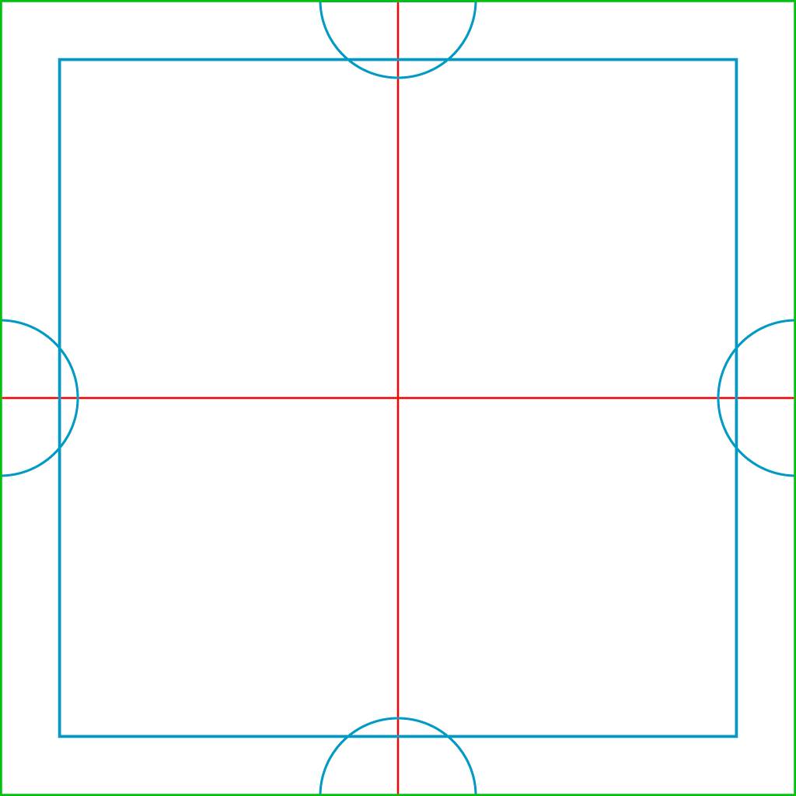

# Convertir en mosaico

<table>
<tr style="border: 0;">
<td width="41.60%" style="border: 0;" valign="top">

**En:** Generadores

</td>
<td width="58.30%" style="border: 0;" valign="top">

## Descripción

Usa el filtro **Convertir en mosaico** para que el material se pueda poner en mosaico. El **filtro Mosaico** también hace que el material sea mosaico, pero cada filtro funciona de una manera diferente. Si el filtro **Hacer que el mosaico** no funcione para ti, prueba el **filtro Mosaico**.

En las imágenes siguientes, puedes ver cómo el filtro **Convertir en mosaico** puede convertir un material que no sea de mosaico en un material en mosaico. Este material se enmarca bien porque sigue un patrón similar a la cuadrícula y no hay puntos específicos que atraigan el enfoque.

En la imagen de arriba, la línea roja muestra el límite del material. Está bastante claro que hay una costura fuerte, y que este material no es de baldosas.

Después de **Make it Tile**, este material se aleja bien y sin la línea roja, sería imposible ver las costuras en los límites del material.

</td>
</tr>
</table>

## Parámetros

**Parámetros básicos**

* **Umbral**: 0-1\
  Ajuste el tamaño y la coincidencia de la capa superior.
* **Smoothness**: 0-1\
  Suaviza la costura de la capa superior.
* **Contraste**: 0-1\
  Ajusta el contraste de la costura. Reducir el contraste tiene el mismo efecto que desenfocar la costura.
* **Eliminación de manchas**: alternar\
  Si se activa, el filtro intentará eliminar los artefactos cerca de la unión entre las capas superior e inferior.
* **Color Equalizer**: 0-50\
  Ecualice los valores de color para disminuir la visibilidad de la unión.
* **Coincidencia de Height**:\
  Cambie la forma en que se mezclan los mapas de height para las capas superior e inferior del filtro. Para ver los resultados con más claridad, vea el canal de height en la **vista 2D**. Tenga en cuenta que la coincidencia de height no afecta a los canales que no sean el canal de height, por lo que las normales y el AO no se verán afectados por los cambios en la coincidencia de height.

**Parámetros avanzados**

* **Influencia de crominancia**: 0-1\
  Ajuste la cantidad de valores de color que afectan a la unión.
* **Invertir máscara**: alternar\
  Invierte las máscaras de las capas superior e inferior.
* **Smoothness de coincidencia de Height**: 0-16\
  Ajusta el desenfoque de la coincidencia de height entre las capas superior e inferior.
* **Origen del parche izquierdo/derecho**: -1 a 1\
  Ajuste la ubicación de origen de los parches izquierdo y derecho.
* **Origen del parche superior/inferior**: -1 a 1\
  Ajuste la ubicación de origen de los parches superior e inferior.

## Guía de uso

El **filtro Hacer mosaico** **funciona superponiendo varias copias del material una sobre la otra.**

En la siguiente imagen se muestra el diseño de las capas:

* El perímetro verde muestra los bordes del material resultante del filtro **Convertir en mosaico**
* Las líneas rojas muestran los bordes de la capa inferior. La capa inferior se desplaza un 50% del espacio UV en los ejes X e Y, por lo que las líneas rojas son costuras de azulejo que deben cubrirse.
* El cuadrado azul y los semicírculos cubren las costuras rojas. Los parámetros del filtro le permiten ajustar los bordes de las formas azules para garantizar que la costura roja no sea visible, mientras que la costura azul se mantiene lo más suave posible.

{width="512px"}

Los semicírculos izquierdo y derecho coinciden entre sí para garantizar que los mosaicos de material se coloquen horizontalmente, mientras que los semicírculos superior e inferior garantizan que los mosaicos de material se coloquen verticalmente. El cuadrado azul en el centro elimina las costuras restantes para crear un material totalmente mosaico sin costuras.
