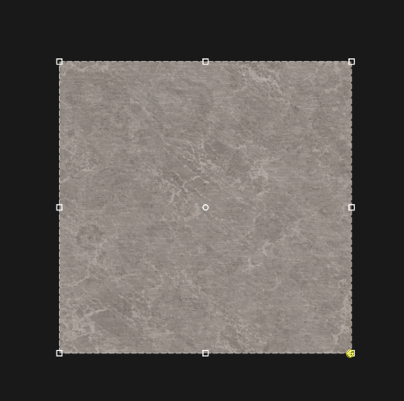

# Transformar

<table>
<tr style="border: 0;">
<td width="41.60%" style="border: 0;" valign="top">

**En:** Herramientas

</td>
<td width="58.30%" style="border: 0;" valign="top">

## Descripción

Usa la **herramienta Transformar** para mover, escalar o rotar tu imagen o material.

</td>
</tr>
</table>

## Parámetros

**Parámetros básicos**

* **Modo de control**:\
  Elija si desea mostrar parámetros para controlar la transformación con reguladores además de los controladores de la **vista 2D**.

  Con **Widget y parámetros** seleccionados, aparecerán los siguientes controles adicionales:

  * **Transformación segura**: alternar\
    Activar o desactivar transformaciones seguras. Cuando está activado, el nodo de transformación mantiene el mosaico y evita perder detalles de píxeles debido a pequeños desplazamientos y rotaciones. Esto reduce la libertad que tiene para controlar la transformación y al habilitar **Transformación segura** se ocultarán algunos parámetros.
  * **Mantener proporción**: alternar\
    Cuando se habilita, solo se muestra un parámetro **Scale** que controla la escala en ambos ejes simultáneamente. Cuando esté desactivada, los controles estarán disponibles para modificar la escala en los ejes Horizontal y Vertical por separado.

    * **Escala**: 0-1\
      Dependiendo de si **Mantener relación** está habilitado o deshabilitado, habrá 1 o 2 reguladores disponibles para ajustar la escala.
  * **Rotación**; 0-360\
    Gire la entrada dentro de los controles.
  * **Sesgar**: -1 a 1\
    Sesgar la entrada dentro de los controles en los ejes horizontal y vertical.
* **Desplazamiento de posición**: -1 a 1\
  Desplace la transformación desde la posición inicial en los ejes horizontal y vertical.
* **Voltear horizontal**: alternar\
  Reflejar la entrada horizontalmente
* **Voltear verticalmente**: alternar\
  Reflejar la entrada verticalmente

**Parámetros avanzados**

* **Transformación**:\
  Ajuste la transformación de los controles con controles deslizantes en lugar de hacerlo en la **vista 2D**.
  * **Escala X**: 0-2
  * **Sesgar vertical**: -7,44 a 2
  * **Sesgar horizontal**: 0-1
  * Escala Y **: 0 - 13,15**
* **Desactivar transformación por canal**: alternar\
  Cuando se activa, aparecen controles adicionales que le permiten desactivar esta transformación para cada canal.

## Guía de uso

Haga clic en la **herramienta Transformar** para agregar una nueva capa de filtro Transformar a la parte superior de la pila de capas.

Al crear o seleccionar una capa de filtro Transformar, se abre automáticamente la **vista 2D**. Con la capa Transformar seleccionada, aparece una **Barra de herramientas** en la parte superior de la **vista 2D**.

## Funcionalidad

{width="300px"}

### Mover

Para mover la capa:

1. Pase el ratón por encima del cuadro de transformación
1. El cursor se convertirá en cuatro flechas
1. Haga clic y arrastre para mover el cuadro de transformación.

### Escala

Para escalar la capa:

1. Pase el ratón sobre uno de los controles situados en el borde o en la esquina del cuadro de transformación
1. El cursor se convertirá en cuatro flechas.
1. Haga clic y arrastre para escalar el cuadro de transformación.

>[!NOTE]
>
> Los controles situados en la esquina del cuadro de transformación le permitirán escalar en dos dimensiones a la vez, mientras que los controles situados en el borde del cuadro de transformación le limitarán a escalar en una dimensión.

### Rotar

Para rotar la capa:

1. Coloque el puntero del ratón fuera del cuadro de transformación, pero dentro de la **vista 2D**.
1. Aparecerá una pequeña flecha horizontal junto al cursor.
1. Haga clic y arrastre para rotar el cuadro de transformación.

>[!NOTE]
>
> Puede cambiar el centro de rotación arrastrando el círculo pequeño situado en el centro del cuadro de transformación. El cuadro de transformación siempre gira alrededor de este círculo.

## Barra de herramientas

{width="200px"}

La barra de herramientas contiene los siguientes métodos abreviados:

* Hazlo cuadrado: Ajuste la escala de la transformación actual para que sea cuadrada.
* Rotación +90° (a la derecha): rotación de 90° hacia la derecha.
* Rotación -90° (a la izquierda): rotación de 90° a la izquierda.
* Restablecer centro de rotación: Restablezca el centro de rotación en el centro del cuadro Transformar.
* Restablecer transformación: Restablezca la herramienta Transformar a su posición predeterminada.
