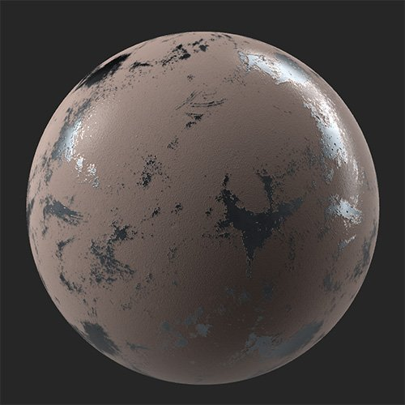

# Pintura

<table>
<tr style="border: 0;">
<td width="41.60%" style="border: 0;" valign="top">

**En:** Desgaste y acabado

</td>
<td width="58.30%" style="border: 0;" valign="top">

## Descripción

El **filtro de pintura** te permite cubrir el material con una capa de pintura de thickness variable.

*Se agregó sobre él un material metálico con pintura desgastada.*

<table>
<tr style="border: 0;">
<td style="border: 0;" valign="top">

{width="200px"}

</td>
<td style="border: 0;" valign="top">

{width="200px"}

</td>
</tr>
</table>

</td>
</tr>
</table>

## Parámetros

**Parámetros básicos**

* **Raíz aleatoria**:\
  La velocidad aleatoria determina los valores aleatorios de otros parámetros que utilizan aleatoriedad en este filtro.
* **Color**: selección de color\
  Defina el color de pintura.
* **Rugosidad**: 0-1\
  Establezca la rugosidad de las áreas que cubre la pintura.
* **Thickness**: 0-1\
  Ajuste la viscosidad y el thickness de la pintura. Esto afecta a la cantidad de height subyacente y a la información normal que se ve a través de la pintura.
* **Pelar**: 0-1\
  Añade parches en los que la pintura se haya despegado del material subyacente.
* **Grano**: 0-1\
  Cambie el grano de la superficie de la pintura.
* **Tamaño de grano**: 1-5\
  Ajuste la escala de la textura utilizada para crear los granos.

**Máscara**

* **Máscara de cavidad**: alternar\
  Cree una máscara basada en las cavidades que se encuentran en el mapa de height. Si se ha activado, aparecerán los siguientes parámetros:
  * **Tamaño de cavidad**: 0-1\
    Ajuste el rango de height utilizado para crear la máscara de cavidad.
  * **Intensidad de la cavidad**: 0-1\
    Ajuste la opacidad de la máscara en función de la profundidad de la cavidad.
  * **Máscara invertida de cavidad**: alternar\
    Invierte la máscara de cavidad para cambiar si afecta a puntos altos o bajos.
* **Usar máscara personalizada**: alternar\
  Activar o desactivar el uso de una máscara personalizada. Si se ha activado, aparecerán los siguientes parámetros:
  * **Máscara**: imagen/pincel\
    Seleccione una imagen para utilizarla como máscara o utilice el pincel para pintar una máscara personalizada directamente en la vista 2D.
  * **Máscara personalizada - Desenfocar**: 0-1\
    Desenfoca la máscara.
  * **Máscara personalizada - Invertir**: alternar\
    Invierte la máscara.

**Parámetros avanzados**

* **Color base**: alternar\
  Defina si el canal de color base se ve afectado por el filtro.
* **Metálico**: alternar\
  Defina si el canal metálico se ve afectado por el filtro.
  * **Valor metálico**: 0-1\
    Ajuste el valor metálico de las áreas pintadas.
* **Rugosidad**: alternar\
  Defina si el canal de rugosidad se ve afectado por el filtro.
* **Normal**: alternar\
  Establezca si el filtro afecta al canal normal. Si se habilita, aparece un control adicional:
  * **Normal - Intensidad**: -1 a 1\
    Ajusta la intensidad de las normales.
* **Height**: alternar\
  Establezca si el canal de height se ve afectado por el filtro. Si se habilita, aparece un control adicional:
  * **Height - Intensidad**: 0-1\
    Ajusta el contraste del mapa de height.
* **Opacidad**: alternar\
  Establezca si el filtro afecta al canal de opacidad. Si se habilita, aparece un control adicional:
  * **Opacidad - Valor**: 0-1\
    Cambiar la opacidad del material.
* **Emisor**: alternar\
  Establezca si el canal de emisión se ve afectado por el filtro. Si se habilita, aparece un control adicional:
  * **Emisor - Color**: selección de color\
    Defina el color del canal de emisión.
* **Oclusión de ambiente**: alternar\
  Establezca si el canal de oclusión ambiente se ve afectado por el filtro. Si se habilita, aparecen los siguientes controles adicionales:
  * **Oclusión ambiente - Intensidad**: 0-1\
    Ajuste la intensidad del AO generado.
  * **Oclusión de ambiente** **- Radio**: 0-1\
    Ajuste el radio del efecto AO.
