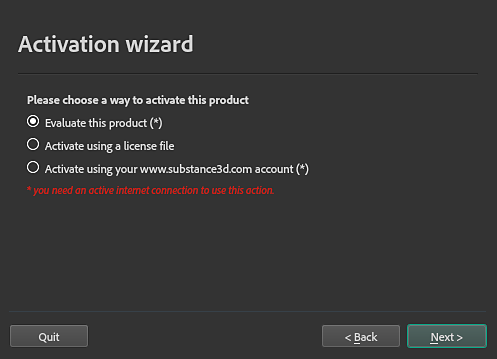

# Activación y licencias

Esta página contiene información sobre cómo activar y administrar sus licencias para que pueda empezar a usar Sampler.

## Proceso de activación por tipo de aplicación

El proceso de activación depende de dónde haya comprado Sampler o tenga acceso a él:

| Tipo de aplicación | Proceso de activación |
| --- | --- |
| Escritorio de Creative Cloud | Consulte la página dedicada en la [documentación de HelpX](https://helpx.adobe.com/support/substance-3d-sampler.html).En caso de que haya algún problema, la [documentación del Creative Cloud](https://helpx.adobe.com/creative-cloud/user-guide.html) puede proporcionar respuestas adicionales. |
| Vapor | Inicie el producto directamente desde la biblioteca de Steam. |
| Substance 3D independiente | Consulte el proceso de activación que se describe a continuación. |

## Pasos de activación

### El asistente de activación

{width="350px"}

Hay tres opciones disponibles:

* **Evaluar este producto**: Las pruebas heredadas ya no están disponibles. En su lugar, puedes iniciar una versión de prueba de 30 días para cada aplicación de Substance 3D [aquí](https://www.adobe.com/creativecloud/3d-augmented-reality.html) o con Creative Cloud Desktop. Cada versión de prueba es independiente de las demás aplicaciones de Substance 3D, por lo que puede probarlas una a una o todas a la vez.
* **Activar usando un archivo de licencia**: active el producto con un archivo de licencia (**\*.key**) descargado de la página de su cuenta en el [sitio web de Substance 3D](https://store.substance3d.com/user) antes del 30 de septiembre de 2022.
* **Activar usando tu cuenta**: Las cuentas de sustancias heredadas ya no se pueden utilizar para la activación. [Aquí encontrará más información sobre las cuentas de Substance](https://helpx.adobe.com/substance-3d/unlisted/faq-end-of-life-accounts.html).

>[!WARNING]
>
> Para instalar el archivo de licencia con el Asistente para la activación, asegúrese de ejecutar Sampler como administrador y desactive temporalmente el antivirus.

### Activación manual

Es posible activar Sampler manualmente colocando el archivo **license.key** en la carpeta siguiente:

<table data-preserve-html="true"><colgroup> <col/> <col/> <col/> <col/> </colgroup><tbody><tr><th>Platform</th><th>Versión</th><th colspan="2">Ruta</th></tr><tr><td rowspan="4"><strong>Windows</strong></td><td rowspan="2"><strong>3.0</strong> o posterior</td><td colspan="1">Datos de la aplicación (local)</td><td colspan="1">C:\Users\[nombre de usuario]\AppData\Local\Adobe\Adobe Substance 3D Sampler</td></tr><tr><td colspan="1">Datos de la aplicación (itinerancia)</td><td colspan="1">C:\Users\[nombre de usuario]\AppData\Roaming\Adobe\Adobe Substance 3D Sampler</td></tr><tr><td rowspan="2">Heredada</td><td colspan="1">Datos de la aplicación (local)</td><td colspan="1">C:\Users\[nombre de usuario]\AppData\Local\Allegorithmic\Substance Alchemist</td></tr><tr><td colspan="1">Datos de la aplicación (itinerancia)</td><td colspan="1">C:\Users\[nombre de usuario]\AppData\Roaming\Allegorithmic\Substance Alchemist</td></tr><tr><td rowspan="2"><strong>Mac</strong></td><td colspan="1"><strong>3.0</strong> o posterior</td><td colspan="2">/Usuarios/[nombre de usuario]/Librería/Application Support/Adobe/Adobe Substance 3D Sampler</td></tr><tr><td colspan="1">Heredada</td><td colspan="2">/Usuarios/[nombre de usuario]/Library/Application Support/Allegorithmic/Substance Alchemist</td></tr><tr><td rowspan="2"><strong>Linux</strong></td><td colspan="1"><strong>3.0</strong> o posterior</td><td colspan="2">/home/[nombre de usuario]/.local/share/Adobe/Adobe Substance 3D Sampler</td></tr><tr><td>Heredada</td><td colspan="2">/home/[nombre de usuario]/.local/share/Allegorithmic/Substance Alchemist</td></tr></tbody></table>

>[!NOTE]
>
> Algunos de los directorios de las rutas mencionadas anteriormente pueden estar ocultos de forma predeterminada. Escriba la ruta de acceso manualmente en el explorador de archivos o muestre los archivos ocultos para verlos.

>[!NOTE]
>
> Asegúrese de que el archivo se llama **license.key**; de lo contrario, la aplicación no podrá encontrarlo.

### Variable de entorno

Puede invalidar la ubicación en la que Sampler comprueba el archivo **license.key** con una [variable de entorno](../pipeline-and-integrations/environment-variables.md).
