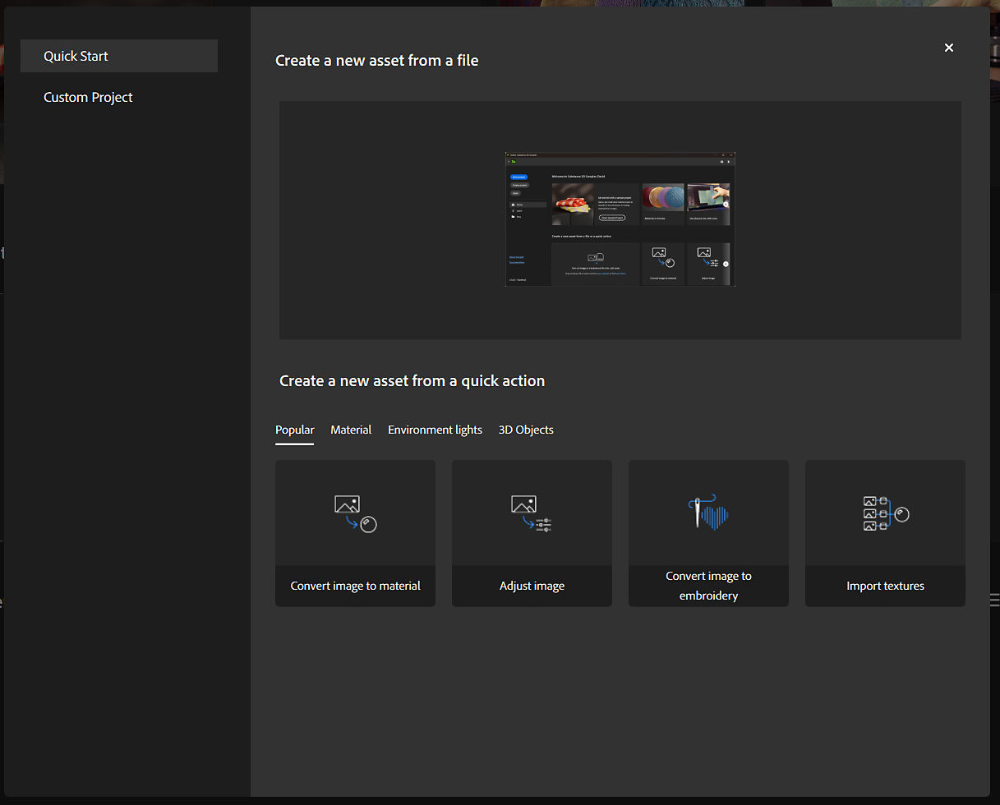

# Importar recursos

Sampler puede utilizar recursos externos, como imágenes y archivos de Substance, para modificar el proyecto. Utilice cualquiera de las siguientes opciones para importar un archivo al proyecto:

* Arrastre y suelte un archivo desde el explorador de archivos a la ventana de Sampler. Aparece una ventana de importación con opciones para cambiar el modo en que se gestiona la importación.

* Desde la <b>barra izquierda</b>, usa el botón <b>Obtener contenido </b> y luego selecciona <b>Importar en pila de capas</b> o <b>Importar en tus activos</b>. Ambas opciones abrirán un explorador de archivos en el que puede navegar y seleccionar el archivo o los archivos que desea importar.
  * <b>Importar en la pila de capas</b> importa el archivo del proyecto actual.
  * <b>Importar en tus activos</b> importa el archivo para que se pueda acceder a él desde cualquier proyecto.

* En el panel <b>Capas</b>, si no se han creado capas, puedes usar los vínculos disponibles para importar un archivo y formar la base de tu material.

>[!NOTE]
>
> Los recursos están vinculados y no importados. Como consecuencia, si se mueve o se elimina un archivo de recursos, los materiales o el contenido creados con ese recurso se verán afectados. Por lo tanto, se recomienda utilizar una carpeta dedicada para Sampler Assets.
> 
> De forma predeterminada, los recursos incluidos de Sampler se almacenan en C:\Program Files\Adobe\Adobe Substance 3D Sampler\Resources\assets

## Formatos de archivo compatibles

| Tipo | Descripción |
| --- | --- |
| <b>Mapas de bits/imágenes</b> (JPEG, PNG, etc.) | Puedes arrastrar y soltar o importar tus mapas de bits en el panel <b>Capas </b>, o en SBSAR o parámetros de filtro que permitan la entrada de una imagen. |
| <b>Paquetes de Substance</b> (SBSAR) | Puedes importar archivos SBSAR en el panel <b>Activos </b> o en el panel <b>Capas </b>. |
