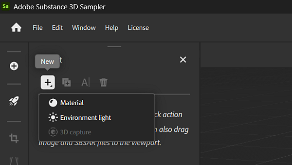

# Gestión de proyectos

En Substance 3D Sampler, puede utilizar colecciones para administrar todos sus recursos y materiales. Los proyectos son una buena forma de organizar tus materiales. Un proyecto se puede exportar o importar para compartirlo fácilmente entre equipos.

## Crear un nuevo proyecto

Para crear un nuevo proyecto, selecciona <b>Crear nuevo</b> en la <b>pantalla Inicio </b> o <b>Archivo > Nuevo proyecto</b>. La creación de un nuevo proyecto iniciará el cuadro de diálogo Inicio rápido, donde puede seleccionar una acción rápida o importar una imagen o un archivo de Substance para iniciar el proyecto.

Como alternativa, puedes usar el botón <b>Inicio rápido</b> para saltar directamente a un proyecto vacío. Todavía puede importar manualmente activos y contenido según sea necesario.

Después de hacer clic en el botón &quot;Crear nuevo&quot;, el proyecto se abrirá automáticamente y se denominará &quot;*Proyecto sin título\**&quot; hasta que guarde el proyecto. Puedes añadir activos a tu proyecto con el <b>botón Nuevo activo </b> resaltado en el <b>panel Proyecto</b>.

{width="600px"}

## Guardar un proyecto

Para guardar un proyecto, use la acción de menú <b>Archivo > Guardar </b> o <b>Guardar como</b>. Se abrirá un cuadro de diálogo que le permitirá elegir qué nombre usar y dónde guardar los archivos del proyecto.

También puede usar el método abreviado <b>Ctrl + S</b> para <b>Guardar</b> o <b>Ctrl + Mayús + S</b> para <b>Guardar como</b>.

Los proyectos guardados aparecen como un archivo denominado <b>YourProject.ssa</b>. SSA es un formato de archivo de muestra, que almacena información sobre el proyecto y las dependencias que pueda tener.

## Abrir un proyecto existente

Los proyectos se pueden abrir de varias maneras:

* En la <b>pantalla de inicio</b>: utilice la lista de proyectos recientes para abrir rápidamente un proyecto haciendo doble clic en él.
* En la <b>pantalla de inicio</b>: Haz clic en <b>Abrir</b> para abrir un explorador de archivos donde puedas elegir el archivo que deseas abrir.
* A través del menú **Archivo > Abrir proyecto**.
