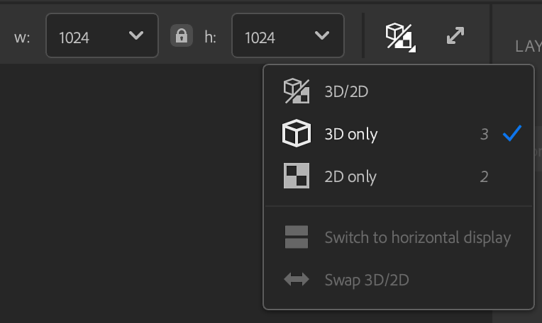

# Ventana gráfica 2D y 3D

La **Ventana gráfica** muestra el activo actual. En la parte superior de la ventana **V**&#x200B;**i**, puedes ver el nombre de tu activo y las opciones para cambiar el aspecto de la **ventana**. Utilice estas opciones para:

* Cambie la anchura y el height del recurso en píxeles.
* Muestra <b>vista 2D</b>, <b>vista 3D</b> o muestra <b>vistas 2D </b> y <b>3D </b> juntas.
* Cambie la <b>vista dividida</b> a la visualización horizontal.
* Intercambie <b>vistas 3D y 2D</b>.
* Alterne entre la ventana gráfica estándar y la de pantalla completa.

## Vista 3D

La <b>Ventana gráfica 3D</b> tiene dos barras de herramientas que le permiten realizar cambios en la apariencia de su activo en la <b>Ventana gráfica</b>. De forma predeterminada, estas barras de herramientas aparecen en la esquina superior derecha y en el centro inferior de la <b>Ventana gráfica 3D</b>.

![] ()

>[!NOTE]
>
> Se puede cambiar la posición de las barras de herramientas de <b>Ventana gráfica 3D</b>:
> 
> * Puede mover las barras de herramientas arrastrando el controlador en la parte superior o izquierda de la barra de herramientas.
> * Haga doble clic en el controlador de la parte superior o izquierda de la barra de herramientas para cambiar entre los diseños horizontales y verticales.
> * Haga clic en las comillas dobles de la parte inferior o derecha de la barra de herramientas para minimizar la barra de herramientas.

La barra de herramientas situada en la parte superior derecha de la <b>Ventana gráfica 3D </b> tiene controles centrados en el aspecto de la ventana gráfica:

* <b>Ver</b>: Cambie los ajustes de la cámara, como el campo de visión o el modo de proyección. Además, cambie la cuadrícula y los colores de fondo.
* <b>Malla</b>: Seleccione una malla diferente para mostrar los activos del material o vea los matices de los activos de luz de entorno.
* <b>Material</b>: Cambie la posición y el mosaico de la textura en la malla.
* <b>Desplazamiento</b>: Ajusta la calidad y la intensidad del desplazamiento.
* <b>Luz</b>: Selecciona y ajusta una luz ambiental, incluidos ajustes como activar las sombras y el plano de tierra.
* <b>Alternar seguimiento de ruta</b>: El trazado de trazados es una técnica de representación que proporciona resultados fotorrealistas que mejoran la apariencia de los activos. Sin embargo, el trazado de rutas puede resultar muy costoso desde el punto de vista computacional, ya que aquí puede activarlo o desactivarlo según sus necesidades.

>[!NOTE]
>
> Active las sombras para mejorar los efectos visuales de la ventana gráfica. Mantenga las sombras alejadas para mejorar el rendimiento de los muestreadores.

![] ()

La barra de herramientas en la parte inferior central de la <b>Ventana gráfica 3D</b> tiene la siguiente información y controles:

* <b>Tiempo de fotograma/FPS</b>: Estos valores muestran el rendimiento del material.
* <b>Objeto de marco</b>: Centre la cámara en la malla.
* <b>Cambiar el eje</b>: Cambiar qué eje se considera hacia arriba. Esto puede ayudar a corregir problemas con mallas importadas.
* <b>Ubicación</b>: Cambie la posición de la malla en relación con el plano del suelo.
* <b>Copiar instantánea</b>: Copie rápidamente una imagen de la <b>Ventana gráfica 3D</b> actual en el portapapeles.
* <b>Guardar instantánea</b>: Guarde una instantánea de la <b>Ventana gráfica 3D</b> en un archivo de imagen.
* <b>Controles de vista 3D</b>: Consulte una referencia rápida para los controles de cámara en la ventana gráfica 3D.

![] ()

## Mover la cámara

La ventana gráfica utiliza una cámara para procesar la vista 3D. Puede mover la cámara para cambiar la vista y ver sus creaciones desde diferentes ángulos.

| Método abreviado | Movimiento | Descripción |
| --- | --- | --- |
| Haga clic y arrastre | Orbitar | Gire la cámara. No es posible girar la cámara. |
| Clic derecho + arrastrar | Dolly | Mueve la cámara hacia adelante y hacia atrás. |
| Clic medio + arrastrar | Panorámica | Mueve la cámara a la izquierda, a la derecha, arriba y abajo. |

La <b>vista 2D</b> es bidimensional, por lo que no hay ninguna opción de órbita. Al hacer clic con el botón derecho + Alt + arrastrar, se acercará y alejará el zoom, mientras que al hacer clic con el botón central + Alt + arrastrar se obtendrá una panorámica.

Tanto en la <b>vista 3D </b> como en la <b>vista 2D</b>, usa <b>F</b> para centrarte en tu activo. Esto resulta útil si pierde de vista el activo 3D o el espacio 2D.

## Vista 2D

![] ()

De forma predeterminada, solo está visible la <b>vista 3D</b>; sin embargo, la <b>vista 2D</b> puede contener mucha información y controles útiles para algunos filtros.

Para abrir la <b>vista 2D</b>, usa el botón <b>Ver selección </b> en la parte superior derecha de la ventana gráfica. También puedes usar el acceso directo <b>2</b> para cambiar rápidamente a la <b>vista 2D</b>.

Con la vista <b>2D </b>abierta, aparecen nuevas opciones:

* En la esquina superior derecha de la **vista 2D**, use el menú desplegable para cambiar el origen de los canales disponibles para ver.

  * Entradas de capa muestra los canales que se introducen en la capa seleccionada
  * Salidas de capa muestra los canales que emite la capa seleccionada
  * Salidas de material muestra los canales que genera la capa superior y no se ven afectados por la selección de capas.
* En la parte inferior de la **vista 2D**, puedes:

  * Consulte la resolución del canal seleccionado.
  * Seleccione un canal para verlo en la vista 2D.
  * Consulte canales de color y profundidad de bits para el canal de material seleccionado.

  
