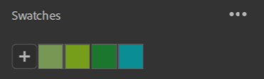

# Selector de color

El Selector de color aparece cada vez que necesita seleccionar un color.

## Introducción a IU

{width="300px"}

1. **Cuadrado de color**: Retoca la saturación y el brillo de tu color con el tono seleccionado.
1. **Regulador HUE**: Ajusta el tono de tu color.
1. **Actual/Anterior**: El color izquierdo es el color actual del selector de color. El color correcto es el color que tenía al abrir el selector de color. Haga clic en el color de la derecha para restablecer el color actual a su valor original.
1. **Entrada hexadecimal**: Puede introducir directamente el código de color hexadecimal del color que desee.
1. **Cuentagotas**: Inicie el cuentagotas para seleccionar un color de la pantalla. Aparecerá una burbuja junto al cursor para previsualizar el color que elegirás.
1. **Reguladores**: Retoca tu color usando diferentes espacios de color (RGB o HSV).
1. **Muestras**: Guarda los colores para acceder a ellos rápidamente y poder usarlos en el futuro.

### Reguladores

#### Espacio de color

RGB (rojo, verde, azul) y HSV (tono, saturación, valor) son los dos espacios de color disponibles.

{width="200px"}

#### Opciones del regulador

{width="200px"}

**Mostrar controles deslizantes**

Esta opción le permite ocultar los reguladores para ahorrar espacio. Incluso con los reguladores ocultos, puede seguir modificando las entradas de valor.

**Valores de punto flotante**

{width="200px"}

Alterne entre utilizar valores de punto flotante o enteros para los reguladores. Los valores de coma flotante están entre 0 y 1, mientras que los valores enteros están entre 0 y 255.

**Reguladores dinámicos**

Alterne si el fondo del regulador se actualiza dinámicamente a medida que cambian los valores. La imagen siguiente muestra el aspecto de los reguladores cuando se desactiva Reguladores dinámicos.

{width="200px"}

### Muestras

Las muestras son útiles cuando desea guardar colores específicos para utilizarlos en la aplicación o en varios proyectos.

Las muestras son globales para Sampler y no específicas para cada proyecto.

Al hacer clic en el botón &quot;+&quot;, se añadirá una muestra con el color actual como primera muestra de la lista.

{width="200px"}

Nota: No se puede añadir una muestra con el mismo color dos veces. La muestra ya guardada se resaltará cuando intente añadirla de nuevo.

Se muestra información sobre herramientas con el valor de color en Código hexadecimal al pasar el cursor sobre una muestra.

#### Opciones de Muestras

Opción Eliminar todo.

{width="200px"}

Haga clic con el botón derecho en una muestra para eliminarla o reemplazarla por el color actual.

{width="200px"}

También puede eliminar una muestra arrastrándola y soltándola fuera del selector de color.
