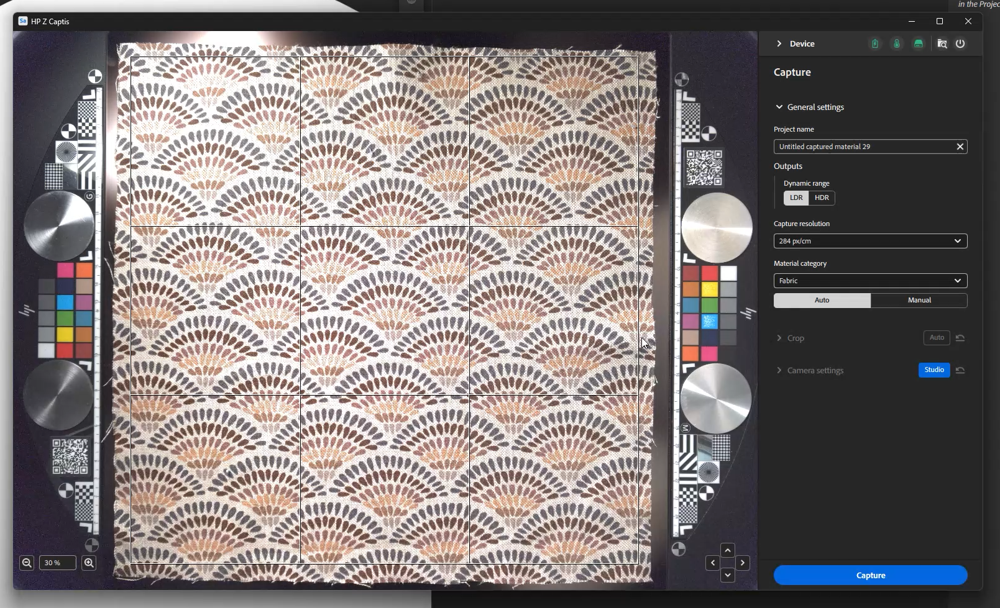
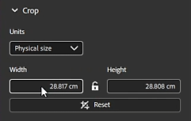

# Inicie Sampler y active el HP Z Captis

Una vez que Sampler se inicie y que el dispositivo HP Z Captis se haya conectado a su ordenador, haga clic en el icono Captis/cone de la barra izquierda.

Si no ve el HP Z Captis en la interfaz de usuario, consulte las preguntas frecuentes.

Después de hacer clic en HP Z Captis, se abre una ventana dedicada con 3 opciones:

1. <b>Examinar contenido</b>: Abrirá su explorador de archivos para examinar el almacenamiento local de su dispositivo HP Z Captis.
1. <b>Iniciar análisis</b>: Inicializará el dispositivo HP Z Captis e iniciará el flujo de captura.
1. <b>Apagar</b>: Apagará el dispositivo y cerrará la ventana.

## Cierre de la ventana HP Z Captis

En cualquier momento si cierras la ventana de HP Z Captis se te preguntará si quieres <b>continuar el proceso</b> o <b>cancelar</b>.

Si selecciona continuar, el dispositivo continuará con su tarea actual sin conexión y se detendrá al final del paso actual. Puede volver a conectar Sampler más tarde para continuar con el siguiente paso de la sesión de captura.

## Paso de previsualización

Sampler inicializará la previsualización del dispositivo HP Z Captis. Se recomienda <b>no interactuar </b>con la vista mientras se está inicializando.

En esta nueva actualización, hay dos modos: Automático y manual.

### Configuración general

#### Modo automático

Ahora tiene la posibilidad de iniciar la captura con un solo clic: Sampler:

* definir un nombre predeterminado,
* definir automáticamente la región de interés (ROI)/zona de recorte usando la retroiluminación,
* centrar la atención en el ROI total, y
* cambie el ajuste de intensidad por uno adaptado a su material.

Si ha realizado capturas anteriormente, la categoría de material, las salidas y la resolución de captura seleccionadas serán las mismas que para la captura anterior.

#### Modo manual

También puede elegir definir algunos de los ajustes a mano:

*Nombre del proyecto*

Puede definir un nombre de proyecto para la captura y el tipo de resultados que desea recuperar.

*Salidas*

* De forma predeterminada, solo se guardarán los canales de material PBR (color base, normal, height y opacidad).\
  Puede elegir el tipo de salida entre LDR (bajo rango dinámico) y HDR (alto rango dinámico).

*Resolución de captura*

* 239 px/in - 94 px/cm (previsualización: menor calidad, exploración más rápida)
* px/in - 142 px/cm (valor predeterminado: alta calidad, fácil de manejar en la mayoría de los flujos de trabajo (equivalente a 4k para captura de 30x30cm)
* 718px/in - 284 px/cm (resolución completa - equivalente a 8k para captura de 30x30cm)

Nota: Solo se cargarán en Sampler los canales PBR.\
Las capturas de carpeta predeterminadas que se guardan en se pueden modificar en las preferencias.

<b>Categoría de material</b>

Establezca esta opción en el tipo de material que está buscando para la generación de mapas, ajustada a su material en particular.\
La categoría predeterminada seleccionada es &quot;Tejido&quot;. Ayudará a optimizar el resultado de su canal de rugosidad.

Si lo que está escaneando contiene varios tipos de materiales, seleccione la categoría de la más grande.

<b>Recortar</b>

El recorte se puede realizar de forma automática o manual.

El recorte automático utilizará la luz de fondo para definir el contorno del material y situará la Región de interés (ROI) a su alrededor. No se adapta cuando se digitalizan varias muestras de material a la vez, o cuando el material es muy transparente.
En ese caso, el ROI se puede definir arrastrando las esquinas del widget de recorte en la vista previa, o definiendo una resolución o tamaño físico definidos.

<b>Configuración de la cámara </b>

* Intensidad: Ajusta la exposición de la cámara.\
  Al hacer clic en Automático, se utilizará el centro del ROI para definir la mejor intensidad para el material.

* Enfoque: Ajusta el enfoque de la cámara.\
  Al hacer clic en Automático, se definirá el enfoque ideal utilizando el ROI completo.
  Este nuevo algoritmo de enfoque, donde el enfoque ya no está en un solo punto, permite un enfoque más uniforme en el material digitalizado, lo que conduce a escaneos de mayor calidad que son más fáciles de hacer mosaico.

Si lo prefiere, puede configurar ambas a mano.

<b>Otras configuraciones</b>

Otros tipos de configuración<b> solo se tienen que modificar ocasionalmente</b>: calibración de color y alineación.

* Calibración de color

Calibrar el color del mapa de color base gracias a las áreas técnicas de HP Z Captis. \
Esto hará que el material final sea exactamente del mismo color que la muestra que añadió en la bandeja HP Z Captis.\
Las áreas técnicas con muestras de color se detectan automáticamente y se utilizan para la calibración. Deben colocarse en su espacio específico a cada lado de la muestra.

Solo está disponible en el modo Estudio. Asegúrate de enfocar antes de calibrar el color.

Esta calibración debe realizarse <b>cada pocos meses</b>. No es necesario hacerlo para cada escaneo o cada vez que se utilice el dispositivo.

* Calibración de alineación

Esta alineación <b> debe realizarse</b> la <b>primera vez que configures tu dispositivo</b>, cada vez que lo muevas físicamente y después cada dos meses. <b>no es necesario</b> realizar este proceso <b>para cada captura</b>.

Por favor, asegúrese de enfocar antes de esta calibración de alineación.

Para hacer la alineación, <b>coloca algo con información clara y nítida, como un trozo de papel con texto impreso, en el centro del espacio de captura</b>, cierra el cajón y haz clic en el botón de alineación. Una vez hecho esto, puede asegurarse de que todo esté en su lugar, con las áreas técnicas en su lugar a cada lado del espacio de escaneo, un material colocado en el centro y si es necesario mantenido en su lugar con los imanes suministrados con el dispositivo HP Z Captis, y puede comenzar a escanear sus materiales.

Una vez que lo tengas todo listo: <b>iniciar el análisis</b>.

## Pasos de captura, procesamiento y copia

Una vez iniciada la digitalización, la previsualización mostrará las fotografías tomadas durante el proceso.

La parte de procesamiento se divide en tres partes:

* <b>Captura</b>: Tomar todas las fotos necesarias

* <b>Procesando</b>: Procesamiento de fotografías para generar canales PBR (color base, normal, height, opacidad)

* <b>Copiando</b>: Copia de los resultados del dispositivo HP Z Captis en el equipo

Mientras captura y procesa, puede añadir metadatos (los mismos metadatos que encontrará en el panel de metadatos de Sampler).

Durante el procesamiento, verá que el resultado se construye mosaico por mosaico.

## Paso de resumen

En este paso puede revisar los resultados del análisis. Se muestran todos los canales creados (en el modo Explorador, no se crea opacidad, ya que el anillo del explorador no tiene luz de fondo).

Puede optar por enviar el material a Sampler, agregarlo al proyecto y comenzar a procesarlo.
También puede iniciar directamente una nueva captura sin agregarla al proyecto.
En ambos casos, encontrará los mapas digitalizados en la carpeta equivalente del equipo: C:\Users\username\Documents\Adobe\Adobe Substance 3D Sampler\Captis\Material

## Edición de material

Después de salir de la ventana HP Z Captis, los canales (color base, normal, height, rugosidad y opacidad si es relevante) se añadirán como una capa en el panel Capas.

Utilice los filtros Sampler (Ecualizar, Recorte con perspectiva, Mosaico, ...) para procesar y limpiar el material.

Una vez que haya terminado, puede:

* Guarde su proyecto de Sampler: Archivo > Guardar como ... (Ctrl + S)

* Exporta el material: Archivo > Exportar ... (Ctrl + E)

