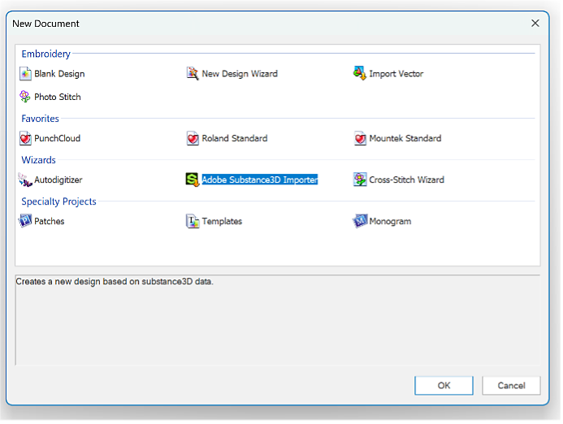

# Tajima Exportador plugin de archivos de bordado

Con esta primera prueba de concepto, ahora puedes transferir sus diseños bordados digitalmente desde Adobe Substance 3D directamente al software de bordado <b>Tajima DG17</b>, lo que elimina la necesidad de una digitización manual que consume mucho tiempo.

Veamos paso a paso cómo se usa.

## Descargar

Descargue el plugin Sampler Tajima aquí:

[Descargue el plugin aquí](https://www.adobe.com/go/sampler-tajima-plugin)

## Instalación

*Desde la interfaz de usuario de Sampler:*

Vaya a Preferencias > Complementos y secuencias de comandos > Añadir un complemento

Seleccione la carpeta de descompresión de la descarga

*Desde el explorador de archivos:*

Vaya a Documentos > Adobe > Adobe Substance 3D Sampler > Complementos

Copie o pegue aquí la carpeta de descompresión de la descarga

## Instalación

Abra su proyecto de Sampler (5.0.3 o posterior) con un material de bordado.

Abra el plugin Tajima y exporte a la ubicación que desee

<b>Software Tajima </b>

<b>1</b>: iniciar el Asistente para Substance 3D

<b>2</b>: seleccione la <b>carpeta de datos</b> adecuada (carpeta de exportación de Sampler)

<b>3</b>: elija el gráfico de hilo de bordado

<b>4</b>: Aplique un ajuste preestablecido de estilo para una configuración óptima de la estructura

<b>5</b>: edita las formas según sea necesario para obtener los mejores resultados

<b>6</b>: obtenga una vista previa de la hoja de cálculo de diseño, con un código de barras que se puede escanear por máquina

