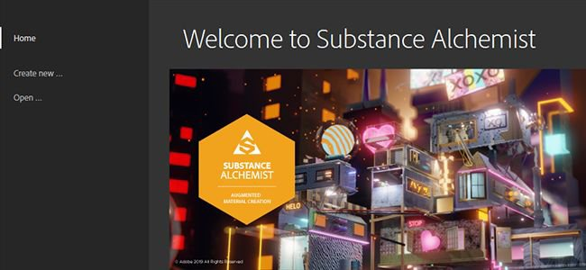
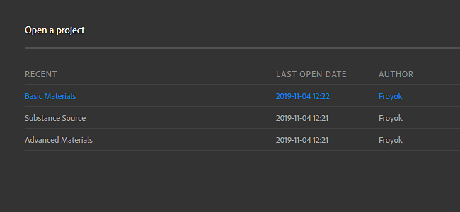
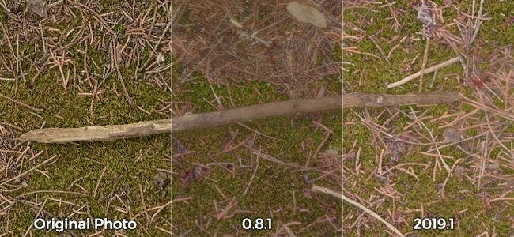

# Versión 2019.1

**Substance Alchemist 2019.1 &quot;Sésamo&quot;** te permite compartir tus recursos con su nueva administración de proyectos. La pila de capas se ha reconstruido completamente para mejorar el flujo de trabajo. Se han añadido controles e información adicionales a la ventana gráfica. Una nueva versión de nuestro deleitador mejora la calidad y precisión de sus materiales.

Fecha de publicación: *4 de noviembre de 2019*

>[!NOTE]
>
> **Nota:** El contenido generado con la versión beta 0.8.1 o anterior no es compatible con la versión 2019.1. Sin embargo, no se pierde nada y se puede acceder a estos datos iniciando la versión 0.8.1.

## Funciones principales

### Nueva pantalla de bienvenida

Substance Alchemist ahora tiene una pantalla de bienvenida que le permite saltar rápidamente a su último proyecto, pero también para crear nuevos. La pantalla de bienvenida también proporciona algunos vínculos a nuestras plataformas existentes, como [Substance Academy](https://academy.substance3d.com/).

### Gestión de proyectos

La versión 2019.1 introduce la noción de proyectos, que pueden recopilar colecciones de materiales. Los proyectos también se pueden exportar para compartirlos con otros equipos.

Para obtener más información sobre proyectos, consulte: [Administración de proyectos](../../getting-started/project-management.md).

### Nuevo Delighter

Hemos mejorado nuestro iluminador, que se utiliza para eliminar las sombras de las fotos. Ahora conserva detalles y los colores originales de las diversas superficies que deberían mejorar la precisión de los materiales generados.

### Nueva pila de capas

La pila de capas se ha reconstruido desde cero para ampliar sus posibilidades y acciones. Los cambios notables son:

* Ahora se puede acceder directamente a **Materiales y máscaras mediante su icono dedicado**\
  Al añadir un material en la pila de capas, ahora tendrá un nuevo icono de máscara. Al pulsar en este segundo icono, se mostrarán los parámetros de fusión del material.

  
* **El modo de fusión se puede cambiar directamente desde la barra de herramientas**\
  A partir de ahora, cuando se selecciona una capa de material, su modo de fusión se puede cambiar directamente desde la barra de herramientas Pila de capas, sin necesidad de hacer clic en la máscara.

  
* **Asignar mapa de bits a entradas de análisis específicas**\
  Al importar mapas de bits para crear materiales a partir de la digitalización, puede asignar el uso adecuado por mapa de bits.

  

### Mejoras de Viewport

Se han añadido algunas funciones nuevas a la ventana gráfica que mejoran su uso. Se puede acceder a estos nuevos ajustes en el [panel Configuración del visor](https://helpx.adobe.com/substance-3d/unlisted/documentation/sadoc/viewer-settings-188973164.html).

* **Modo de cámara**\
  El modo de proyección de cámara permite elegir entre Perspectiva y Ortográfica.

  
* **Campo de visión de la cámara**\
  Ahora puede cambiar el campo de visión (FOV) de la cámara de la ventana gráfica. Ajustar este valor puede ayudar a que tus materiales se visualicen de manera realista. El campo de visión solo se puede controlar en el modo de proyección Perspectiva.

  
* **Resolución y profundidad de bits por canal**\
  La vista 2D muestra ahora la resolución de textura y la profundidad de bits de cada canal.

  

## Notas de la versión

### 2019.1.4 Sésamo

*(Lanzado el 30 de enero de 2020)*

**Agregado:**

* [Resources] Mensaje de confirmación al borrar una carpeta de recursos

**Corregido:**

* [Capas] Mover capas a dos o más capas superiores o inferiores
* [Crear] Asignación de suficiente presupuesto de VRAM para tener un buen rendimiento

**Problemas conocidos:**

* Importar una gran cantidad de recursos puede ralentizar al Substance Alchemist
* Los filtros de relleno según el contenido son lentos en alta resolución
* No se recomienda el uso de varios encantadores en un solo material
* Delighter se bloquea con controladores NVIDIA antiguos (menos de 400.x)
* La coma o el punto se pueden ignorar al escribir un valor específico en un regulador
* El filtro Normal a Height puede bloquearse en MacOS

### 2019.1.3 Sésamo

*(Publicado El 28 De Enero De 2020)*

**Agregado:**

* [Workflow] Compatibilidad con varios flujos de trabajo
* [Workflow] Compatibilidad con el flujo de trabajo Brillo de Specular PBR
* [Flujo de trabajo] Nuevo panel Configuración de canal
* [Workflow] Selección de flujo de trabajo al crear el proyecto
* [Configuración de canal] Activar/Desactivar cálculo de canal específico
* [Configuración de canal] Muestra la lista de canales personalizados disponibles en el material actual
* [Configuración de canal] Cálculo automático de canales personalizados cuando sea necesario
* [Configuración de canal] Forzar/Bloquear el cálculo de canales personalizados
* [Layers] Nueva interfaz de usuario del marcador de posición de entrada de material en los filtros de Atlas scatter y salpicaduras
* [Layers] El parámetro de entrada de imagen de un filtro se puede alimentar debajo de las capas
* [Capas] Muestra una notificación cuando algunas capas no están actualizadas
* [Capas] Posibilidad de actualizar a la última versión de las capas obsoletas a través de la notificación
* [Project] Nuevos campos de metadatos en la creación de proyectos
* [Inspire] Las variaciones generadas son específicas de un proyecto
* [Vista 2D] Cambiar entre las entradas de capa, las salidas de capa y las salidas de material
* [Pantalla de bienvenida] Opción Agregar proyecto de importación (.alch)
* [Preferencias] Nueva ventana Preferencias para definir la configuración de privacidad de análisis y ubicación de la caché
* [UI] Nuevos botones de IU
* [Rendimiento] Mejora global del sistema de paralelización
* [Rendimiento] Optimización del número de cálculos de material
* Actualización del Substance Engine [del motor]
* [Framework] Actualización a Qt 5.13
* [MacOS] Mejoras globales de la compatibilidad con macOS Catalina
* [Contenido] Filtro de ajuste: intensidad normal y parámetros de inversión

**Corregido:**

* [Layers] Desactiva el parámetro de entrada de imagen al eliminar la capa
* [Layers] Se ha solucionado un bloqueo al añadir una capa de parche de clonación
* [Capas] Solucionar algunos bloqueos al mezclar capas y apilar materiales en otros materiales de pila de capas
* [Exportar] Ahora se respeta la selección de canales para la exportación
* [Resources] No se bloquea al navegar por el panel Resources
* [Recursos] Solucionar el bloqueo al importar archivos de Substance dañados
* [Recursos] Reducir el número de bloqueos al cargar carpetas grandes
* [Miniatura] El cálculo de miniaturas no bloquea la interfaz
* [Image Import] Uniformización del tipo de imagen compatible en toda la aplicación
* [Ajuste preestablecido] Guarde la descripción al crear un ajuste preestablecido a partir de una SBSAR
* [Inspire] Corrección de arrastrar y soltar imágenes
* [Application] Fix se bloquea al salir
* [Aplicación] Fix se bloquea al salir cuando se exportan materiales
* [UI] Correcciones y mejoras
* [UI] Cambiar el nombre del activo temporal a &quot;material no guardado&quot;
* [Contenido] Actualización global y limpieza de todos los filtros

**Problemas conocidos:**

* Importar una gran cantidad de recursos puede ralentizar al Substance Alchemist
* Los filtros de relleno según el contenido son lentos en alta resolución
* No se recomienda el uso de varios encantadores en un solo material
* Delighter se bloquea con controladores NVIDIA antiguos (menos de 400.x)
* La coma o el punto se pueden ignorar al escribir un valor específico en un regulador
* El filtro Normal a Height puede bloquearse en MacOS

### 2019.1.2 Sésamo

*(Publicado El 11 De Diciembre De 2019)*

**Agregado:**

* [Workflow] Compatibilidad con varios flujos de trabajo
* [Workflow] Compatibilidad con el flujo de trabajo Brillo de Specular PBR
* [Flujo de trabajo] Nuevo panel Configuración de canal
* [Workflow] Selección de flujo de trabajo al crear el proyecto
* [Configuración de canal] Activar/Desactivar cálculo de canal específico
* [Configuración de canal] Muestra la lista de canales personalizados disponibles en el material actual
* [Configuración de canal] Cálculo automático de canales personalizados cuando sea necesario
* [Configuración de canal] Forzar/Bloquear el cálculo de canales personalizados
* [Layers] Nueva interfaz de usuario del marcador de posición de entrada de material en los filtros de Atlas scatter y salpicaduras
* [Layers] El parámetro de entrada de imagen de un filtro se puede alimentar debajo de las capas
* [Capas] Muestra una notificación cuando algunas capas no están actualizadas
* [Capas] Posibilidad de actualizar a la última versión de las capas obsoletas a través de la notificación
* [Project] Nuevos campos de metadatos en la creación de proyectos
* [Inspire] Las variaciones generadas son específicas de un proyecto
* [Vista 2D] Cambiar entre las entradas de capa, las salidas de capa y las salidas de material
* [Pantalla de bienvenida] Opción Agregar proyecto de importación (.alch)
* [Preferencias] Nueva ventana Preferencias para definir la configuración de privacidad de análisis y ubicación de la caché
* [UI] Nuevos botones de IU
* [Rendimiento] Mejora global del sistema de paralelización
* [Rendimiento] Optimización del número de cálculos de material
* Actualización del Substance Engine [del motor]
* [Framework] Actualización a Qt 5.13
* [MacOS] Mejoras globales de la compatibilidad con macOS Catalina
* [Contenido] Filtro de ajuste: intensidad normal y parámetros de inversión

**Corregido:**

* [Layers] Desactiva el parámetro de entrada de imagen al eliminar la capa
* [Layers] Se ha solucionado un bloqueo al añadir una capa de parche de clonación
* [Capas] Solucionar algunos bloqueos al mezclar capas y apilar materiales en otros materiales de pila de capas
* [Exportar] Ahora se respeta la selección de canales para la exportación
* [Resources] No se bloquea al navegar por el panel Resources
* [Recursos] Solucionar el bloqueo al importar archivos de Substance dañados
* [Recursos] Reducir el número de bloqueos al cargar carpetas grandes
* [Miniatura] El cálculo de miniaturas no bloquea la interfaz
* [Image Import] Uniformización del tipo de imagen compatible en toda la aplicación
* [Ajuste preestablecido] Guarde la descripción al crear un ajuste preestablecido a partir de una SBSAR
* [Inspire] Corrección de arrastrar y soltar imágenes
* [Application] Fix se bloquea al salir
* [Aplicación] Fix se bloquea al salir cuando se exportan materiales
* [UI] Correcciones y mejoras
* [UI] Cambiar el nombre del activo temporal a &quot;material no guardado&quot;
* [Contenido] Actualización global y limpieza de todos los filtros

**Problemas conocidos:**

* Importar una gran cantidad de recursos puede ralentizar al Substance Alchemist
* Los filtros de relleno según el contenido son lentos en alta resolución
* No se recomienda el uso de varios encantadores en un solo material
* Delighter se bloquea con controladores NVIDIA antiguos (menos de 400.x)
* La coma o el punto se pueden ignorar al escribir un valor específico en un regulador
* El filtro Normal a Height puede bloquearse en MacOS

### 2019.1.1 Sésamo

*(Publicado El 26 De Noviembre De 2019)*

**Agregado:**

* [Fusionar] Nueva opacidad Modo de fusión
* [Motor] Nueva versión del Substance Engine

**Corregido:**

* [Capas] Se ha solucionado el bloqueo al eliminar una capa que aún se está calculando
* [Layers] Se corrige el bloqueo al eliminar la capa inferior
* [Layers] Se corrige el bloqueo si el nombre del material contiene caracteres especiales
* [Capas] Detener el cálculo de todos los filtros que utilizan un widget
* [Capas] Evite el bloqueo al utilizar los filtros Clonar parche y Relleno según el contenido
* [Layers] Se ha solucionado el bloqueo al arrastrar y soltar un filtro en ranuras de entrada de salpicaduras
* [Resources] Solucionar el bloqueo al vincular carpetas locales o importar recursos en Substance Alchemist
* [Colección] Se corrige un bloqueo al cambiar rápidamente de un material a otro
* [UI] Se corrige el bloqueo si el valor es nulo o no es válido en los reguladores de mosaico y desplazamiento en la ventana gráfica
* [Inspire] Se ha solucionado un bloqueo al acceder a la pestaña Inspire
* [Inspire] Se ha solucionado un bloqueo al inspirar en un material de pila de capas recién guardado
* [Rendimiento] Los materiales y filtros de Substance pesado (segmentación) calculan más rápido
* [Ayuda] Solucionar problemas de archivo de registro de exportación
* [Contenido] El filtro aleatorio funciona en todos los canales
* [Contenido] El flujo de trabajo multiangular tiene en cuenta todas las digitalizaciones
* [Contenido] Mezcla correcta de AO
* [Contenido] Curvatura Fusión fusión correcta
* [Contenido] Fusión de ID de color Fusión correcta
* [Contenido] Fusión de máscara personalizada y fusión correcta
* [Contenido] Fijar el filtro Ajuste para la modificación de rugosidad
* [Contenido] Corrección del filtro de Material base para la carga personalizada de canales normales
* [Contenido] Corrección del patrón de importación personalizado del filtro Relieve

**Problemas conocidos:**

* No se recomienda el uso de varios encantadores en un solo material
* Delighter se bloquea con controladores NVIDIA antiguos (menos de 400.x)
* La coma o el punto se pueden ignorar al escribir un valor específico en un regulador
* El filtro Normal a Height puede bloquearse en MacOS

### 2019.1 Sésamo

*(Publicado El 4 De Noviembre De 2019)*

**Agregado:**

* [Proyecto] Creación de un proyecto
* [Project] Introducción al formato de archivo .alch que contiene datos de proyecto
* [Project] Exportar un proyecto .alch que contenga las colecciones y sus materiales
* [Project] Importar un proyecto .alch
* [Project] Abrir proyectos recientes
* [Pantalla de bienvenida] Aparece una pantalla de bienvenida al iniciar
* [Pantalla de bienvenida] Crear un proyecto desde la pantalla de bienvenida
* [Pantalla de bienvenida] Acceda a la lista de todos sus proyectos en la pantalla de bienvenida
* [Pantalla de bienvenida] Enlaces rápidos para acceder a la documentación, la información acerca de la gestión de licencias y ventanas emergentes
* [File Menu] Integración de un menú de archivo
* [Menú Archivo] Acceda a los comandos del proyecto desde la pestaña Archivo y guarde la pila de capas
* [Menú Archivo] Acceda a los comandos de deshacer y rehacer desde la pestaña Editar
* [File Menu] El menú de ayuda anterior se movía en el menú de archivo en la pestaña Ayuda
* [Layers] Nueva arquitectura de la pila de capas
* [Layers] Nueva interfaz de usuario de la pila de capas
* [Capas] Seleccione el modo de fusión directamente en la barra de herramientas
* [Capas] Acceda por separado a los parámetros de mezcla y a los parámetros de material
* [Capas] Añade materiales directamente en entradas dedicadas del filtro Salpicadura en la pila de capas
* [Capas] Cambie el orden de digitalización directamente en la capa de importación de imágenes.
* [Ventana gráfica] Control del campo de visión de la cámara
* [Viewport] Posibilidad de cambiar entre cámara ortográfica o de perspectiva
* [Viewport] Muestra la información de resolución y profundidad de bits de cada canal
* Los Materiales base de [Resources] se abren por defecto
* [Cache] Localiza tu carpeta de caché de miniaturas
* [Cache] Localizar la carpeta de caché de procesamiento
* [Paneles] El panel Ajustes de material está oculto temporalmente
* [Flujo de trabajo] Specular/Brillo desactivado temporalmente
* [MacOS] Notarización de la versión del sistema operativo Catalina
* [Contenido] Nueva versión del filtro Delighter
* [Contenido] Nueva imagen según el contenido Filtro de relleno
* [Contenido] Nuevo filtro Relleno según el contenido de material
* [Contenido] El filtro Transformar tiene una opción de transformación segura

**Corregido:**

* Todos los errores anteriores relacionados con Create no son válidos hoy con la nueva versión de la interfaz de usuario y la arquitectura
* La información sobre herramientas no oculta los iconos de la barra superior (3D, 2D, 2D/3D)
* [Contenido] Splatter filter acepta Atlas con mapa de height completo
* [Contenido] El filtro de transformación funciona en imágenes (scan1, scan2,...)

**Problemas conocidos:**

* No se recomienda el uso de varios encantadores en un solo material
* Delighter se bloquea con controladores NVIDIA antiguos (menos de 400.x)
* La coma o el punto se pueden ignorar al escribir un valor específico en un regulador
* El filtro Normal a Height puede bloquearse en MacOS

**Agregado:**

* [Fusionar] Nueva opacidad Modo de fusión
* [Motor] Nueva versión del Substance Engine

**Agregado:**

* [Fusionar] Nueva opacidad Modo de fusión
* [Motor] Nueva versión del Substance Engine

**Agregado:**

* [Workflow] Compatibilidad con varios flujos de trabajo
