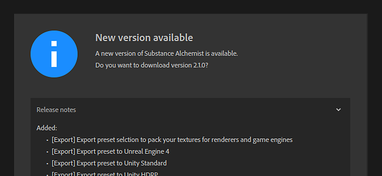

# Versión 2020.1 (2.1)

**Substance Alchemist 2020.1 &quot;Tiramisu&quot;** te permite exportar tus materiales empaquetados directamente para renderizadores y motores de juegos. De forma predeterminada, hay 15 ajustes preestablecidos de exportación disponibles, como Unity HDRP, Unreal Engine 4, Blender, Vray-Next y muchos más.

Incluye un nuevo archivo de configuración y controles para el comprobador de actualizaciones.

Fecha de publicación: *12 de marzo de 2020*

## Funciones principales

### Ventana Nuevo exportador

La ventana de exportación se ha rediseñado para introducir una nueva interfaz con varias funciones nuevas:

* **Usar ajustes preestablecidos de exportación para empaquetar texturas para un procesador o motor de juego específico** Ahora es posible elegir durante el proceso de exportación una configuración entre una lista de ajustes preestablecidos de exportación que convierten, empaquetan y asignan nombres a las texturas para una aplicación de terceros específica. El resultado de esta conversión se muestra en la lista de canales situada a la derecha de la interfaz.\
  El nuevo exportador incluye los siguientes ajustes preestablecidos de forma predeterminada:

  * Unreal Engine 4
  * Unity Standard
  * Unity HDRP
  * Ciclos de mezclador/Eeve
  * Arnold 5
  * Renderizado de corona
  * Enscape
  * Keyshot 9
  * Redshift
  * Variar siguiente
  * Lens Studio
  * Spark AR Studio
  * SPECULAR de PBR/Brillo de la rugosidad metálica PBR

  
* **Cree una subcarpeta con el nombre del material**\
  Al exportar varios materiales a una ubicación común, ahora es posible crear una subcarpeta
* **La configuración de exportación se guarda y se restaura con la siguiente exportación**\
  Para mayor comodidad, al volver a abrir la ventana de exportación, también se reutilizarán los ajustes de exportación utilizados anteriormente. Facilitar y agilizar la reexportación de un material.
* **Crear, importar y administrar ajustes preestablecidos de exportación personalizados**\
  También es posible crear ajustes preestablecidos de exportación personalizados. Para aprender a crearlas y administrarlas, consulte las siguientes páginas de documentación:

  * [Administración de ajustes personalizados](https://helpx.adobe.com/substance-3d/unlisted/documentation/sadoc/creating-and-importing-custom-presets-188976295.html)
  * [Gestión de ajustes preestablecidos](../../getting-started/export/managing-presets.md)

### Configuración de aplicaciones

(Foto de [Fabian Grohs](https://unsplash.com/@grohsfabian?utm_source=unsplash&utm_medium=referral&utm_content=creditCopyText) en [Unsplash](https://unsplash.com/?utm_source=unsplash&utm_medium=referral&utm_content=creditCopyText))

Ahora es posible configurar Substance Alchemist con un archivo de configuración. Esto facilita la configuración de la aplicación en todos los equipos, como en un estudio, por ejemplo. Los archivos de configuración definen los recursos predeterminados y la lista de carpetas vinculadas.

Para obtener más información sobre cómo crear y usar un archivo de configuración, consulte la [página de documentación](https://helpx.adobe.com/substance-3d/unlisted/documentation/sadoc/resources-configuration-file-188976187.html) dedicada.

### Mejoras diversas

En esta versión están disponibles algunas mejoras nuevas en el flujo de trabajo:

* **Enfoque de la vista 2D**\
  Ahora es posible utilizar el método abreviado &quot;F&quot; para restablecer y centrar la vista 2D, al igual que con la vista 3D.
* **Volver a abrir el último proyecto**\
  Para facilitar y agilizar la creación de contenido, la aplicación vuelve a abrir el último proyecto utilizado. El laboratorio Create ahora también es el modo predeterminado al abrir la aplicación.
* **Actualizar configuración del Comprobador**\
  Defina si desea que se le notifique si hay una nueva versión disponible. Para obtener más información, consulte la [página de documentación](../../technical-support/configuration/update-checker.md) dedicada.

### Nuevo contenido

Mejoramos algunos filtros y también actualizamos el contenido de inicio:

* **Nuevos Materiales De Inicio**\
  Hemos sustituido unos pocos materiales existentes por otros nuevos, aquí está la lista de los nuevos materiales:
  * Alcantara Microfiber
  * Suelo de moqueta
  * Cliff Rock
  * Cobre
  * Dirt agrietado
  * Roughcast
  * Terracota
  * Tela de lana
  * Tela tejida
* **Control metálico con filtro de material Bitmap 2**\
  El filtro Material de Bitmap 2 se ha actualizado para ofrecer un mayor control sobre el canal metálico. Ahora es posible utilizar una entrada de mapa de bits personalizada para ella o definir un color uniforme.
* **Filtro de ajuste mejorado**\
  El filtro Ajuste ahora puede funcionar con el conjunto de proyectos para utilizar el flujo de trabajo de PBR Specular/Brillo.
* **Nuevos parámetros de Atlas scatter**\
  Hemos añadido algunos parámetros nuevos para ofrecer un mejor control sobre cómo se mezclan los elementos con el mapa de height del material que aparece a continuación.

## Tutoriales

Esta versión incluye un nuevo conjunto de entradas en nuestro tutorial para empezar con Substance Alchemist:

## Notas de la versión

### 2.1.0 Tiramisu

*(Publicado El 12 De Marzo De 2020)*

**Agregado:**

* [Exportar] La selección de ajustes preestablecidos de exportación empaqueta las texturas para los procesadores y los motores de juegos
* [Exportar] Exportar ajuste preestablecido a Unreal Engine 4
* [Exportar] Exportar ajuste preestablecido a Unity Standard
* [Exportar] Exportar ajuste preestablecido a Unity HDRP
* [Exportar] Exportar ajuste preestablecido a Ciclos de fusión/Eve
* [Exportar] Exportar ajuste preestablecido a Arnold 5
* [Exportar] Exportar ajuste preestablecido al procesador Corona
* [Exportar] Exportar ajuste preestablecido a Enscape
* [Exportar] Exportar ajuste preestablecido a Keyshot 9
* [Export] Ajuste preestablecido de exportación a Redshift
* [Exportar] Exportar ajuste preestablecido a Vray Siguiente
* [Exportar] Exportar ajuste preestablecido a Lens Studio
* [Exportar] Exportar ajuste preestablecido a Spark AR Studio
* [Exportar] Ajuste preestablecido de exportación a Brillo de Specular PBR desde Rugosidad metálica PBR
* [Exportar] Nueva interfaz de usuario de exportación
* [Exportar] Recordar ajustes de exportación
* [Export] Importación y administración de los ajustes preestablecidos de exportación personalizados
* [Exportar] Elimine y reemplace los ajustes preestablecidos de exportación personalizados
* [Exportar] Cambie el nombre de los ajustes preestablecidos de exportación personalizados
* [Exportar] Establezca la resolución de exportación predeterminada en la resolución actual
* [Exportar] Añada la opción de crear una subcarpeta en la ubicación de exportación
* [Export] Mensaje de advertencia antes de reemplazar los archivos existentes
* [Aplicación] Nuevo esquema de numeración de versiones
* [Aplicación] Abra Crear al iniciar y cambie el orden de los laboratorios
* [Pantalla de bienvenida] Nuevo banner de bienvenida
* [Project] Abrir el último proyecto al iniciar
* [UI] Nuevo estilo de cuadro combinado
* [vista 2D] F acceso directo para enfocar en la vista 2D
* [Filters] Se ha añadido compatibilidad con la etiqueta alchemist::parameterVisibility en los gráficos de Substance.
* [Filtros] Se ha realizado un ajuste global para gestionar la visibilidad de los parámetros en función del flujo de trabajo.
* [Resources] Nueva opción de línea de comandos para configurar recursos y carpetas vinculadas con un archivo de configuración
* [Comprobador de versiones] Configuración de la comprobación de versiones
* [Contenido] Nuevos materiales de inicio
* [Contenido] Mapa de bits a material : añada la posibilidad de definir el canal metálico (importación uniforme de imágenes personalizadas, selección de color)
* [Contenido] Ajuste : Añade la compatibilidad con el flujo de trabajo de specular/brillo de PBR
* atlas scatter [Content]: Nuevos parámetros

**Corregido:**

* [Project] Bloqueo al importar el mismo proyecto dos veces
* [Project] Se ha corregido el bloqueo al importar y abrir proyectos varias veces
* [Aplicación] Bloqueo al cargar un material sin nombre
* [Aplicación] Reconocer los archivos que faltan al volver a importarlos
* [Aplicación] Solucionar un bloqueo aleatorio al cerrarse
* [Aplicación] Se ha corregido un bloqueo raro al descargar un material en Crear
* [Aplicación] Se ha corregido un bloqueo aleatorio al utilizar controles de IU
* [UI] El panel Exportar tiene un tamaño incorrecto al abrirlo en Crear
* [UI] Abrir proyecto con un solo clic
* [UI] Establecer correctamente los valores mínimo y máximo del regulador
* [UI] Mostrar la etiqueta de los usos del canal en lugar de los identificadores
* [UI] Al hacer clic en un material, siempre se abre o se cierra el panel de ajustes
* [UI] Corrección de colores de capas ocultas
* [UI] Mejoras en los botones de pantalla de bienvenida
* [Layers] Menos cálculos innecesarios
* [Layers] se bloquea al utilizar el parche de clonación
* [Capas] Al seleccionar una capa de importación de imágenes, ya no se activa un equipo
* [Configuración de canal] Al activar o desactivar los usos, ahora se activa un procesamiento
* [Resources] Evita el bloqueo al hacer clic de forma masiva en una pila de la biblioteca
* [Resources] Se produce un impacto en el rendimiento al volver a añadir una carpeta vinculada previamente añadida
* [Recursos] Se ha corregido un bloqueo al intentar abrir un archivo .sbsar eliminado.
* [Rendimiento] Evite cargar materiales para acceder a sus parámetros
* [Rendimiento] Los activos de copia de seguridad solo se utilizan en un proyecto o en un material creado
* [Exportar] En ocasiones, los materiales fijos de la cola de exportación se omiten o se exportan con parámetros incorrectos
* [Vista 2D] Panorámica y zoom restaurados
* [Contenido] El patrón de parquet tiene en cuenta el canal de Oclusión ambiental
* [Contenido] Paint: muestra la entrada de máscara al activar la máscara personalizada
* [Contenido] Motivo de Stonewall: elimina los posibles efectos de bandas en el mapa normal
* [Contenido] Modulación de Height: Corregir entradas de color base doble en la vista 2D

**Problemas conocidos:**

* Los filtros de relleno según el contenido son lentos en alta resolución
* No se recomienda el uso de varios encantadores en un solo material
* Delighter se bloquea con controladores NVIDIA antiguos (menos de 400.x)
* La coma o el punto se pueden ignorar al escribir un valor específico en un regulador
