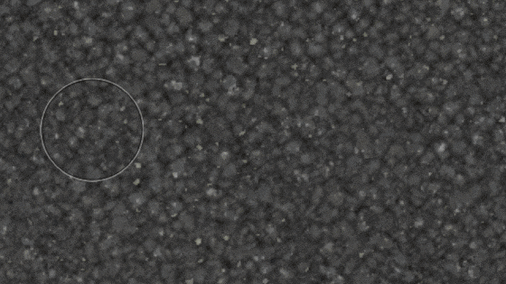
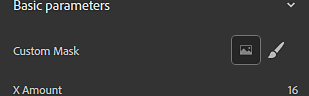

# Versión 2020.2 (2.2)

**Substance Alchemist 2020.2 &quot;Udon&quot;** presenta un nuevo proceso de transformación de imágenes a materiales con tecnología de IA para transformar una sola entrada de imagen en un material PBR completo, una plantilla de creación de materiales mejorada, muchas mejoras en el flujo de trabajo y la facilidad de uso y nuevo contenido, como nuevos filtros.

Fecha de publicación: *15 de junio de 2020*

## Funciones principales

### De imagen a material (con tecnología de IA)

La plantilla **Imagen a material** tiene una nueva configuración denominada **AI Powered**. Este nuevo ajuste proporciona mejores resultados para generar un material PBR de alta calidad a partir de una sola imagen de entrada.

El ajuste con tecnología de inteligencia artificial utiliza el aprendizaje automático para reconocer formas y objetos y generar con precisión información normal y de height. Este ajuste también incluye el filtro Encantador para eliminar las sombras y las iluminaciones. Este nuevo entorno funciona mejor con materiales exteriores, ya que el algoritmo se ha formado con terrenos, cantos rodados, corteza, piedras y otras superficies exteriores iluminadas con luz natural. Las actualizaciones posteriores aportarán más flexibilidad y versatilidad a los materiales admitidos. Para obtener más información, consulte la [página de documentación dedicada](../../filters/tools/image-to-material.md).

A continuación se compara la información de height generada por los dos algoritmos con sus valores predeterminados:

{width="800px"}

>[!NOTE]
>
> El ajuste con tecnología de inteligencia artificial requiere un hardware específico. Solo está disponible en Windows y Linux con una GPU NVIDIA. Consulte los [requisitos técnicos](../../getting-started/system-requirements.md) para obtener más información.

### Nueva plantilla de importación de textura

La ventana emergente de importación de imágenes se ha mejorado en varios aspectos. También hay un nuevo tipo de proceso disponible denominado **Importación de texturas**.

* **Interfaz mejorada**\
  La interfaz se ha actualizado para facilitar su uso y aprendizaje, con explicaciones detalladas para cada opción disponible.
* **Nueva opción de importación de textura**\
  Ahora está disponible una nueva opción denominada **Importación de texturas** que permite importar y conectar como conjunto de imágenes directamente en los canales de salida correctos en función de sus nombres. Proporciona una forma sencilla de configurar un material a partir de un grupo de imágenes existente. Para obtener más información, consulte la [página de documentación dedicada](../../features-and-workflows/texture-import.md).

### Nueva pintura 2D para filtros Entradas de máscara

En esta versión ahora es posible pintar y editar filtros y máscaras directamente en la vista 2D sin tener que importar una imagen externa. La pintura automáticamente azulejos para hacer posible la creación de material sin fisuras.

{width="450px"}

* **Entrando en modo de pintura 2D**\
  Para iniciar el modo de pintura 2D, simplemente haga clic en el icono del pincel junto al nombre de la máscara en las propiedades del filtro.

  
* **Barra de herramientas de pintura 2D**\
  Dentro del modo de pintura, la vista 2D mostrará una nueva barra de herramientas en la parte superior con las siguientes funcionalidades:

  * **Color de pincel**: ajuste el valor de escala de grises del pincel para pintar la máscara.
  * **Tamaño del lápiz de pincel**: ajuste el tamaño del pincel para pintar la máscara.
  * **Restablecer máscara**: si borra la máscara actual a negro, se perderá cualquier información de pintura.
  * **Detener dibujo**: salga del modo Pintura 2D.

  
* **Métodos abreviados de teclado**\
  El modo de pintura admite los siguientes métodos abreviados para acelerar el proceso de pintura:

  * **X**: invierte el valor actual de escala de grises del pincel.
  * **Ctrl + Rueda del ratón**: cambie el tamaño del pincel.
  * **[ o ]**: cambie el tamaño del pincel.

### Nuevos métodos abreviados de modo de creación de atlas y calcomanías

Se han añadido dos nuevos modos de creación para aprovechar los nuevos tipos de materiales de Substance y facilitar su configuración en la pila de capas:

* **Modo de pegatina**\
  **Alt+Arrastrar y soltar**: al arrastrar y soltar un material de una colección, presione y mantenga presionada la tecla **Alt** para crear automáticamente el material en el modo de proyección de pegatinas.
* **Modo Atlas**\
  **Mayús + arrastrar y soltar**: al arrastrar y soltar un material de una colección, pulse y mantenga pulsada la tecla Mayús para crear automáticamente el material en modo atlas scatter.

### Nueva herramienta de corrección de perspectiva

Se ha añadido una nueva herramienta denominada **Corrección de perspectiva** a la lista de filtros, que permite ajustar o compensar la perspectiva de una imagen.

* **Corrección de perspectiva**\
  Con este filtro es posible corregir los valores predeterminados de las imágenes escaneadas y fotográficas para que sean más adecuadas para la creación de materiales. El filtro ofrece cuatro puntos de control que representan las esquinas iniciales de la imagen. Mueva los puntos para ajustar/compensar la perspectiva.

  

### Widget de color mejorado

El widget de color visible en el panel de parámetros ahora ofrece más controles:

* **Información sobre la herramienta Valor de color**\
  Cuando se pasa el ratón por encima de un widget de color, ahora aparece una información sobre herramientas que describe el valor de color actual (formato hexadecimal).
* **Acciones Al Hacer Clic Con El Botón Derecho**\
  Al hacer clic con el botón derecho en un widget de color, aparecerá un nuevo menú contextual con las siguientes acciones:
  * **Borrar**: establezca el color en negro y el valor alfa en cero.
  * **Copiar**: copie en memoria el valor de color actual del widget.
  * **Pegar**: pegue en el widget el valor de color actual en la memoria.

### Nuevo contenido

Esta versión trae un montón de contenido nuevo y variado:

* **Nuevas mallas predeterminadas**\
  Hay tres nuevas mallas disponibles para mostrar materiales en la ventana gráfica:
  * Forma del zapato
  * Camiseta de hombre
  * Camiseta de mujer
* **Nuevos filtros**\
  Hay 5 nuevos filtros disponibles en esta versión:
  * Grietas
  * Musgo
  * Suturas de tejidos
  * Azulejos de piso
  * Validación PBR
* **Nuevo modo de fusión**
* Los filtros y otras herramientas ahora admiten un nuevo modo de fusión denominado **Modo de fusión por canal**. Cuando este modo está activado, es posible ajustar la operación de fusión de cada canal en el panel Propiedades.
* **Exportar ajustes preestablecidos**\
  Esta versión incluye ajustes preestablecidos de exportación nuevos y actualizados:
  * VStitcher
  * CLO
  * Compatibilidad con DetailMap en plantillas HDRP de Unity
