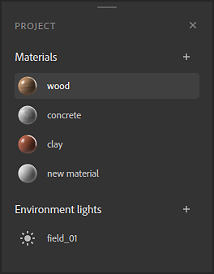

# Versión 3.0

**Substance 3D Sampler 3.0.0** es el nuevo nombre para Substance Alchemist ahora que está conectado a Adobe Creative Cloud. Incluye una completa renovación de la interfaz de usuario, compatibilidad con la creación de Luces ambientales, filtros totalmente reprocesados y nuevos, funcionalidad Enviar a y compatibilidad con el sombreador de ASM.

Fecha de publicación: *23 de junio de 2021*

## Funciones principales

### Nueva interfaz y gestión de paneles

Con un nuevo nombre, llega un nuevo aspecto. La interfaz de usuario de Sampler se ha renovado completamente para permitir una mayor personalización y un acceso más sencillo.

{width="600px"}

Los paneles se pueden acoplar y desacoplar, lo que le permite utilizar completamente una configuración de doble pantalla.

### Nuevo flujo de trabajo de proyecto

Sampler ahora funciona con proyectos. El [panel Proyecto](../../interface/panels/project-panel.md)te permite administrar y agrupar tus activos por proyecto. Los proyectos se almacenan en archivos de Substance Sampler y se comparten fácilmente.

### Nuevo panel Activos

El [panel de activos](../../interface/panels/assets-panel.md) es un diseño nuevo y común del panel Recursos, combinado con tus colecciones.

* 3 Secciones: Activos iniciales + Tus activos + Carpetas locales conectadas
* Nuevos tipos de activos compatibles: filtros e imágenes
* Vista estrecha/amplia
* Filtros de filtro y búsqueda

### Creación de nuevas Luces ambientales

{width="600px"}

Sampler ahora te permite hacer más que solo materiales. Las luces ambientales son un nuevo tipo de recurso con su [propio conjunto de filtros](../../filters/hdri-tools/hdri-tools.md). Empieza a partir de [fotos entre corchetes de 360](../../filters/hdri-tools/hdr-merge.md), crea una luz ambiental [desde cero](../../filters/hdri-tools/shape-light.md) o [edita un archivo HDR. existente](../../filters/hdri-tools/nadir-patch.md).

### Filtros reelaborados y nuevos

{width="600px"}

Se han retrabajado todos los filtros existentes:

* Compatibilidad con canales de especificaciones/brillo.
* Compatibilidad con máscaras personalizadas
* Nombres de parámetros estandarizados
* Iconos para casi todos los filtros

El filtro de ajuste se ha dividido en filtros independientes según su funcionalidad para imitar a Photoshop:

Se han añadido algunos filtros nuevos:

* [Transformación de deformación](../../filters/tools/warp-transform.md)
* [Tejer](../../filters/generators/weave.md)
* [Panel](../../filters/generators/panel.md)

### Nueva Funcionalidad Enviar A

Ahora Sampler puede [compartir fácilmente materiales y entornos livianos](../../interface/panels/share-panel.md)con Substance 3D Painter y Stager, con un solo clic.

### Nuevo motor de procesamiento en tiempo real

* Compatibilidad con materiales de ASM, lo que permite una apariencia coherente entre las aplicaciones con más canales de materiales.
* Cambiar entre 2 [motores en tiempo real](https://helpx.adobe.com/substance-3d/unlisted/documentation/sadoc/viewer-settings-188973164.html)
* Posibilidad de controlar las texturas predeterminadas en una malla

### Mejoras generales

* Nuevos idiomas
* Capacidad de respuesta de aplicaciones
* Compatibilidad con texturas no cuadradas
* Herramientas Deshacer/Rehacer
* Asignación de usos personalizados a imágenes en la capa de importación de imágenes
* Restablecer un valor de parámetro
* Progreso de la exportación en la barra de tareas de Windows

## Tutoriales

A continuación, se muestran nuestros tutoriales en vídeo sobre las nuevas funciones:

## Notas de la versión

### 3.0.0 Waffle

*(Publicado El 23 De Junio De 2021)*

**Agregado:**

* [Marca] Substance Alchemist se convierte en Adobe Substance 3D Sampler
* [Branding] Nuevos iconos de aplicaciones
* [UI] Nueva experiencia de usuario e interfaz de usuario
* [UI] Nueva pantalla de presentación
* [UI] Los paneles se pueden desacoplar y acoplar en la interfaz
* [UI] Acoplar hasta 3 paneles en la misma columna
* [UI] Acoplar hasta 3 paneles en el mismo panel (pestañas)
* [UI] Desacople paneles para crear una ventana independiente en la misma pantalla o en otra diferente
* [UI] Ventana emergente de paneles cerrados al hacer clic en sus iconos
* [UI] Reorganiza la barra izquierda y derecha moviendo los iconos de los paneles
* [UI] Nueva barra de herramientas para acceder directamente a filtros específicos (Recortar, Transformar, Transformar Perspectiva, Sello de Clonar)
* [UI] Nuevo botón &quot;Obtener contenido&quot; en la barra izquierda
* [IU] Importe archivos directamente en los activos con el botón Obtener contenido
* [UI] Importa archivos directamente a tus capas con el botón Obtener contenido
* [UI] Acceder directamente al sitio web de Substance 3D Assets de Adobe con el botón Obtener contenido
* [UI] Ahora se puede acceder directamente al widget de resolución en la ventana gráfica
* [UI] Todos los elementos de la interfaz de usuario ahora se cargan dinámicamente
* [UI] Método abreviado: utilice &quot;2&quot; para cambiar la visibilidad del Vista 2D.
* [UI] Método abreviado: utilice &quot;3&quot; para cambiar la visibilidad de la vista 3D.
* [Pantalla de bienvenida] Cree un proyecto con un solo clic con el botón Nuevo
* [Pantalla de bienvenida] Nuevo banner de ilustración
* [Project] Todos los proyectos se asocian ahora a un archivo único
* [Project] Nueva extensión de archivo de proyecto .ssa
* [Project] Al guardar como proyecto, se le pedirá que seleccione dónde guardar el proyecto
* [Proyecto] Al cerrar Sampler, se le pedirá que guarde el proyecto si no se ha guardado
* [Proyecto] Al cerrar Sampler, se le pedirá que guarde el proyecto si hay modificaciones desde la última operación de guardado
* [Project] El nombre del proyecto se muestra sobre la ventana gráfica
* [Proyecto] El nombre del proyecto aparece en cursiva con una estrella si no se guarda o si contiene modificaciones desde la última operación de guardado
* [Proyecto] Abra un archivo de proyecto .ssa directamente desde el explorador del sistema operativo
* [Proyecto] Si abre un archivo .sbsar desde el explorador del sistema operativo, Sampler se iniciará con un nuevo proyecto que tendrá el archivo .sbsar listo para usarse
* [Proyecto] Abra un archivo .alch (archivo de Substance Alchemist heredado) desde el explorador del sistema operativo
* [Project Panel] Nuevo panel que contendrá todos los recursos creados dentro de un proyecto
* [Panel Proyecto] Cree un recurso (material o luz ambiental) mediante el icono +
* [Panel de proyecto] Al hacer clic con el botón derecho en el recurso se abre un menú contextual
* [Panel de proyecto] En el menú contextual del botón derecho, puede eliminar un recurso
* [Panel de proyecto] En el menú contextual del botón derecho, puede duplicar un recurso
* [Panel de proyecto] En el menú contextual del botón derecho, puede cambiar el nombre de un recurso
* [Panel de proyecto] Cambiar entre recursos no perderá las modificaciones
* [Resolución] Ahora puede establecer una resolución no cuadrada para todos sus recursos
* [Resolución] El valor de resolución se guarda por recurso dentro de un proyecto
* [Luz ambiental] Crear luz ambiental en Substance 3D Sampler
* [Luz ambiental] Al crear una luz ambiental, al arrastrar y soltar imágenes, se mostrará la ventana Plantilla de creación de Luces ambientales
* [Luz ambiental] En la plantilla de creación de Luces ambientales, seleccione Importar entorno para asignar la imagen al entorno en la vista 3D
* [Luz ambiental] En la plantilla de creación de Luces ambientales, seleccione HDR. merge para crear una luz ambiental a partir de varias imágenes de 360 grados con diferentes niveles de exposición
* [Luz ambiental] En la plantilla de creación de Luces ambientales, seleccione &quot;Usar como mapa de bits&quot; para editar las imágenes antes de crear una luz ambiental
* [Luz ambiental] Asigne el uso del entorno en la capa de importación de imágenes para asignar directamente la imagen al entorno en la vista 3D
* [Luz ambiental] En la Vista 2D del canal de entorno, existe una corrección de color automática para que la representación tenga el mismo aspecto que en la vista 3D
* [Luz ambiental] Nuevo contenido dedicado para la creación de luces ambientales
* [Panel Activos] Los paneles Recursos y Filtros se combinan en un nuevo panel Activos
* [Panel de recursos] El panel de recursos ahora admite los siguientes tipos de recursos: materiales, filtros e imágenes
* [Panel de recursos] Todos los recursos de inicio están disponibles en la sección Recursos de inicio
* [Panel de recursos] La sección Activos iniciales es de solo lectura
* [Panel de Recursos] Nueva sección &quot;Sus Recursos&quot;
* [Panel de recursos] La sección &quot;Sus recursos&quot; es el lugar donde puede importar todos sus recursos
* [Panel de activos] Todos los activos de &quot;Sus activos&quot; se añaden a una carpeta específica de sus Documentos
* [Panel de recursos] Conecte las carpetas locales en el panel de recursos para añadir nuevas secciones
* [Panel Activos] La búsqueda se realizará en la carpeta actual y sus subcarpetas
* [Panel de recursos] Desplazarse entre carpetas y subcarpetas con rutas de exploración
* [Panel de recursos] Filtre la carpeta actual por material, filtro o imagen
* [Panel de recursos] Combine varios filtros para obtener solo materiales e imágenes
* [Panel de recursos] Cambie la visualización al cambiar entre una cuadrícula o una lista
* [Panel de recursos] Los filtros se representan con su icono
* [Panel de recursos] Las imágenes se representan con su vista previa
* [Panel de recursos] Al aumentar la anchura, se cambiará el diseño del panel con una vista específica para desplazarse entre carpetas
* [Panel de recursos] En las secciones de no solo lectura, elimine un recurso arrastrándolo y soltándolo en el icono de la bandeja
* [Panel de recursos] Al hacer clic con el botón derecho en un recurso, se abre un menú contextual
* [Panel de recursos] En el menú contextual del botón derecho, acceda a los metadatos del recurso (nombre, categoría, ubicación)
* [Panel de recursos] En el menú contextual del botón derecho, elimine el recurso (solo disponible en las secciones de no solo lectura)
* [Panel de recursos] En el menú contextual del botón derecho, examine el recurso en Adobe Bridge
* [Panel Capas] Nuevo icono para añadir directamente un material base sobre las capas
* [Panel de capas] Método abreviado : Mayús + B añadirá un material base encima de las capas
* [Panel Capas] Las capas ahora tienen una vista previa en miniatura (miniatura de material, icono de filtro o vista previa de imagen)
* [Panel Propiedades] Nuevo diseño del título del panel Propiedades con el nombre del recurso y la miniatura del recurso
* [Panel Propiedades] Las capas de filtro ahora admiten ajustes preestablecidos
* [Panel Propiedades] En Capa de importación de imagen, haga clic con el botón derecho en la vista previa de la imagen para editarla en Photoshop
* [Adobe Bridge] Busque y examine el contenido en Adobe Bridge. Bridge se abrirá en la ubicación del contenido
* [Adobe Photoshop] Editar en Adobe Photoshop abrirá la imagen en Photoshop lista para editarse
* [Adobe Photoshop] En cada operación de guardar en Adobe Photoshop, la imagen editada se vuelve a cargar en Sampler
* [Substance 3D Designer] Los contenidos enviados desde Adobe Substance 3D Designer aparecerán directamente en la sección &quot;Sus contenidos&quot; del panel de contenidos
* [Exportar] Enviar recursos directamente a Adobe Substance 3D Painter y Adobe Substance 3D Stager
* [Exportar] Enviar materiales y luces ambientales a Adobe Substance 3D Painter
* [Exportar] Enviar luces ambientales a Adobe Substance 3D Stager
* [Renderizado] Ahora se admiten nuevas propiedades de material, que se procesan en 3D
* [Renderizado] Adición de compatibilidad con brillo (Color de brillo, opacidad y rugosidad de brillo)
* [Renderizado] Agregando soporte de recubrimiento (Color de capa, Rugosidad de capa, Normal de capa, Nivel especular de capa y capa IOR)
* [Renderizado] Adición de compatibilidad con Anisotropías (Nivel de anisotropía y Ángulo de anisotropía)
* [Renderizado] Adición de compatibilidad con Speculares edges color
* [Renderizado] Active estas nuevas propiedades en el panel Configuración de canal
* [Renderizado] Introducción de un nuevo procesador de Realtime Engine (2021) en la versión beta
* [Renderizado] Cambiar entre las dos versiones de Renderizado en el panel Ajustes del visor
* [Renderizado] El procesador del motor en tiempo real (2021) admite las propiedades de translucidez, absorción y material de dispersión
* [Renderizado] El procesador del motor en tiempo real (2021) presenta una nueva forma de calcular sombras a partir de la luz ambiental
* [Renderizado] El procesador de motor en tiempo real (2021) calcula en tiempo real la irradiancia de la luz ambiental
* [Panel Ajustes de Sombreador] Nuevo panel Ajustes de Sombreador para ajustar parámetros específicos del sombreador de material
* [Panel Ajustes de Sombreador] Nuevos parámetros (Escala normal, Escala de height, Nivel de height, Intensidad de emisión, IOR, Intensidad de Normal de capa y IOR de capa)
* [Panel de ajustes del Sombreador] Parámetros específicos del motor en tiempo real 2021 (dispersión subsuperficial, distancia de dispersión, desplazamiento rojo y dispersión de Rayleigh)
* [Panel de configuración de Sombreador] Los valores de configuración se guardan por recurso
* [Panel de configuración del visor] Se ha añadido una vista previa de las luces ambientales predeterminadas
* [Panel de configuración del visor] Se ha añadido una vista previa de las mallas predeterminadas
* [Panel de configuración del visor] Nuevo parámetro de opacidad del entorno
* [Panel de configuración del visor] Nuevo parámetro de desenfoque de entorno (específico del procesador Realtime Engine 2021)
* [Localización] Nuevas traducciones en alemán y francés
* [Contenido] Nuevos materiales de inicio predeterminados
* [Contenido] Nuevas luces ambientales predeterminadas
* [Contenido] Todos los filtros se han actualizado, limpiado y optimizado
* [Contenido] El filtro Ajuste se ha dividido en varios filtros
* [Contenido] Nuevo filtro Brillo/Contraste
* [Contenido] Nuevo filtro Tono/Saturación
* [Contenido] Nuevo filtro de intensidad
* [Contenido] Nuevo filtro Enfocar
* [Contenido] Nuevo ajuste Normal/Height
* [Contenido] Nuevo filtro de paneles
* [Contenido] Nuevo filtro de difuminado
* [Contenido] Nuevo filtro Tejidos
* [Contenido] Nuevo filtro transformar deformación
* [Contenido] Nuevo Height para el filtro AO
* [Contenido] Nuevo Height a filtro Normal
* [Contenido] Reemplazo de color: Reemplazar en nuevos canales compatibles (brillo, revestimiento, Anisotropía, etc.)
* [Contenido] Variación de color: modo manual para seleccionar exactamente los colores que desea cambiar
* [Contenido] Mosaico - opción para visualizar el corte de las costuras
* [Contenido] Mosaico - opción de pintura de las costuras cortadas para un azulejo perfecto
* [Contenido] Coincidencia : Opción para añadir un material para que coincida con su color y su rugosidad
* [Contenido] Coincidencia: ahora funciona en imágenes para que coincidan con el color de otra imagen
* [Contenido] Luz de ambiente: nuevo filtro de temperatura de color
* [Contenido] Luz de ambiente: nuevo filtro de exposición
* [Contenido] Luz de entorno: nuevo filtro de previsualización de exposición
* [Contenido] Luz de entorno: nuevo filtro de Nadir patch
* [Contenido] Luz de entorno: nuevo filtro de Nadir extract
* [Contenido] Luz de ambiente: nuevos filtros de luces (esfera, línea, forma, plano)
* [Contenido] Luz de entorno: nuevo filtro de parche de panorama
* [Contenido] Luz de ambiente: nuevo filtro Enderezar horizonte
* [Contenido] Luz de entorno: nuevo filtro HDR. merge

**Problemas conocidos:**

* [Realtime Engine 2021] Al cambiar el diseño, se crea un bloqueo de la aplicación
* [Realtime Engine 2021] Cálculo intenso, bloqueo de la aplicación
* [Panels] MacOS: los paneles no acoplados se encuentran delante de todas las aplicaciones
* [Widgets] Los widgets Transformar y Posiciones pueden desaparecer. Ocultar y mostrar la capa para que aparezcan.
* [Export] La exportación SBSAR de una luz ambiental pierde la precisión de 32 profundidades de bits
* [Panel de recursos] Los recursos se pueden resaltar al abrir una carpeta
* [Panel Propiedades] Al restablecer los parámetros no se restablece la interfaz de usuario del cuadro combinado
* [Localización] Cambiar el idioma no afecta al panel Proyecto hasta que se vuelve a crear
