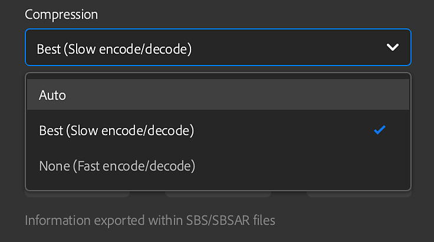

# Versión 3.2

**Substance 3D Sampler 3.2** presenta un flujo de trabajo integral de digitalización de materiales que captura y procesa el tamaño físico de materiales, nuevos filtros como tejido de tela y cambio de canal, y la capacidad de crear metadatos personalizados.

Fecha de publicación: 25 *enero de 2022*

## Funciones principales

### Tamaño físico

En esta versión se ha introducido un nuevo flujo de trabajo de escaneado de materiales que captura y procesa el tamaño físico de los materiales.

Haz coincidir el [tamaño físico](../../features-and-workflows/end-to-end-physical-size-workflow.md) real de tus muestras/imágenes en un contexto digital para crear materiales físicamente precisos en cualquier software.

{width="400px"}

### Tejido de tela

En esta versión se ha añadido el nuevo generador. El tejido de tela le permite crear y diseñar telas con patrones de tejido personalizados.

<table>
<tr style="border: 0;">
<td style="border: 0;" valign="top">

{width="390px"}

</td>
<td style="border: 0;" valign="top">

{width="400px"}

</td>
</tr>
</table>

### Metadatos personalizados

Añade metadatos personalizados a tus materiales. Todos los metadatos personalizados se incluirán en el archivo de material (SBSAR) para garantizar un flujo de trabajo más eficiente para compartir materiales digitales entre aplicaciones.

{width="264px"}

### Conmutador de canal

Con Channel Switch ahora puede cambiar los canales de los mapas de salida del material.

{width="300px"}

### Exportar

Se han añadido nuevas funciones de exportación a esta versión.

* Establecer la configuración de compresión de archivos .sbsar

  {width="400px"}
* Definir el tipo de gráfico al exportar un archivo .sbs(ar)
* Mantener la proporción física para EXR, JPEG, PNG, TARGA, TIFF

  {width="400px"}

## Notas de la versión

### 3.2.0 Yakitori

*(Lanzamiento el 25 de enero de 2022)*

**Agregado:**

* [Tamaño físico] Nuevo panel Tamaño físico
* [Tamaño físico] Añadir opciones de Tamaño físico a la ventana Plantilla de Creación de Material
* [Tamaño físico] Herramienta Agregar medida de Tamaño físico
* [Tamaño físico] Herramienta Agregar medida automática de Tamaño físico
* [Tamaño físico] Herramienta Agregar diagnóstico de Tamaño físico
* [Tamaño físico] Permite definir el valor z del Tamaño físico
* [Tamaño físico] Widget desplegable para establecer el nivel de zoom en la vista 2D
* [Tamaño físico] Nueva opción &quot;Mostrar con proporción física&quot; en el menú desplegable de nivel de zoom
* [Tamaño físico] Nueva opción &quot;Ajustar al tamaño físico&quot; en el menú desplegable de nivel de zoom
* [Tamaño físico] Mostrar el Tamaño físico en la vista 2D
* [Tamaño físico] Mostrar el Tamaño físico en la ventana gráfica 3D
* [Tamaño físico] En el cuadro de diálogo de importación de imágenes, mostrar profundidad de tamaño físico si hay un mapa de height importado
* [Tamaño físico] Mostrar el Tamaño físico en el menú contextual del recurso
* [Tamaño físico] Establezca la unidad de longitud en Preferencias
* [Tamaño físico] Exportar texturas respetando la proporción física
* [Metadatos] Posibilidad de añadir metadatos personalizados a un activo creado por el usuario
* [Exportar] Exportar metadatos personalizados a archivos .sbs(ar)
* [Exportar] Exportar descripción, categoría, autor y etiquetas de metadatos a archivos .sbs(ar)
* [Exportar] Exporte el Tamaño físico a archivos .sbs(ar)
* [Exportar] Establecer la configuración de compresión de archivos .sbsar
* [Exportar] Exporte la miniatura del activo a archivos .sbs(ar)
* [Exportar] Establezca el tipo de gráfico al exportar un archivo .sbs(ar)
* [Aplicación] Realtime Engine 2021 ya no está disponible
* [Aplicación] Ahora, Deshacer/Rehacer admite cambios en el control deslizante de segmentación (U,V) y escala de height
* [Procesamiento] Generar caché de disco al guardar el recurso creado
* [Assets] Use Ctrl+clic para activar varios filtros de tipo de activo en el panel Resources (Recursos)
* [UI] Posibilidad de bloquear los reguladores de Mosaico (U,V)
* [UI] Añade un menú contextual con &quot;Copiar&quot;, &quot;Cortar&quot;, &quot;Pegar&quot;, &quot;Copiar todo&quot; y &quot;Cortar todo&quot; en los campos de texto
* [UI] Unidad de longitud (metros, pulgadas, parsecs, ...) compatibilidad con etiquetas y campos de texto
* [UI] El usuario puede establecer la precisión decimal utilizada para mostrar números
* [UI] Utilice unidades en ventanas emergentes de medida en todas partes que sean relevantes
* [Localización] El nombre del nuevo recurso predeterminado ahora está localizado
* [Contenido] Nuevo generador de tejido de tela
* [Contenido] Nuevo filtro de cambio de canal
* [Contenido] Todos los filtros relevantes ahora conocen el Tamaño físico
* [Contenido] Nuevos iconos para Acabado en Madera
* [Contenido] Todos los filtros ahora son compatibles con los canales de Adobe de materiales estándar (ASM)
* [Contenido] Los filtros ahora pueden tener una variación de &quot;entorno&quot;

**Corregido:**

* [Vista 2D] El canal permanece en la lista cuando se elimina
* [Aplicación] No se puede duplicar un recurso cargado desde el explorador de archivos del sistema operativo
* [Application] Bloqueo al salir
* [Aplicación] A veces se produce un bloqueo al hacer clic en &quot;Activos iniciales&quot; en el panel Activos
* [Aplicación] Bloqueo al eliminar un material
* [Aplicación] La variable de entorno &quot;SUBSTANCE\_DISABLE\_SPECIFIC\_FEATURES&quot; sigue activa cuando se establece en &quot;0&quot; o &quot;&quot;.
* [Aplicación] Bloqueo al guardar un proyecto con varios materiales
* [Aplicación] Importar una imagen puede provocar un bloqueo
* [Aplicación] Faltan algunos recursos de inicio en el primer inicio
* [Exportar] La exportación de un recurso a veces produce un bloqueo
* [Capas] No se pueden importar imágenes cuando el panel de capas está cerrado o es invisible
* [Capas] Cambiar el idioma hace que el activo actual se vuelva a calcular
* [Layers] Cambiar el uso de una imagen importada no actualiza qué variación de filtro usar
* [Capas] En ocasiones, la imagen a material (IA) no se calcula al ajustar capas por debajo de ella
* [Layers] La imagen a material (AI) a veces se vuelve a calcular cuando no es necesario
* [Layers] No se sugiere ninguna actualización cuando se actualiza un filtro personalizado en el disco
* [Capas] El canal normal a veces tiene un formato de píxel incorrecto
* [Capas] Algunas capas se siguen calculando incluso cuando no están visibles
* [Capas] Las herramientas de la vista 2D pueden romperse al cambiar la visibilidad de una capa
* [Capas] La interfaz de usuario se bloquea al utilizar Imagen a material (AI)
* [Capas] Al cambiar la visibilidad de la capa de filtro Transformar, se rompe la herramienta de vista 2D y puede producirse un bloqueo
* [Capas] Demasiados cálculos al eliminar una capa de la pila de capas
* [Capas] Cuando un filtro compuesto contiene una entrada/salida inusual o personalizada, Sampler no la calcula
* [Rendimiento] El panel Activos tarda en abrirse
* [Rendimiento] Evite algunos cálculos innecesarios de la pila de capas
* [Rendimiento] La carga de recursos del proyecto lleva demasiado tiempo
* [Rendimiento] No se puede usar la caché de procesamiento en el disco
* [Rendimiento] El cambio entre capas es lento
* [Rendimiento] La modificación de un material o un filtro es lenta
* [Project] Guardar un proyecto al salir puede producir un bloqueo
* [Renderizado] Al quitar una imagen, es posible que se eliminen todas las salidas
* [Renderizado] El tiempo de renderizado que se muestra en la ventana gráfica es incorrecto al ajustar
* [UI] No se puede desplazar verticalmente en la ventana emergente de exportación cuando es necesario
* [UI] Es posible abrir la ventana emergente de exportación cuando no hay nada que exportar
* [UI] Algunas ventanas emergentes no se desplazan si su contenido se desborda
* [UI] Los campos de texto no se seleccionan al hacer clic en ellos o abrir un menú
* [UI] El nombre del modo de fusión en el panel de propiedades a veces no es correcto
* [UI] La opción Guardar del menú Archivo a veces está atenuada
* [UI] El campo de texto no desaparece después de cambiar el nombre de dos materiales
* [UI] Error tipográfico en la ventana emergente de preferencias

**Problemas conocidos:**

* [Selector de color] Es posible que no funcione seleccionar un color en un segundo monitor con una resolución diferente
