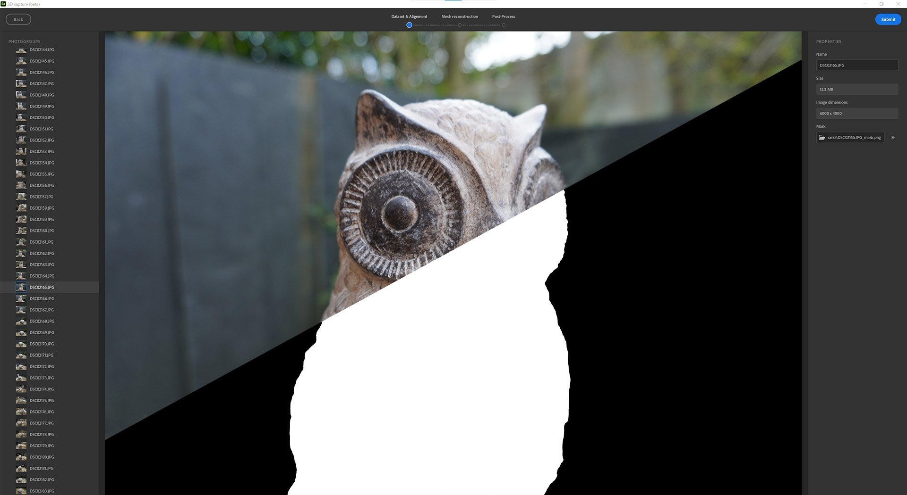

# Versión 4.0

Con **Substance 3D Sampler 4.0**, puedes usar imágenes del mundo real para crear objetos en 3D con máscaras de sujetos automáticas, asignación de texturas y geometría diezmada. Esta versión introduce algunas mejoras de UX como nuevas posibilidades en la API de Python.

*Fecha de publicación: 31 de enero de 2023*

## Captura 3D

Con Substance 3D Sampler 4.0, ahora puede crear objetos 3D a partir de imágenes.

Contamos con capacidades de fotogrametría integradas. La fotogrametría es el proceso técnico de tomar medidas a partir de imágenes. Así es como Sampler crea mallas 3D a partir de una serie de fotografías.

Solo tienes que empezar con una serie de fotos que capturen las superficies visibles de un objeto: un teléfono inteligente o una cámara DLSR funcionan genial.

Descubre el flujo de trabajo paso a paso [aquí](../features-and-workflows/3d-capture.md).

## Iluminaciones

### Enmascaramiento automático

Elimina el fondo del objeto que deseas Captura 3D. Cree una máscara del objeto generada automáticamente después de importar las imágenes mediante la ficha Máscara .

El uso de máscaras tiene muchas ventajas. Permite detectar características y reconstruir solo áreas no enmascaradas.

{width="500px"}

### Defina el área de reconstrucción

Alternar Región de interés para activar un cuadro delimitador después de alinear las imágenes. Establezca y alinee el área precisa que desea reconstruir.

{width="500px"}

### Posprocesamiento conectado

Una vez reconstruido el objeto 3D, optimice el resultado con la diezmación automática, el desenvolvimiento UV y el horneado.

El procesamiento posterior le ayuda a adaptar y optimizar su malla y texturas a sus necesidades y a cómo desea usarlas.

El resultado de la reconstrucción puede generar una malla con millones de polígonos y hasta 16K de texturas. A menudo, esto no se optimiza para el procesamiento, el tiempo real o la experiencia de realidad aumentada.

El paso posterior al procesamiento encadena 4 pasos automáticamente:

* Diezmación
* Desempaquetado UV
* Reproyección
* Baking

{width="500px"}

### Exportar a formatos de archivo principales

Exporta los objetos 3D reconstruidos en todos los formatos de archivo estándar para que puedas usarlos donde los necesites.

{width="500px"}

## Área de visualización

Las ventanas gráficas 2D y 3D se pueden redimensionar, intercambiar y apilar verticalmente.

{width="500px"}

## Scripts

Dividimos la función de exportación en 4:

* materiales de exportación: `export_material`
* exportar luces de entorno: `export_environment_light`
* exportar malla con o sin texturas: `export_mesh` o `export_3d_object`

Se ha añadido una nueva función para importar texturas con un uso específico: `import_textures`

Sampler se cargará ahora en el script de inicio y los complementos almacenados en las rutas definidas por dos variables de entorno:

* `SAMPLER_PLUGIN_PATH`
* `SAMPLER_SCRIPT_PATH`

## Tutoriales

## Nota de la versión

1. **0.0 Plátano**

   *(Lanzamiento el 31 de enero de 2022)*

   **Agregado**

* [captura 3D] Creación de objetos 3D a partir de imágenes
* [captura 3D] Asistente para captura 3D dedicadas
* [captura 3D] Importar o generar máscaras en blanco y negro en el conjunto de datos
* [captura 3D] Resultado de la alineación: ver todas las funciones coincidentes como una nube de puntos
* [captura 3D] Resultado de la alineación: vea e interactúe con las cámaras asociadas a cada fotografía alineada
* [captura 3D] Defina el área de reconstrucción con un widget de cuadro delimitador
* [captura 3D] Escala, traslación y rotación en todos los ejes en el widget de cuadro delimitador
* [captura 3D] Definir la precisión geométrica de la malla reconstruida
* [captura 3D] Optimice sus mallas y texturas creando una nueva versión
* [captura 3D] Cada una de las versiones se diezma automáticamente al conjunto de números de caras de destino
* [captura 3D] El paso posterior al proceso desenvuelve, reproyecta texturas automáticamente y, a continuación, hornea la información normal de height y AO de la malla de alta densidad de poli
* [captura 3D] Agregue el resultado original o una versión al proyecto de Sampler
* [captura 3D] Nueva capa de proceso posterior de malla para diezmar, desenvolver, volver a proyectar texturas y hornear detalles de la capa de malla subyacente de forma automática
* [captura 3D] Nueva capa de transformación de malla para escalar, rotar o trasladar la capa de malla subyacente
* [Exportar] Nueva ventana de exportación
* [Exportar] Ajustes e interfaz de usuario específicos en función del tipo de recurso (material, luz de entorno, malla)
* [Exportar] Exporte la malla como USD, USDA, USDZ, glTF, glb, obj, fbx, stl
* [Exportar] Defina el tipo de material al exportar archivos de Substance (SBSAR, SBS)
* [UI] Mueva la configuración de la caché a una nueva pestaña en el menú emergente Preferencias
* [Aplicación] Las ventanas gráficas 2D y 3D ahora se pueden cambiar de tamaño, intercambiar y apilar verticalmente
* [Aplicación] Nueva variable de entorno SAMPLER\_RESOURCES\_PATH para añadir recursos de inicio adicionales
* [Scripting] Se han añadido variables de entorno SAMPLER\_PLUGIN\_PATH y SAMPLER\_SCRIPT\_PATH para importar complementos y secuencias de comandos al inicio
* [Scripts] Se han añadido funciones de exportación para materiales, luces de entorno y objetos 3D
* [Scripting] Se han añadido a los parámetros identificadores, valores predeterminados, valores mínimos y máximos, etiquetas y valores de enumeración
* [Scripting] Se ha añadido la función import\_textures para introducir un uso personalizado al importar imágenes

**Corregido**

* [Aplicación] Bloqueo al abrir un proyecto reciente y guardar en el cuadro de diálogo de confirmación
* [Aplicación] El cuadro de diálogo Archivo impide abrir archivos .ssa
* [Aplicación] Los cuadros de diálogo de archivo pueden aparecer en una ventana de fondo en macOS
* [Aplicación] Bloqueo potencial al abrir proyectos de la versión 3.2
* [Aplicación] Al seleccionar un archivo, se cierra el cuadro de diálogo Archivo antes de mostrar advertencias
* [Parámetros expuestos] La exportación de luces de entorno paramétricas no funciona
* [Capas] El vínculo &quot;Haga clic aquí para examinar&quot; de la pila de capas ya no funciona
* [Capas] Pintar varias imágenes dentro de la misma capa a veces no funciona
* [Capas] Al configurar una imagen en las propiedades de capa, no se actualiza la miniatura del selector de imágenes
* [Capas] La modificación de un recurso de Sampler añadido como capa no funciona
* [Project] Actualización de recursos no deseada al abrir un proyecto
* [Scripts] En ocasiones, se producen errores al examinar la carpeta del complemento en Windows
* [Scripting] Bloqueo al utilizar &#39;open\_project()&#39; en un script de Python
* Falta la exportación del JPEG [Scripting] en la API
* [Scripting] El panel de registro no es de solo lectura
* El valor del parámetro image\_picker de [Scripting] no funciona
* [UI] Falta el icono de recurso para las luces de entorno en el panel Proyecto
* [UI] El menú desplegable Enviar a formato Designer en el menú emergente Preferencias puede estar vacío
* [UI] Algunos botones tienen un estilo incorrecto
* [UI] La etiqueta se superpone a los botones en los widgets de grupo de botones
* [UI] La posición de la información sobre herramientas es incorrecta para &quot;Herramientas&quot; en el menú Establecer tamaño físico
* [UI] Al cambiar el idioma, el menú Archivo no está alineado correctamente

**Problemas conocidos**

* [captura 3D] Al utilizar máscaras, la proyección de textura puede romperse
* [captura 3D] Pueden aparecer pequeños defectos en el objeto si la escala en la transformación de malla es demasiado pequeña
* [captura 3D] La malla exportada puede ser muy pequeña. Restablecer la escala de la transformación de malla y volver a exportar
* [Selector de color] Es posible que no funcione seleccionar un color en un segundo monitor con una resolución diferente
* [Contenido] El widget de luz de forma no funciona en modo de proyección esférica
* [Interoperabilidad] El material con desplazamiento enviado a Stager perderá los controles de desplazamiento
