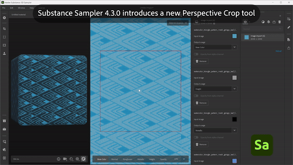
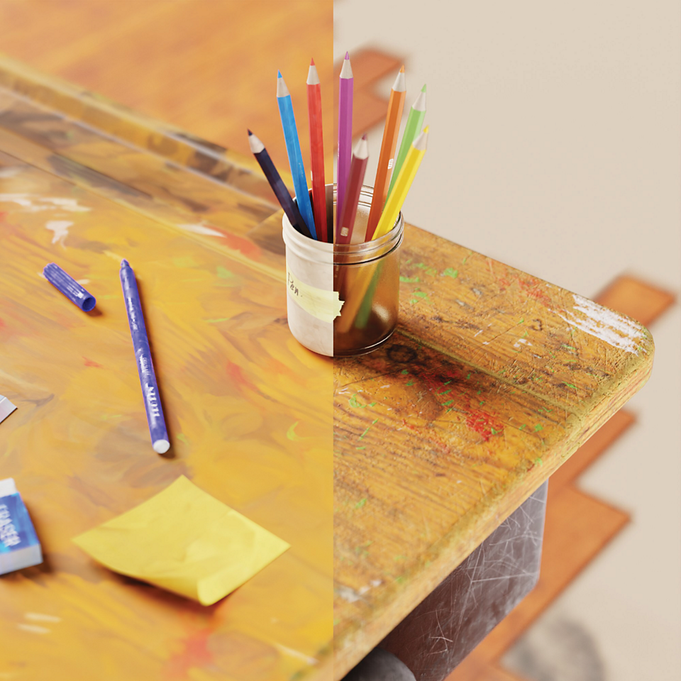

# Versión 4.3

<b>Substance 3D Sampler 4.3</b> presenta nuevo contenido de inicio, incluidos <b>Generadores de Textura</b>, una nueva versión del filtro <b>Bordado</b> y una herramienta <b>Recorte con perspectiva</b>.

*Fecha de publicación: 25 de enero de 2024*

## Nuevo contenido de Activos de inicio

Los materiales incluidos en Sampler se han actualizado para satisfacer mejor las necesidades de los flujos de trabajo de <b>diseño industrial</b>, los flujos de trabajo de <b>moda</b> y los artistas técnicos que trabajan en los medios de comunicación y el entretenimiento ahora tendrán más control sobre los aspectos técnicos de la creación de texturas.

## Generador de texturas

Los nuevos generadores de textura proporcionan un control mejorado sobre la creación de materiales mediante las opciones de <b>ruido paramétrico, patrones </b> y <b> suciedad</b>.  Las imágenes generadas se pueden utilizar en mapas de canales o máscaras, lo que facilita más que nunca la colaboración de los equipos técnicos y creativos en el diseño de materiales.

Utilice el nuevo icono de filtrado para analizar sólo los generadores de textura.

## Bordado

El filtro de bordado actualizado ha mejorado la precisión de la costura y admite hasta 8 colores. Las entradas del material están de vuelta en la pila de capas, lo que permite la inserción de otros materiales en el parche.

## Recorte con perspectiva

La nueva herramienta de recorte de Perspectiva le permite recortar materiales distorsionados y escaneos con cuatro puntos de control para eliminar artefactos de Perspectiva y obtener un activo en mosaico.

## Estilización

El filtro Estilización te permite estilizar cualquier material para conseguir un aspecto pintado a mano.

## Modo de Fusión en el filtro Rellenar

La actualización del filtro Relleno introduce modos de Fusión, lo que le permite multiplicar el valor, los mapas de entrada o los generadores de textura del Relleno con los resultados de canal de las capas de abajo.

## Mejoras de capa de importación de imágenes

Puede añadir varias imágenes en una capa de importación de imágenes y generar un mapa de opacidad a partir del canal alfa de una imagen.

## Nota de la versión

*(Lanzado: 25 de enero de 2024)*

<b>Agregado</b>:

* [Assets] Nuevo tipo de activo: Generadores de textura
* [Activos] Nuevos materiales incluidos en los Activos iniciales
* [Assets] Nuevo selector de recursos para parámetros de imagen en el panel Propiedades
* [Assets] Arrastre y suelte Generadores de Texturas del panel Assets en los selectores de imágenes del panel Properties (Propiedades)
* [Assets] Arrastre y suelte Generadores de Texturas desde el explorador de archivos del sistema operativo
* [Assets] Los filtros pueden sugerir el montaje de generadores mediante una etiqueta de usuario en la entrada de la imagen
* [Assets] Los generadores de Texturas pueden definir qué filtro debe sugerirlas mediante una etiqueta de usuario
* [Contenido] Nuevo filtro Recorte de Perspectiva
* [Contenido] Nuevo filtro de estilización
* [Contenido] Modo de fusión en el filtro de relleno
* [Contenido] Filtro de bordado actualizado
* [Contenido] Filtro de ajuste de Pintura actualizado
* [Contenido] Se han actualizado todos los filtros para admitir los generadores de Texturas
* [Layers] Posibilidad de elegir un canal de salida del Generador de Texturas al añadirlo a la pila de capas
* [Layers] Posibilidad de enumerar y aplicar fácilmente ajustes preestablecidos en los generadores de Textura
* [Layers] Mostrar una vista previa del generador de Texturas en los selectores de imágenes
* Los parámetros del generador de Texturas [Layers] se pueden exponer y exportar
* [Layers] Asigne el uso de Color base al importar una sola imagen con la Textura Import Creation Template
* [Capas] Comentarios al intentar arrastrar y soltar archivos incompatibles en los selectores de imágenes del panel Propiedades
* [Capas] Genera un canal de opacidad a partir del canal alfa de una imagen importada
* [Layers] Image to Material (AI) es más rápido de calcular al cambiar su categoría
* [Capas] Seleccione la capa más relevante después de utilizar una plantilla de creación
* [Capas] Los widgets de posición ahora se pueden retocar con un regulador en el grupo Parámetros avanzados
* [Exportar] Muestra un porcentaje en la cola en lugar de números RAW
* [Interoperabilidad] El canal de opacidad ahora se reconoce como canal alfa al enviar a Painter
* [Aplicación] Cuadro de diálogo Nuevo para mostrar y guardar información de hardware
* [Aplicación] Nueva preferencia para cambiar la escala de height predeterminada de cada proyecto
* [Aplicación] Mejorar la forma en que se muestran los activos obsoletos
* [Scripting] Nuevas funciones asset.documentResolution() y asset.setDocumentResolution()
* [Scripting] Nueva función select\_asset()
* [Scripting] API de Python para generadores de Textura
* [Scripting] get\_project\_assets() ahora devuelve objetos 3D
* [UI] El tamaño de la miniatura de un activo se puede cambiar en el panel Activos
* [UI] Iconos de visualización de ventanilla actualizados

<b>Corregido:</b>

* [vista 2D] El zoom con la rueda del ratón está bloqueado en un 244 %
* [Aplicación] Bloqueo al inicio al inicializar la API gráfica
* [Aplicación] Bloqueo si el nombre del proyecto contiene el carácter #
* [Aplicación] bloqueo posible al abrir un proyecto antiguo
* [Aplicación] Volver a abrir el proyecto actual puede provocar un bloqueo
* [Aplicación] Algunos cambios de proyecto no se registran y se pierden sin advertencia al cerrar el proyecto si no se guarda
* [Exportar] La exportación de .sbs/.sbsar produce problemas al utilizar varios archivos con el mismo nombre
* [Exportar] Espacio de color incorrecto para el archivo .sbs/.sbsar de imágenes de escala de grises exportado
* [Filtros] Problemas de comportamiento de fusión de opacidad
* A veces, los archivos .svg de [capas] no se procesan con la resolución correcta
* [Rendimiento] No es necesario guardar algunos proyectos en disco
* [Project] Al importar un proyecto antiguo, no se cargan los ajustes preestablecidos asociados
* [Scripting] No se pueden obtener los parámetros de la primera capa insertada
* [UI] La ventana emergente de vista previa al pasar el cursor sobre un activo puede aparecer en una ubicación o pantalla equivocadas
* [UI] Los paneles no acoplados son visibles y se pueden utilizar en la parte superior de la pantalla de bienvenida
