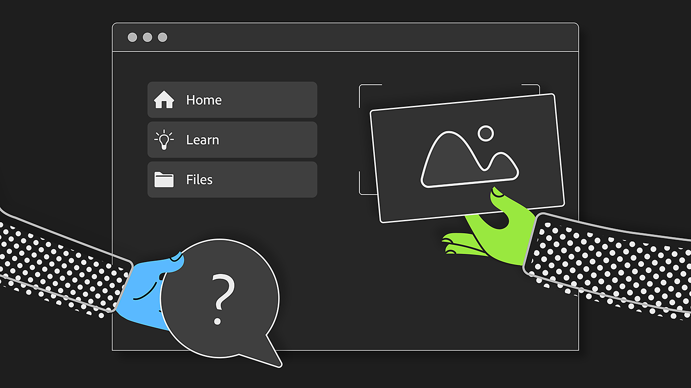

# Versión 5.0

<b>Substance 3D Sampler 5.0</b> presenta formas más sencillas de introducirte en el gemelo digital de materiales con digitalizaciones y representaciones de mayor calidad.

Las principales características nuevas incluyen:

## Acciones rápidas

Inicie todos los flujos de trabajo principales de Sampler con un solo clic y tenga la pila de capas lista para usted.

Más información *[aquí](../interface/panels/quick-actions-panel.md)*.

## Nuevo diseño de pantalla de inicio

Encuentra todos tus proyectos, tutoriales y comienza tu trabajo directamente desde la página de inicio.

Más información *[aquí](../interface/the-home-screen.md)*.

## Nuevo procesador

Elige entre el trazado en tiempo real y el trazado de trayectorias para mejorar la coherencia visual y admitir nuevas propiedades de los materiales. Guarde instantáneas del trabajo directamente desde la vista 3D.

Más información *[aquí](../interface/2d-and-3d-viewport.md)*.

## Integración de HP Z Captis

Con HP Z Captis y Substance 3D Sampler, convierte materiales del mundo real en digitales en cuestión de minutos.

Función disponible para las cuentas Enterprise, Teams y Education.

Más información *[aquí](../pipeline-and-integrations/hp-z-captis-support/hp-z-captis-support.md)*.

## Notas de la versión V5.0

*(Lanzado: 20 de febrero de 2025)*

<b>Agregado</b>:

* [Onboarding] Nueva página de inicio con acceso rápido a contenido de aprendizaje, proyectos de muestra, acciones rápidas y proyectos recientes.
* [Onboarding] Da tus primeros pasos rápidamente con las nuevas acciones rápidas, accesibles desde la página de inicio y desde un panel específico
* [Incorporación] [Contenido] Las acciones rápidas son flujos de trabajo predefinidos que rellenan la pila de capas con las capas más utilizadas
* [Onboarding] Posibilidad de crear un nuevo proyecto a través de un nuevo menú Inicio rápido, a través de acciones rápidas o Proyecto personalizado
* [Onboarding] Posibilidad de crear un proyecto vacío directamente desde la página de inicio mediante un botón específico
* [Vista 3D] El nuevo rasterizador y trazador de trazados avanzados aportan nuevas capacidades de representación (propiedades como el revestimiento, el brillo, la translucidez, la dispersión subsuperficial) y coherencia visual en todo el ecosistema Substance
* [Vista 3D] Ahora se puede acceder directamente a la configuración del visor en la vista 3D
* [Vista 3D] Posibilidad de guardar una instantánea de procesamiento en el portapapeles o en archivos
* [Vista 3D] Visualización de una cuadrícula para visualizar el origen de la escena
* [Vista 3D] Active el plano de tierra para capturar sombras y reflejos
* [Vista 3D] Controla qué nivel de reflectancia y opacidad tiene el plano de tierra
* [captura 3D] Posicionar la malla sobre el suelo
* [Aplicación] Comprobar la compatibilidad del hardware al iniciar la aplicación
* [Aplicación] Ahora se abre la ventana Informes de bloqueos justo después de que se produzca un bloqueo
* [Contenido] Abra un proyecto de muestra para comenzar fácilmente
* [Exportar] Exportar el sombreador de Adobe Standard Material en archivos USD
* [IA generativa] Marque la etiqueta &quot;No inferir&quot; cuando utilice image como entrada en los flujos de trabajo de Imagen a textura.
* [Project] Las miniaturas se almacenan en el archivo de proyecto para abrir los proyectos más rápido
* [Proyecto] Configuración de las preferencias para almacenar datos de caché en el archivo de proyecto, con diferentes modos (sin caché, caché ligera, caché completa)
* [Scripting] [Breaking change] Migración de Qt a Qt6.15: compatibilidad de efectos de los complementos existentes
* [Scripting] Los complementos predeterminados y la carpeta de scripts ahora están en la carpeta Documents
* [Scripting] Nueva interfaz de usuario para plugins por coherencia visual con los paneles principales de Sampler
* [Scripting] Accede a 2 ejemplos de plugins para descubrir las funciones de los plugins de Sampler
* [Scripting] Nueva función open\_3d\_capture()
* [Scripting] Al insertar una capa, controle si se inserta encima o debajo de la posición de destino

<b>Corregido:</b>

* [captura 3D] Bloqueo si no se puede iniciar la captura de objetos en macOS
* [Application] Bloqueo al salir
* [Aplicación] Colgar al salir al añadir recursos al panel Proyecto
* [Aplicación] Cambiar el nombre de un recurso de proyecto no funciona a menos que presione Intro
* [Aplicación] Las entradas de menú Deshacer y Rehacer no se desactivan cuando deberían
* [Assets] No se pueden eliminar activos de la sección Todas las bibliotecas del panel Activos
* [Contenido] Creador del atlas: utilizar el mapa de opacidad existente, si existe.
* [Contenido] Fusión de ID de color: corrige la selección de color en el color base
* [Capas] Evite cálculos inútiles al utilizar generadores
* [Capas] Si se retoca un generador, se pueden activar demasiados equipos
* [Rendimiento] Mejora de la gestión de memoria de la GPU
* [Rendimiento] La caché de procesamiento no se puede usar al reiniciar la aplicación
* [Recursos] Los archivos de solo lectura no están visibles en el panel Activos
* [Scripting] Permitir reutilizar una capa después de añadir otra
* [Scripting] Puede producirse un error al cambiar la estructura de la pila de capas varias veces en una secuencia de comandos

<b>Eliminado:</b>

* [Aplicación] Quitar la compatibilidad con los archivos de imagen .dng y .nef
