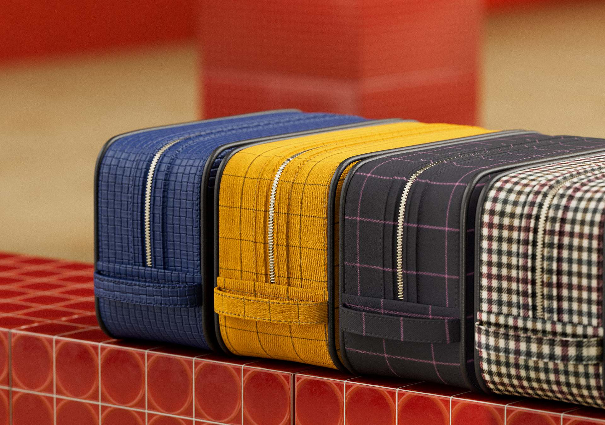
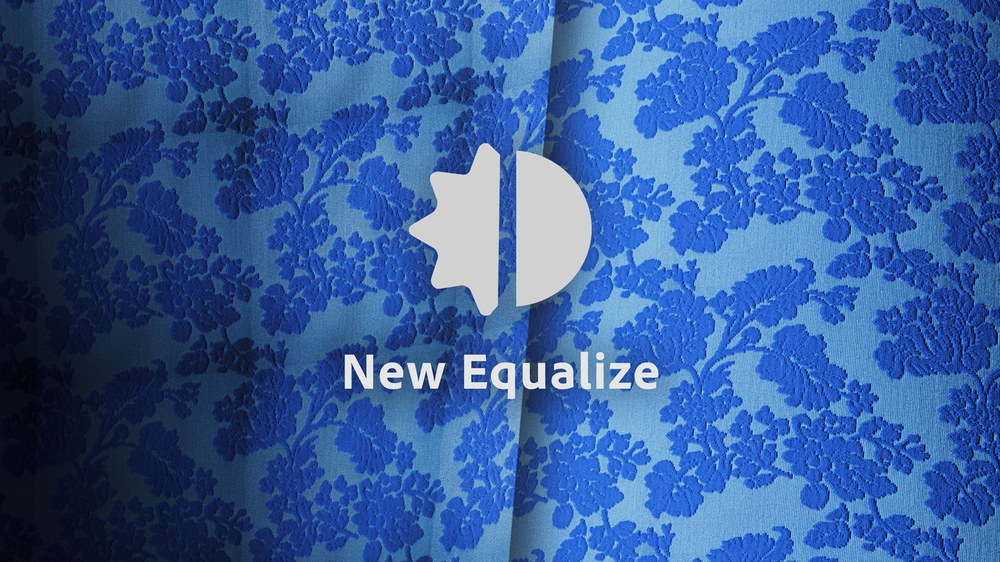

# Versión 5.1

Pasa menos tiempo entre capturar tus materiales y exportar a sus gemelos digitales con herramientas nuevas y mejoradas en <b>Substance 3D Sampler 5.1</b>.

Las principales características nuevas incluyen:

## Generación automática de mosaicos de materiales estructurados

Ahorra tiempo procesando materiales estructurados o modelados, como telas, generando automáticamente baldosas perfectas.

Más información *[aquí](../filters/tools/auto-tiling.md)*.

## Flujos de trabajo de capa eficientes

Aumenta el rendimiento y reduce el tiempo de cálculo con la capa Acoplar transformando las capas apiladas en un único conjunto de mapas dentro de una capa unificada. Cambie el nombre y duplíquelas para obtener más eficacia.

Más información *[aquí](../features-and-workflows/flatten-layers.md)*.

## Herramientas potentes para el procesamiento de escaneo

Con los filtros mejorados Ecualizar y Tampón de clonar, además de una nueva función de eliminación automática de pliegues para las telas, puedes conseguir escaneos perfectos con solo unos clics, independientemente de la complejidad del material.

## Compatibilidad mejorada con HP Z Captis

Ahora, con la generación de mapas de rugosidad y la detección automática de tamaños físicos en el modo Estudio, obtendrá un gemelo digital de material más detallado y preciso que nunca.

## Notas de la versión 5.1

*(Lanzado: 7 de agosto de 2025)*

## Añadido:

* [Vista 2D] El tamaño del pincel ahora se adapta a la resolución de textura actual
* [Vista 3D] Alterne la escala de visualización nativa para el procesamiento 3D en las preferencias
* [Aplicación] Actualización del motor de procesamiento
* [Captis] Añadir la posibilidad de &quot;hacer cuadrado&quot; durante la previsualización
* [Captis] Detección automática de tamaños físicos
* [Captis] Al capturar un nuevo material se crea un nuevo recurso
* [Captis] Cambiar la selección de resolución en el menú desplegable a píxeles por pulgada o centímetro en lugar de la resolución de píxeles del área máxima
* [Captis] Ayuda contextual sobre calibración de alineación
* [Captis] Generar mapa de rugosidad
* [Captis] Avisar al usuario si faltan los archivos de calibración predeterminados
* [Filters] Filtro de segmentación automática para escaneos y materiales estructurados
* [Filters] Nuevo filtro Eliminador de plegado
* [Filters] Nuevas funciones del filtro Tampón de clonar
* [Filters] Nuevas funciones del filtro Ecualizar
* [Capas] Capacidad para acoplar capas
* [Capas] Menú contextual al hacer clic con el botón derecho en una capa para cambiar el nombre, duplicar, eliminar o acoplar la capa
* [Onboarding] Actualización Bienvenida y contenido de las pantallas Novedades
* [Rendimiento] Mejor rendimiento al utilizar el filtro Recortar
* [Rendimiento] Mejora del uso de memoria para la vista 3D
* [Rendimiento] La actualización de la vista 3D es más rápida
* [Tamaño físico] Habilitar &quot;visualización con proporción física&quot; al trabajar con filtros de Substance cuando el Tamaño físico está habilitado
* [Tamaño físico] Al importar imágenes en una pila vacía, proponga una resolución más coherente con la proporción de imágenes
* [Acciones rápidas] 3 nuevas acciones rápidas para el procesamiento de digitalizaciones
* API [Scripting] para acoplar capas
* [Scripting] Obtenga el nombre de archivo de cada imagen de una capa de importación de imágenes
* [Scripting] Nueva función para activar o desactivar un canal determinado de un activo
* [UI] Reorganización de iconos y botones en el panel Capas para adaptarlos a las nuevas funciones
* [UI] Advertencia sobre la degradación de la creación de luz ambiental

## Corregido:

* [Vista 2D] La selección de &quot;Mostrar con proporción física&quot; puede no funcionar al utilizar filtros de Substance
* [captura 3D] Los archivos SVG aparecen en el selector de archivos, pero no son compatibles
* [Vista 3D] El parámetro de intensidad de emisión de la configuración del sombreado no funciona
* [Vista 3D] En ocasiones, la posición de la malla es incorrecta al crear un activo nuevo
* [Vista 3D] El cambio al procesamiento de seguimiento de trazado de trazado se bloquea en el hardware no compatible
* [Aplicación] La aplicación se bloquea al cerrar la ventana emergente de medida manual sin establecer un tamaño
* Bloqueo de [aplicación]
* [Aplicación] Bloqueo en Windows al mostrar el escritorio (tecla Windows + método abreviado de teclado D)
* [Aplicación] Posible bloqueo al cambiar de idioma
* [Captis] Bloqueo cuando los datos de vista previa no son válidos
* [Captis] No es posible reducir completamente el zoom después de acercarlo
* [Captis] Falta la localización en algunos pasos del asistente
* [Captis] Posible bloqueo al salir al utilizar Captis
* [Captis] El análisis no funciona si el dispositivo carece de archivos de calibración
* [Filtros] La vista previa del pincel al utilizar el filtro Tampón de clonar puede ser incorrecta en función de la textura y los tamaños de pincel
* [Filters] Tamaño de salida incorrecto después de utilizar el filtro de aumento de escala
* [Filters] Faltan iconos para los filtros de rotación de entorno y estilización
* [Filters] Si se actualizan algunos filtros, el procesamiento puede ser incorrecto
* [Capas] Primer procesamiento incorrecto al mezclar dos materiales
* [Capas] El botón para actualizar capas muestra &quot;Actualizar todo&quot; incluso cuando solo hay una actualización
* [Capas] Cálculos innecesarios al importar imágenes en la pila de capas
* [Rendimiento] Mejora el control de formatos de mapa de normales para reducir los tiempos de procesamiento
* [Tamaño físico] La ventana emergente de medición manual solo funciona después de realizar una medición automática
* [Tamaño físico] Resolución de exportación incorrecta en la ventana emergente de exportación cuando se activa el Tamaño físico
* [Acciones rápidas] Falta la localización en los nombres de recursos generados
* [UI] Es posible que la vista previa del activo al pasar el cursor no se muestre
* [UI] Al hacer clic en el botón Restablecer el valor predeterminado, se pueden romper algunos de los controles
* [UI] Los mensajes de error no se borran al cambiar de proyecto
* [UI] Asegúrese de que el nombre del material en el panel Ventana gráfica y propiedades esté vacío cuando no haya ningún recurso
* [UI] El botón Restablecer el valor predeterminado para el parámetro de punto de vista no funciona
* [UI] Se restablece la superposición del botón de valor predeterminado
* [UI] Algunos botones no se pueden hacer clic cuando un panel no está acoplado
* [UI] Parámetro V de segmentación de texturas parcialmente oculto en Ajustes del visor y Vista 3D

## Eliminado:

* [captura 3D] Quitar la compatibilidad con captura 3D
* [Aplicación] Quitar la compatibilidad con macOS x86
