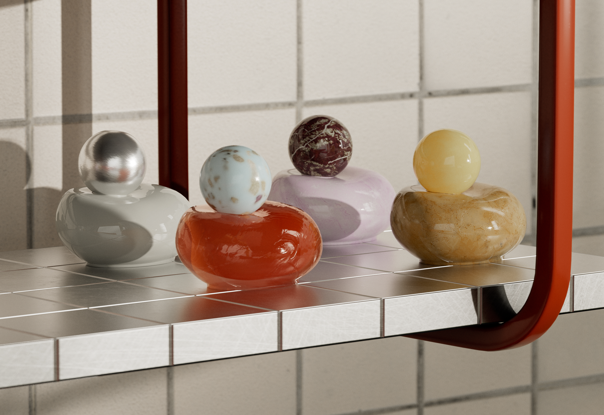

# Versión 6.0

Jalapeño

Esta actualización incluye compatibilidad con OpenPBR estándar del sector, ajustes preestablecidos de materiales para agilizar la creación de materiales avanzados y un panel Propiedades rediseñado para una creación más flexible.

Las principales características nuevas incluyen:

## OpenPBR: el corazón del ecosistema de Substance

Sampler 6.0 adopta [OpenPBR](../features-and-workflows/openpbr.md), el modelo de material unificado del sector. Crea materiales que se entiendan de forma nativa en todo el ecosistema 3D: un estándar, compatibilidad ilimitada.Diseña una vez, elimina las conjeturas y acelera tu flujo de trabajo con un modelo creado para lograr una interoperabilidad perfecta entre herramientas.

## Materiales complejos en un solo clic

Crea materiales más ricos y más complejos al instante. Las nuevas plantillas como fuzz, translucency y clear coat te permiten añadir efectos físicos avanzados sin la complejidad. ¡Elige una plantilla y vete!

Más información *[aquí](../interface/tools-and-widgets/material-creation-presets.md)*

## Diseñado para la creación de materiales

Sampler 6.0 perfecciona toda la experiencia en torno a lo que más importa: creación de materiales digitales gemelos de alta calidad. Todas las actualizaciones y nuevas funciones están diseñadas para eliminar fricciones, ahorrarte tiempo y permitirte centrarte en las partes de tu flujo de trabajo que realmente añaden valor.

## Una pila de capas nueva creada para el control

Hazte cargo de tus materiales. Con el panel de propiedades rediseñado, puedes orientar filtros por canal, lo que te ofrece ediciones precisas sin pasos adicionales.

Más información *[aquí](../interface/panels/properties-panel.md)*

## Capture materiales más rápido que nunca

Sampler ahora te permite lanzar una captura de HP Z Captis con un solo clic, con la región de interés detectada automáticamente, giratoria bajo demanda y automatización inteligente para el enfoque y la intensidad de luz, para que obtengas mapas nítidos y coherentes con menos configuración.

Más información *[aquí](../pipeline-and-integrations/hp-z-captis-support/your-first-capture-step-by-step.md)*

## Notas de la versión V6.0

*(Lanzado: 16 de abril de 2026)*

## Añadido:

* [Vista 3D] Proporcione mallas predeterminadas en formato USD
* [Aplicación] Detecta usos en un material que no está disponible en el modelo de material actual
* [Aplicación] Leer etiqueta de modelo de material de archivos SBSAR
* [Captis] Permite la rotación de la región de interés y la nueva resolución 4K
* [Captis] Comprueba la versión del sistema operativo Captis y avisa al usuario para que actualice si corresponde
* [Captis] Mantener los parámetros de análisis entre análisis sucesivos
* [Captis] Nuevo sistema de enfoque automático
* Análisis con un clic de [Captis]
* [Captis] Muestra una notificación cuando finaliza la captura
* [Captis] Varias mejoras de IU y UX
* [Configuración de canal] Panel de configuración de canal rediseñado para el OpenPBR
* [Configuración de canal] Compatibilidad para cambiar entre modelos de material de OpenPBR y ASM
* [Exportar] Habilite la exportación de materiales como USD, USDA o USDZ
* [Exportar] Admite canales de OpenPBR en la selección de canales de exportación
* [Exportar] Use la ruta del proyecto como ruta de exportación predeterminada
* [Filtros] Permite actualizar de filtros compuestos estáticos a dinámicos
* [Filtros] Permite actualizar de filtros estáticos a dinámicos
* [Filtros] Versiones dinámicas de segmentación automática, relleno según el contenido, mezcla de Heightes y fusión normal
* [Filtros] Ocultar la versión estática de un filtro cuando hay una versión dinámica
* [Filtros] Nueva experiencia de relleno
* [Filtros] Nuevo Material base compatible con OpenPBR y ASM
* [Importación de imágenes] La importación de imágenes ahora propone agregar usos al flujo de trabajo
* [Importación de imágenes] Selector de uso mejorado
* [Capas] El tamaño de recurso predeterminado ahora es 2K
* [Capas] Habilite una selección de uso de salida por capa
* [Preferencias] Agregar una preferencia de modelo de material predeterminada
* [Ajuste preestablecido] El ajuste preestablecido predeterminado ahora usa el modelo de material de OpenPBR
* [Procesando] Habilitar procesamiento 8K
* [Procesando] sombreador de OpenPBR de control en una escena de USD
* [Representación] Representa imágenes con el tamaño del documento cuando no se exportan
* [Scripting] modelo de material de identificador para la creación de recursos en la API de Python
* [Secuencias de comandos] Nueva propiedad MaterialModel en el recurso
* [UI] Agregar una categoría a Acciones rápidas y ocultar filtros de malla/entorno
* [IU] Mostrar la ventana de plantilla cuando la pila solo contiene un material base
* [IU] Implementar búsqueda difusa en descriptor de acceso rápido
* [UI] Selección de plantilla integrada en el cuadro de diálogo de creación de materiales
* [IU] Creación de materiales desde el inicio rápido
* [UI] Flujo de trabajo de creación de materiales con plantillas
* [UI] Nuevo estilo para las barras de acción flotantes
* [IU] Notificar al usuario cuando un material necesite usos adicionales
* [UI] Proponer nuevo nombre de material con número incrementado
* [UI] Cambie el nombre &quot;Crear proyecto vacío&quot; a &quot;Inicio rápido&quot;
* Panel &quot;Obtener contenido&quot; de [UI] renovado
* [IU] Implementación de la búsqueda en la edición de lista de canales
* [IU] Mostrar una notificación al guardar una instantánea en un archivo

## Corregido:

* [Vista 2D] Ordene la vista 2D según el índice de uso de resultados en la especificación
* [Aplicación] Solucionar un bloqueo al iniciar
* [Aplicación] Corrige la lógica incorrecta para el filtrado de uso de flujo de trabajo con OpenPBR
* [La lista de versiones conocidas de la aplicación] se lee ahora al buscar una actualización
* [Aplicación] Evita un bloqueo de acceso simultáneo
* [Aplicación] Evita un cálculo doble al importar imágenes con material base
* [Aplicación] Evitar un posible bloqueo al salir
* [Aplicación] Evita el bloqueo al borrar una máscara dos veces
* [Aplicación] Impedir la conversión de uso que pierde el caso original
* [Aplicación] Impide el cálculo inútil de resultados invisibles
* [Aplicación] Reemplace espacios por guiones bajos al crear el identificador de uso a partir del nombre
* [Aplicación] Varias correcciones de actualizaciones
* No se detectó el dispositivo [Captis] después de actualizar las directivas de seguridad
* [Captis] corrige errores de protocolo FTP
* [Captis] Corregir recorte
* [Captis] Céntrate en un área técnica antes de calibrar el color
* [Captis] Mantener proporción de recorte cuando la resolución está bloqueada
* [Captis] impide el bloqueo al pulsar &#39;Enviar resultados al muestreador&#39; varias veces
* [Captis] Levanta la ventana Captis al hacer clic en el menú Captis y se minimiza
* [Captis] Intercambia dos secciones en la interfaz de usuario de vista previa
* [Captis] Los metadatos del activo final no están establecidos
* [Captis] Varias correcciones de errores
* [Captis] de tamaño de recorte incorrecto
* [Configuración de canal] Enmascara los canales en el panel si son invisibles
* [Exportar] Abrir una carpeta con caracteres especiales funciona correctamente
* [Exportar] Evita el bloqueo al exportar cuando se ha descargado el árbol
* [Exportar] Las salidas seleccionadas no se mantienen en el cuadro de diálogo de exportación
* [Filtros] Al exportar un árbol con imágenes se rompe la resolución dinámica de la imagen
* [Filtros] Solucionar la disponibilidad de filtros de C++
* [Filtros] Corrección de detección de filtro dinámico de Tampón de clonar
* [Filtros] Corrige la inicialización del contador UID al rellenar usos dinámicos
* [Filtros] Corregir el espacio de color en el Asistente para segmentación automática
* [Filtros] Corrige los tamaños de salida de recorte
* [Filtros] Hacer que la actualización de filtros con parámetros anclados funcione
* [Filtros] Evitar un bloqueo en macOS en el Asistente para segmentación automática
* [Filtros] Evita el bloqueo en la ampliación cuando falta una entrada
* [Filtros] Evita el bloqueo al cargar un filtro compuesto sin nombre de archivo
* [Filtros] El ajuste de máscara de destino se duplicó en PatchMatch
* [Importación de imágenes] Corrige la medida manual automática para el tamaño físico
* [Importación de imágenes] Tamaño de rasterizado de SVG adecuado cuando se usa como ajuste
* [Capas] No funciona asignar un uso a una imagen escribiéndola
* [Capas] Evite bloqueos al agregar capas a la pila
* [Capas] Se quitaron los parámetros expuestos que no necesitaban actualizarse
* [Capas] Corrección al agregar un generador de texturas como mapa
* [Capas] Corregir acoplar
* [Capas] Acoplar subpila en tamaño de entrada, no en tamaño de documento
* [Capas] Evita el bloqueo al acoplar una pila que contiene capas acopladas
* [Capas] Impide que se muestre un mensaje de optimización de procesamiento con el Material base
* [Capas]: La actualización de un filtro a un filtro de salida único no actualizaba la interfaz de usuario correctamente
* [Preferencias] Solucionar el cambio de las preferencias
* [Proyecto] Corrige la importación de proyectos .alch
* [Proyecto] Ya no se producen errores al guardar de forma silenciosa
* [Procesamiento] Evite el bloqueo en macOS manteniendo el modo de programación en modo automático
* [El procesamiento] del cambio del componente V del mosaico de texturas no tuvo ningún efecto
* [Procesando] Se ha corregido la falta de representación y miniaturas
* [Procesamiento] Impide el acceso simultáneo a los valores de salida
* [Procesando] administra correctamente los valores de salida de un árbol en el procesador
* [Procesando] Deje de recrear la estructura de árbol en cada procesamiento
* [Secuencias de comandos] Solucionar un bloqueo en get_project_assets
* [Secuencias de comandos] Evita el bloqueo al acoplar desde la API de Python
* [UI] Todos los divisores del panel de propiedades ahora tienen el ancho del panel
* [IU] Evite mostrar los usos internos de segmentación automática como personalizados
* [IU] Solucionar menú contextual roto
* [UI] Solucionar el menú contextual para los ajustes del generador
* [IU] Solucionar la carga de fuentes
* [IU] Corrige el ajuste preestablecido de material con nombres largos
* [IU] Solucionar enlaces de ajuste de múltiples reguladores
* [IU] Solucionar problemas poco comunes de tamaño pequeño en el cuadro de diálogo
* [IU] Solucionar cambio de valor de ajuste al crear el componente
* [UI] Corrija la visualización de entrada de variable y quite el comando fantasma incorrecto
* [IU] Corrige la actualización del panel de configuración de la vista cuando cambia el contexto del recurso
* [IU] Solucionar el modo de ajuste de texto del selector unificado
* [IU] Prohíbe agregar caracteres especiales en el campo de nombre de metadatos
* La visualización de la herramienta de medida de Tamaño físico [UI] está dañada
* [IU] Evita el bloqueo al abrir el panel de configuración del canal
* [IU] Evita el bloqueo al utilizar Restablecer el diseño predeterminado
* [UI] Evita que desaparezca la notificación de actualización en el panel del árbol
* [IU] Prioriza el filtro dinámico al buscar por nombre
* [IU] Desplácese por el panel de propiedades para utilizar ajustes
* [IU] Actualizar la configuración del canal al ajustar el uso de una imagen
* [UI] Actualizar la redacción en la ventana emergente de conversión de Modelo de material

## Eliminado:

* [UI] Quitar elemento de menú del Captura 3D
* [IU]: Quitar el panel de IA generativa
* [IU] Quitar la configuración del sombreado
