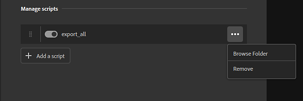

# Administrar scripts y complementos instalados

Para instalar, modificar o eliminar complementos, utilice Editar > Preferencias y, a continuación, seleccione Complementos y secuencias de comandos.

Desde el panel Complementos y scripts , puede habilitar el panel Registro , que muestra la salida de los complementos. Esto puede resultar útil para solucionar problemas y depurar. Una vez habilitado, puede abrir el panel Registro desde la barra de la derecha en la interfaz principal de Sampler. El panel Registro se puede acoplar al igual que otros paneles de Sampler.

## Complementos frente a scripts

La principal diferencia entre complementos y scripts es que los complementos incluyen elementos de interfaz de usuario donde los scripts no los incluyen. Los complementos requieren al menos un archivo PY y un archivo QML. El archivo QML define los elementos de la interfaz de usuario, mientras que el archivo PY define el comportamiento del complemento. Por otra parte, los scripts solo constan de un archivo PY.

Los elementos de la interfaz de usuario de un complemento significan que el comportamiento del complemento se puede modificar mediante el uso de parámetros. Por ejemplo, el plugin de autoguardado de ejemplo tiene controles que permiten modificar el tiempo entre autoguardados. Los complementos pasan a formar parte de la interfaz de Sampler y se pueden acoplar y mover como paneles estándar de Sampler.

Los scripts no permiten este nivel de flexibilidad, sino que realizan una tarea determinada. Por ejemplo, la secuencia de comandos Exportar todo siempre se comportará del mismo modo cuando se llame. Se puede acceder a las secuencias de comandos desde la barra de menús superior: el menú Secuencia de comandos solo está disponible una vez que se han añadido secuencias de comandos a Sampler.

## Gestionar plugins

De forma predeterminada, la única opción disponible es &quot;Añadir un plugin&quot;. Esto abre un explorador de archivos donde puede seleccionar un archivo PY para cargarlo.

>[!NOTE]
>
> Los complementos requieren tanto un archivo PY como un archivo QML para funcionar. Cuando seleccione un archivo PY para importar, Sampler buscará un archivo QML en la carpeta. Si no se encuentra ningún archivo QML, la carga del complemento fallará.

Una vez instalado un complemento, quedan disponibles algunas opciones:

* Los complementos se pueden reordenar arrastrando el controlador del lado izquierdo del complemento.
* Active o desactive los complementos con el conmutador.
* Use el botón de menú a la derecha de cada complemento para volver a cargar, eliminar o abrir la ubicación de la carpeta del complemento.

Los complementos instalados aparecerán inicialmente en la barra derecha de la interfaz principal de Sampler. Desde allí, puede abrir, acoplar y mover el panel del complemento, igual que los paneles estándar de Sampler.

## Administrar scripts

Los scripts se pueden administrar de forma similar a los complementos.

Una vez que se instala un script, quedan disponibles algunas opciones:

* Reordene los scripts con el controlador en el lado izquierdo del script.
* Active o desactive la secuencia de comandos con el conmutador.
* Utilice el botón de menú situado a la derecha de cada script para quitar el script, o bien abra la ubicación de la carpeta del script.
* Cuando se importan, los scripts se copian en **%\AppData\Roaming\Adobe\Adobe Substance 3D Sampler\scripts**
* Para editar el script, debe modificar el que ha copiado Sampler
