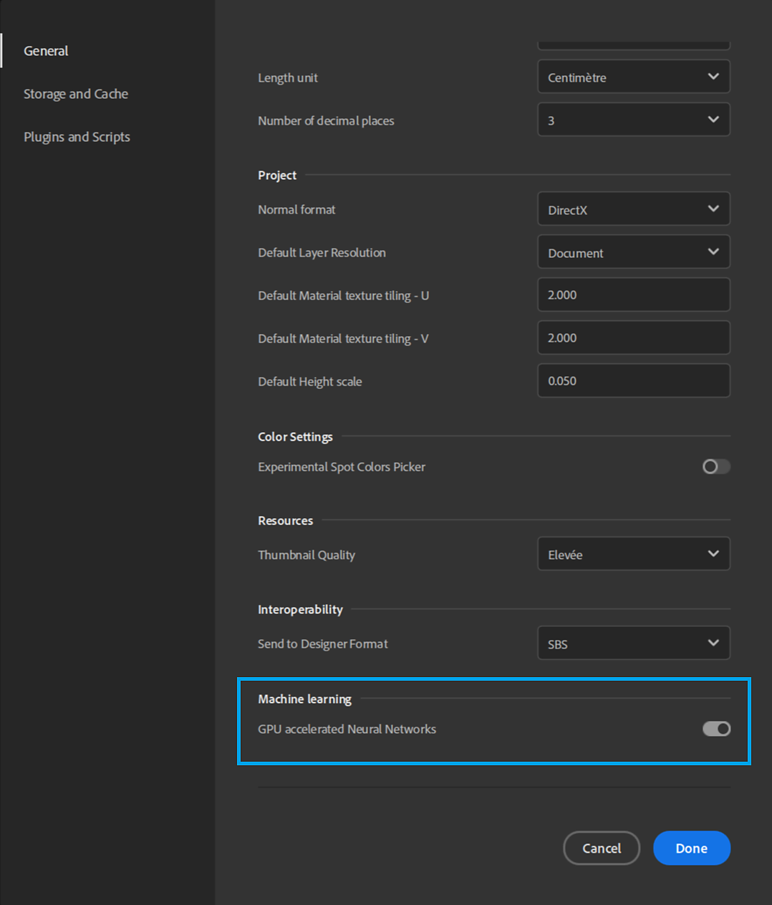

# Artefactos visuales de imagen a material

Los resultados de <b>Imagen a material (impulsada por IA)</b> a veces se pueden alterar (principalmente colores incorrectos).

Habilite o deshabilite *Redes neuronales aceleradas por GPU* en la sección <b> Aprendizaje automático</b> de Preferencias de Substance 3D Sampler para resolver el problema.

